<div align="center">


**Universidad Peruana de Ciencias Aplicadas**<br>
**Carrera de Ingeniería de Software**<br>
**Ciclo académico 2026-20**

**1ASI0732**<br>
**Diseño de Experimentos de Ingeniería de Software**

**NRC 9100**

**Profesor**<br>
**Alex Humberto Sánchez Ponce**

# Informe de Trabajo Final

**Startup: Teralume**<br>
**Producto: EnergyCore**

## Integrantes

| Código | Apellidos y nombres |
|:--:|:--|
| U20241E406 | Loa Rojas, Jean Franck |
| U202418755 | Santiago Atanacio, Jairo Mathias |

**Septiembre de 2026**

</div>

<div style="page-break-after: always;"></div>

## Registro de Versiones del Informe

| Versión | Fecha | Autor | Descripción de la modificación |
|:--:|:--:|:--|:--|
| AV1 | 05/09/2026 | Loa Rojas, Jean Franck | Creación de la estructura del informe conforme al enunciado del curso, incorporación de la carátula, los enlaces de los repositorios, el perfil individual y el sustento inicial del Student Outcome 4. |
| AV1.1 | 05/09/2026 | Loa Rojas, Jean Franck | Desarrollo de los capítulos I al V requeridos para el Primer Hito, incluyendo Lean UX, needfinding provisional, requirements specification, diseño, arquitectura, modelo de datos, backlog y evidencias técnicas. |
| AV1.2 | 05/09/2026 | Loa Rojas, Jean Franck | Desarrollo de las secciones acumulativas de verificación y validación, DevOps y ciclo de experimentación; incorporación del acuerdo SaaS, auditoría heurística, protocolos de evidencia y matriz ética. Las entrevistas permanecen excluidas por decisión del equipo. |

<div style="page-break-after: always;"></div>

## Project Report Collaboration Insights

EnergyCore se desarrolla mediante cinco repositorios independientes dentro de la organización Teralume. Esta separación permite mantener trazabilidad específica para el informe, la Landing Page, la aplicación web, la aplicación móvil y los servicios de backend.

### Repositorios del proyecto

- [Project Report](https://github.com/teralume/energycore-report)
- [Landing Page](https://github.com/teralume/energycore-website)
- [Frontend Web Application](https://github.com/teralume/energycore-webapp)
- [Native Mobile Application](https://github.com/teralume/energycore-mobile)
- [RESTful API](https://github.com/teralume/energycore-platform)

### Entrega AV1

Durante AV1 se preparó la plataforma EnergyCore a partir de un proyecto académico anterior cuya reutilización fue autorizada por el profesor. El trabajo no se limitó a cambiar el nombre del producto: se separaron los entregables en repositorios propios, se actualizó la identidad a Teralume y EnergyCore, se revisaron los contratos entre frontend y backend, se desarrolló una nueva experiencia visual y se incorporó una aplicación móvil en Flutter conectada a la misma API.

#### Participación de Loa Rojas Jean Franck

- Creó y vinculó los cinco repositorios de EnergyCore con la organización Teralume.
- Adaptó la solución previamente desarrollada a la identidad y alcance de EnergyCore.
- Implementó y corrigió la aplicación web Angular y su integración con la API REST.
- Desarrolló la Landing Page y alineó su navegación con el inicio de sesión de la aplicación.
- Implementó la aplicación móvil Flutter para Android, con autenticación, consumo energético, gestión de dispositivos y adaptación responsiva.
- Revisó la estructura DDD del backend y la conexión de los bounded contexts del producto.
- Preparó la estructura inicial del informe de acuerdo con el enunciado de Diseño de Experimentos de Ingeniería de Software.

#### Evidencias de colaboración y commits

Los siguientes commits locales organizan el trabajo existente en bloques verificables. Se generaron con la fecha real de incorporación al control de versiones y no pretenden simular una cronología anterior.

| Repositorio | Commits preparados para AV1 |
|:--|:--|
| Report | `1a0eced` - estructura y Student Outcome; `4b24a34` - línea base de commits; ampliación AV1 incluida en el cambio actual |
| Platform | `63d5a7a` - inicialización; `6f7f47e` - bounded contexts; `250517e` - pruebas |
| WebApp | `d3b1c79` - inicialización; `eb76229` - experiencia web; `85ee2eb` - referencias de diseño |
| Mobile | `1fe1a80` - inicialización Flutter; `24cf286` - experiencia móvil; `0f545f0` - pruebas y paridad web |
| Website | `b3adb4e` - Landing Page; `268de90` - sistema de diseño |

_Las capturas de commits y GitHub Insights permanecen pendientes hasta publicar las ramas en los repositorios remotos._

<div style="page-break-after: always;"></div>

## Contenido

- [Student Outcome](#student-outcome)
  - [Loa Rojas Jean Franck](#loa-rojas-jean-franck)
- [Part I As Is Software Project](#part-i-as-is-software-project)
  - [Capítulo I Introducción](#capítulo-i-introducción)
    - [1.1 Startup Profile](#11-startup-profile)
      - [1.1.1 Descripción de la Startup](#111-descripción-de-la-startup)
      - [1.1.2 Perfiles de integrantes del equipo](#112-perfiles-de-integrantes-del-equipo)
    - [1.2 Solution Profile](#12-solution-profile)
      - [1.2.1 Antecedentes y problemática](#121-antecedentes-y-problemática)
      - [1.2.2 Lean UX Process](#122-lean-ux-process)
        - [1.2.2.1 Lean UX Problem Statements](#1221-lean-ux-problem-statements)
        - [1.2.2.2 Lean UX Assumptions](#1222-lean-ux-assumptions)
      - [1.2.2.3 Lean UX Hypothesis Statements](#1223-lean-ux-hypothesis-statements)
      - [1.2.2.4 Lean UX Canvas](#1224-lean-ux-canvas)
    - [1.3 Segmentos objetivo](#13-segmentos-objetivo)
  - [Capítulo II Requirements Elicitation and Analysis](#capítulo-ii-requirements-elicitation-and-analysis)
    - [2.1 Competidores](#21-competidores)
      - [2.1.1 Análisis competitivo](#211-análisis-competitivo)
      - [2.1.2 Estrategias y tácticas frente a competidores](#212-estrategias-y-tácticas-frente-a-competidores)
    - [2.2 Entrevistas](#22-entrevistas)
      - [2.2.1 Diseño de entrevistas](#221-diseño-de-entrevistas)
      - [2.2.2 Registro de entrevistas](#222-registro-de-entrevistas)
      - [2.2.3 Análisis de entrevistas](#223-análisis-de-entrevistas)
    - [2.3 Needfinding](#23-needfinding)
      - [2.3.1 User Personas](#231-user-personas)
      - [2.3.2 User Task Matrix](#232-user-task-matrix)
      - [2.3.3 User Journey Mapping](#233-user-journey-mapping)
      - [2.3.4 Empathy Mapping](#234-empathy-mapping)
      - [2.3.5 As Is Scenario Mapping](#235-as-is-scenario-mapping)
    - [2.4 Ubiquitous Language](#24-ubiquitous-language)
  - [Capítulo III Requirements Specification](#capítulo-iii-requirements-specification)
    - [3.1 To Be Scenario Mapping](#31-to-be-scenario-mapping)
    - [3.2 User Stories](#32-user-stories)
    - [3.3 Product Backlog](#33-product-backlog)
    - [3.4 Impact Mapping](#34-impact-mapping)
  - [Capítulo IV Product Design](#capítulo-iv-product-design)
    - [4.1 Style Guidelines](#41-style-guidelines)
      - [4.1.1 General Style Guidelines](#411-general-style-guidelines)
      - [4.1.2 Web Style Guidelines](#412-web-style-guidelines)
      - [4.1.3 Mobile Style Guidelines](#413-mobile-style-guidelines)
        - [4.1.3.1 iOS Mobile Style Guidelines](#4131-ios-mobile-style-guidelines)
        - [4.1.3.2 Android Mobile Style Guidelines](#4132-android-mobile-style-guidelines)
    - [4.2 Information Architecture](#42-information-architecture)
      - [4.2.1 Organization Systems](#421-organization-systems)
      - [4.2.2 Labeling Systems](#422-labeling-systems)
      - [4.2.3 SEO Tags and Meta Tags](#423-seo-tags-and-meta-tags)
      - [4.2.4 Searching Systems](#424-searching-systems)
      - [4.2.5 Navigation Systems](#425-navigation-systems)
    - [4.3 Landing Page UI Design](#43-landing-page-ui-design)
      - [4.3.1 Landing Page Wireframe](#431-landing-page-wireframe)
      - [4.3.2 Landing Page Mockup](#432-landing-page-mockup)
    - [4.4 Mobile Applications UX UI Design](#44-mobile-applications-ux-ui-design)
      - [4.4.1 Mobile Applications Wireframes](#441-mobile-applications-wireframes)
      - [4.4.2 Mobile Applications Wireflow Diagrams](#442-mobile-applications-wireflow-diagrams)
      - [4.4.3 Mobile Applications Mockups](#443-mobile-applications-mockups)
      - [4.4.4 Mobile Applications User Flow Diagrams](#444-mobile-applications-user-flow-diagrams)
    - [4.5 Mobile Applications Prototyping](#45-mobile-applications-prototyping)
      - [4.5.1 Android Mobile Applications Prototyping](#451-android-mobile-applications-prototyping)
      - [4.5.2 iOS Mobile Applications Prototyping](#452-ios-mobile-applications-prototyping)
    - [4.6 Web Applications UX UI Design](#46-web-applications-ux-ui-design)
      - [4.6.1 Web Applications Wireframes](#461-web-applications-wireframes)
      - [4.6.2 Web Applications Wireflow Diagrams](#462-web-applications-wireflow-diagrams)
      - [4.6.3 Web Applications Mockups](#463-web-applications-mockups)
      - [4.6.4 Web Applications User Flow Diagrams](#464-web-applications-user-flow-diagrams)
    - [4.7 Web Applications Prototyping](#47-web-applications-prototyping)
    - [4.8 Domain Driven Software Architecture](#48-domain-driven-software-architecture)
      - [4.8.1 Software Architecture Context Diagram](#481-software-architecture-context-diagram)
      - [4.8.2 Software Architecture Container Diagrams](#482-software-architecture-container-diagrams)
      - [4.8.3 Software Architecture Components Diagrams](#483-software-architecture-components-diagrams)
    - [4.9 Software Object Oriented Design](#49-software-object-oriented-design)
      - [4.9.1 Class Diagrams](#491-class-diagrams)
      - [4.9.2 Class Dictionary](#492-class-dictionary)
    - [4.10 Database Design](#410-database-design)
      - [4.10.1 Relational Non Relational Database Diagram](#4101-relational-non-relational-database-diagram)
  - [Capítulo V Product Implementation](#capítulo-v-product-implementation)
    - [5.1 Software Configuration Management](#51-software-configuration-management)
      - [5.1.1 Software Development Environment Configuration](#511-software-development-environment-configuration)
      - [5.1.2 Source Code Management](#512-source-code-management)
      - [5.1.3 Source Code Style Guide and Conventions](#513-source-code-style-guide-and-conventions)
      - [5.1.4 Software Deployment Configuration](#514-software-deployment-configuration)
    - [5.2 Product Implementation and Deployment](#52-product-implementation-and-deployment)
      - [5.2.1 Sprint Backlogs](#521-sprint-backlogs)
      - [5.2.2 Implemented Landing Page Evidence](#522-implemented-landing-page-evidence)
      - [5.2.3 Implemented Frontend Web Application Evidence](#523-implemented-frontend-web-application-evidence)
      - [5.2.4 Acuerdo de Servicio SaaS](#524-acuerdo-de-servicio-saas)
      - [5.2.5 Implemented Native Mobile Application Evidence](#525-implemented-native-mobile-application-evidence)
      - [5.2.6 Implemented RESTful API and Serverless Backend Evidence](#526-implemented-restful-api-and-serverless-backend-evidence)
      - [5.2.7 RESTful API Documentation](#527-restful-api-documentation)
      - [5.2.8 Team Collaboration Insights](#528-team-collaboration-insights)
    - [5.3 Video About the Product](#53-video-about-the-product)
- [Part II Verification Validation and Pipeline](#part-ii-verification-validation-and-pipeline)
  - [Capítulo VI Product Verification and Validation](#capítulo-vi-product-verification-and-validation)
    - [6.1 Testing Suites and Validation](#61-testing-suites-and-validation)
      - [6.1.1 Core Entities Unit Tests](#611-core-entities-unit-tests)
      - [6.1.2 Core Integration Tests](#612-core-integration-tests)
      - [6.1.3 Core Behavior Driven Development](#613-core-behavior-driven-development)
      - [6.1.4 Core System Tests](#614-core-system-tests)
    - [6.2 Static Testing and Verification](#62-static-testing-and-verification)
      - [6.2.1 Static Code Analysis](#621-static-code-analysis)
        - [6.2.1.1 Coding Standard and Code Conventions](#6211-coding-standard-and-code-conventions)
        - [6.2.1.2 Code Quality and Code Security](#6212-code-quality-and-code-security)
      - [6.2.2 Reviews](#622-reviews)
    - [6.3 Validation Interviews](#63-validation-interviews)
      - [6.3.1 Diseño de Entrevistas](#631-diseño-de-entrevistas)
      - [6.3.2 Registro de Entrevistas](#632-registro-de-entrevistas)
      - [6.3.3 Evaluaciones según heurísticas](#633-evaluaciones-según-heurísticas)
    - [6.4 Auditoría de Experiencias de Usuario](#64-auditoría-de-experiencias-de-usuario)
      - [6.4.1 Auditoría realizada](#641-auditoría-realizada)
        - [6.4.1.1 Información del grupo auditado](#6411-información-del-grupo-auditado)
        - [6.4.1.2 Cronograma de auditoría realizada](#6412-cronograma-de-auditoría-realizada)
        - [6.4.1.3 Contenido de auditoría realizada](#6413-contenido-de-auditoría-realizada)
      - [6.4.2 Auditoría recibida](#642-auditoría-recibida)
        - [6.4.2.1 Información del grupo auditor](#6421-información-del-grupo-auditor)
        - [6.4.2.2 Cronograma de auditoría recibida](#6422-cronograma-de-auditoría-recibida)
        - [6.4.2.3 Contenido de auditoría recibida](#6423-contenido-de-auditoría-recibida)
        - [6.4.2.4 Resumen de modificaciones para subsanar hallazgos](#6424-resumen-de-modificaciones-para-subsanar-hallazgos)
  - [Capítulo VII DevOps Practices](#capítulo-vii-devops-practices)
    - [7.1 Continuous Integration](#71-continuous-integration)
      - [7.1.1 Tools and Practices](#711-tools-and-practices)
      - [7.1.2 Build and Test Suite Pipeline Components](#712-build-and-test-suite-pipeline-components)
    - [7.2 Continuous Delivery](#72-continuous-delivery)
      - [7.2.1 Tools and Practices](#721-tools-and-practices)
      - [7.2.2 Stages Deployment Pipeline Components](#722-stages-deployment-pipeline-components)
    - [7.3 Continuous Deployment](#73-continuous-deployment)
      - [7.3.1 Tools and Practices](#731-tools-and-practices)
      - [7.3.2 Production Deployment Pipeline Components](#732-production-deployment-pipeline-components)
    - [7.4 Continuous Monitoring](#74-continuous-monitoring)
      - [7.4.1 Tools and Practices](#741-tools-and-practices)
      - [7.4.2 Monitoring Pipeline Components](#742-monitoring-pipeline-components)
      - [7.4.3 Alerting Pipeline Components](#743-alerting-pipeline-components)
      - [7.4.4 Notification Pipeline Components](#744-notification-pipeline-components)
- [Part III Experiment Driven Lifecycle](#part-iii-experiment-driven-lifecycle)
  - [Capítulo VIII Experiment Driven Development](#capítulo-viii-experiment-driven-development)
    - [8.1 Experiment Planning](#81-experiment-planning)
      - [8.1.1 As Is Summary](#811-as-is-summary)
      - [8.1.2 Raw Material Assumptions Knowledge Gaps Ideas Claims](#812-raw-material-assumptions-knowledge-gaps-ideas-claims)
      - [8.1.3 Experiment Ready Questions](#813-experiment-ready-questions)
      - [8.1.4 Question Backlog](#814-question-backlog)
      - [8.1.5 Experiment Cards](#815-experiment-cards)
    - [8.2 Experiment Design](#82-experiment-design)
      - [8.2.1 Hypotheses](#821-hypotheses)
      - [8.2.2 Domain Business Metrics](#822-domain-business-metrics)
      - [8.2.3 Measures](#823-measures)
      - [8.2.4 Conditions](#824-conditions)
      - [8.2.5 Scale Calculations and Decisions](#825-scale-calculations-and-decisions)
      - [8.2.6 Methods Selection](#826-methods-selection)
      - [8.2.7 Data Analytics Goals KPIs and Metrics Selection](#827-data-analytics-goals-kpis-and-metrics-selection)
      - [8.2.8 Web and Mobile Tracking Plan](#828-web-and-mobile-tracking-plan)
    - [8.3 Experimentation](#83-experimentation)
      - [8.3.1 To Be User Stories](#831-to-be-user-stories)
      - [8.3.2 To Be Product Backlog](#832-to-be-product-backlog)
      - [8.3.3 Pipeline Supported Experiment Driven To Be Software Platform Lifecycle](#833-pipeline-supported-experiment-driven-to-be-software-platform-lifecycle)
        - [8.3.3.1 To Be Sprint Backlogs](#8331-to-be-sprint-backlogs)
        - [8.3.3.2 Implemented To Be Landing Page Evidence](#8332-implemented-to-be-landing-page-evidence)
        - [8.3.3.3 Implemented To Be Frontend Web Application Evidence](#8333-implemented-to-be-frontend-web-application-evidence)
        - [8.3.3.4 Implemented To Be Native Mobile Application Evidence](#8334-implemented-to-be-native-mobile-application-evidence)
        - [8.3.3.5 Implemented To Be RESTful API and Serverless Backend Evidence](#8335-implemented-to-be-restful-api-and-serverless-backend-evidence)
        - [8.3.3.6 Team Collaboration Insights](#8336-team-collaboration-insights)
      - [8.3.4 To Be Validation Interviews](#834-to-be-validation-interviews)
        - [8.3.4.1 Diseño de Entrevistas](#8341-diseño-de-entrevistas)
        - [8.3.4.2 Registro de Entrevistas](#8342-registro-de-entrevistas)
    - [8.4 Experiment Aftermath and Analysis](#84-experiment-aftermath-and-analysis)
      - [8.4.1 Analysis and Interpretation of Results](#841-analysis-and-interpretation-of-results)
      - [8.4.2 Re Scored and Re Prioritized Question Backlog](#842-re-scored-and-re-prioritized-question-backlog)
    - [8.5 Continuous Learning](#85-continuous-learning)
      - [8.5.1 Shareback Session Artifacts Learning Workflow](#851-shareback-session-artifacts-learning-workflow)
    - [8.6 To Be Software Platform Pre Launch](#86-to-be-software-platform-pre-launch)
      - [8.6.1 About the Product Intro Video](#861-about-the-product-intro-video)
      - [8.6.2 Resumen usando GEES Framework](#862-resumen-usando-gees-framework)
      - [Matriz de Evaluación Ética y de Impacto](#matriz-de-evaluación-ética-y-de-impacto)
- [Conclusiones](#conclusiones)
- [Video App Validation](#video-app-validation)
- [Video About the Team](#video-about-the-team)
- [Bibliografía](#bibliografía)
- [Anexos](#anexos)

<div style="page-break-after: always;"></div>

## Student Outcome

Cada participante del equipo debe sustentar evidencia de cómo las actividades realizadas en el trabajo final han ayudado a desarrollar las dimensiones del student outcome. Por ello en esta sección debe haber una subsección por cada alumno donde éste describa por escrito la relación entre el outcome, sus dimensiones y el trabajo que ha realizado. Esto se complementa con lo reflejado en los testimonios expuestos que forman parte del video About The Team.

El curso contribuye al cumplimiento del Student Outcome ABET:

**ABET EAC Student Outcome 4**

**Criterio:** La capacidad de reconocer responsabilidades éticas y profesionales en situaciones de ingeniería y hacer juicios informados, que deben considerar el impacto de las soluciones de ingeniería en contextos globales, económicos, ambientales y sociales.

En el siguiente cuadro se describen las acciones realizadas y los enunciados de conclusiones que permiten sustentar el logro del ABET EAC Student Outcome 4.

| Criterio específico | Acciones realizadas | Conclusiones |
|:--|:--|:--|
| **4.c.1 Reconoce responsabilidad ética y profesional en situaciones de ingeniería de software** | **Loa Rojas, Jean Franck (U20241E406)**<br>**AV1**<br>Reutilicé un proyecto académico anterior con autorización expresa del profesor y documenté su adaptación bajo una nueva identidad, evitando presentarlo como un producto creado íntegramente desde cero para este curso. Organicé EnergyCore en repositorios independientes para conservar trazabilidad y eliminé referencias funcionales y artefactos de la identidad anterior. En la solución técnica consideré la autenticación con JWT, el cifrado de contraseñas con BCrypt, el almacenamiento seguro del token móvil mediante Android Keystore e iOS Keychain, la separación de responsabilidades mediante bounded contexts y la comunicación honesta de las verificaciones que todavía requieren evidencia. También incorporé una experiencia accesible mediante tema claro y oscuro, diseño responsivo, navegación de retorno en autenticación y mensajes explícitos cuando no existe conexión a Internet. | La responsabilidad profesional exige conservar trazabilidad sobre lo reutilizado, proteger credenciales y datos energéticos, y diferenciar con claridad implementación, verificación y validación. Por ello no se presentan escenarios omitidos, despliegues no comprobados ni resultados experimentales como éxitos concluyentes. |
| **4.c.2 Emite juicios informados considerando el impacto de las soluciones de ingeniería de software en contextos globales, económicos, ambientales y sociales** | **Loa Rojas, Jean Franck (U20241E406)**<br>**AV1**<br>Evalué EnergyCore como una solución multiplataforma que debe funcionar en web, Android e iOS sin mantener fuentes de datos separadas, por lo que todos los clientes consumen una única API y base de datos. Consideré el impacto económico mediante el seguimiento de consumo, costos, metas y planes; el impacto ambiental mediante herramientas que permiten identificar consumos elevados, programar dispositivos y promover decisiones de ahorro energético; y el impacto social mediante una interfaz responsiva, soporte en español, inglés y portugués, y avisos de conectividad comprensibles. La adaptación de la solución busca que hogares y pequeños negocios puedan tomar decisiones informadas sin depender de una infraestructura distinta para cada cliente. | EnergyCore solo debe recomendar una acción cuando puede comunicar la fuente, frescura, alcance y limitaciones de los datos. El valor ambiental o económico se medirá mediante experimentos y telemetría calibrada; la accesibilidad, privacidad, seguridad y autonomía funcionan como condiciones obligatorias del producto. |

#### Evidencias individuales

- Código de estudiante: **U20241E406**.
- Repositorios trabajados: Report, Website, WebApp, Mobile y Platform.
- Evidencia de commits: hashes registrados en Project Report Collaboration Insights; las capturas de GitHub se incorporan solo después de publicar las ramas.
- Testimonio About The Team: guion individual desarrollado en la sección final; la URL se registra después de la grabación real.

<div style="page-break-after: always;"></div>

# Part I As Is Software Project

# Capítulo I Introducción

## 1.1 Startup Profile

### 1.1.1 Descripción de la Startup

Teralume es una startup tecnológica peruana orientada a crear productos digitales que ayuden a hogares y pequeños negocios a comprender y gestionar su consumo energético. Su propuesta combina software web y móvil con un modelo de dispositivos conectados, de modo que el usuario pueda organizar sus espacios, controlar equipos, automatizar rutinas, revisar lecturas y recibir alertas desde una sola cuenta.

**Misión.** Facilitar decisiones de consumo energético informadas mediante experiencias digitales accesibles, seguras y fáciles de utilizar.

**Visión.** Ser una referencia latinoamericana en gestión energética cotidiana, conectando personas, espacios y dispositivos mediante productos de software responsables.

**Principios de trabajo.** Teralume prioriza la privacidad, la transparencia sobre las capacidades reales del producto, la accesibilidad, la interoperabilidad entre clientes y la reducción de desperdicios energéticos.

### 1.1.2 Perfiles de integrantes del equipo

| Nombre completo | Código | Carrera | Fotografía | Conocimientos y habilidades |
|:--|:--:|:--|:--:|:--|
| Loa Rojas, Jean Franck | U20241E406 | Ingeniería de Software, Universidad Peruana de Ciencias Aplicadas |  | Soy Jean Franck Loa Rojas, estudiante de séptimo ciclo de Ingeniería de Software. Aporto experiencia en desarrollo de aplicaciones web con Angular, servicios backend con Java y Spring Boot, aplicaciones móviles con Flutter, modelado de soluciones mediante Domain-Driven Design y administración de repositorios con Git. Me interesa construir productos integrados, documentar las decisiones técnicas y evaluar sus efectos sobre las personas, los costos y el uso responsable de los recursos. |

_Los perfiles de los demás integrantes se incorporarán cuando el equipo confirme sus datos._

## 1.2 Solution Profile

### 1.2.1 Antecedentes y problemática

La energía eléctrica sostiene actividades domésticas y comerciales, pero el recibo mensual muestra el resultado agregado y no explica con claridad qué equipos, espacios o hábitos generan el consumo. Las soluciones de domótica existentes suelen concentrarse en dispositivos aislados y aplicaciones propias de cada fabricante. Esto obliga al usuario a alternar herramientas y dificulta comparar lecturas, costos, rutinas y alertas dentro de un mismo contexto.

EnergyCore aborda este problema mediante una plataforma que centraliza sedes, habitaciones, dispositivos, grupos, rutinas, modos de operación, lecturas energéticas, alertas, metas, reportes y solicitudes de servicio. La Web Application y la Native Mobile Application consumen la misma RESTful API y la misma fuente de datos, lo cual evita inconsistencias entre canales.

| Elemento 5W2H | Definición para EnergyCore |
|:--|:--|
| Who | Familias urbanas y responsables de pequeños negocios que administran varios equipos eléctricos y necesitan controlar costos sin conocimientos técnicos avanzados. |
| What | Falta de visibilidad y control integrado sobre el consumo energético, los dispositivos y las automatizaciones. |
| Where | Hogares, oficinas, talleres, tiendas y otros espacios urbanos con conexión a Internet. |
| When | Al revisar consumos, salir de un espacio, programar horarios, detectar anomalías o analizar el gasto mensual. |
| Why | El consumo invisible dificulta tomar decisiones económicas y ambientales responsables. |
| How | Mediante clientes web y Android conectados a una RESTful API que organiza el dominio y presenta información accionable. |
| How much | El modelo considera planes Starter de S/29, Professional de S/79 y Enterprise de S/199 mensuales, sujetos a validación comercial antes de una operación real. |

**Objetivo general.** Diseñar e implementar una plataforma de gestión energética que permita observar, controlar y automatizar el consumo de hogares y pequeños negocios desde web y Android.

**Objetivos específicos.** Centralizar la información de sedes y dispositivos; mostrar consumo actual e histórico; permitir rutinas y modos; notificar eventos relevantes; definir metas y reportes; y conservar una experiencia coherente en español, inglés y portugués.

### 1.2.2 Lean UX Process

#### 1.2.2.1 Lean UX Problem Statements

Los responsables de hogares y pequeños negocios necesitan entender qué consume energía, dónde ocurre y qué acción pueden tomar, porque un recibo agregado y varias aplicaciones desconectadas no les permiten relacionar hábitos, dispositivos y costos. Las alternativas actuales ofrecen control remoto y medición, pero el usuario todavía debe reunir información distribuida para decidir.

EnergyCore propone una experiencia integrada y progresiva: primero organiza los espacios, luego vincula dispositivos, registra lecturas, configura automatizaciones y finalmente convierte los datos en alertas, metas y reportes. El éxito inicial se evaluará por la capacidad de los usuarios para completar esas tareas y explicar qué decisión tomarían con la información recibida.

#### 1.2.2.2 Lean UX Assumptions

| Tipo | Supuesto |
|:--|:--|
| Usuario | El usuario posee al menos un teléfono Android o acceso a un navegador moderno. |
| Problema | El usuario no identifica con facilidad qué dispositivo o espacio concentra su consumo. |
| Valor | Una vista unificada reduce el esfuerzo requerido para revisar y controlar la energía. |
| Uso | Las consultas más frecuentes serán el dashboard, el estado de dispositivos, las alertas y las rutinas. |
| Confianza | El usuario necesita confirmaciones visibles antes de operaciones sensibles y explicaciones cuando no hay conexión. |
| Negocio | Un plan escalonado puede atender desde un hogar pequeño hasta una organización con varias sedes. |
| Riesgo | La utilidad percibida disminuye si no existen lecturas recientes o si la configuración inicial resulta compleja. |
| Restricción | El alcance académico representa la integración IoT mediante registros y operaciones de software; no certifica hardware físico para uso comercial. |

#### 1.2.2.3 Lean UX Hypothesis Statements

1. Creemos que los responsables de hogares comprenderán mejor su consumo si pueden ver lecturas, alertas y metas en una misma experiencia. Sabremos que la hipótesis es válida cuando los participantes de validación identifiquen el dispositivo o espacio prioritario y propongan una acción sin asistencia.
2. Creemos que los dueños de pequeños negocios reducirán omisiones operativas si pueden agrupar dispositivos y ejecutar rutinas o modos por horario. Lo comprobaremos cuando completen la configuración y ejecución del escenario asignado dentro de la sesión de validación.
3. Creemos que una experiencia coherente entre web y Android aumentará la confianza del usuario. Lo comprobaremos cuando los participantes reconozcan las mismas entidades, estados y acciones en ambos canales.
4. Creemos que las alertas configurables evitarán fatiga de notificaciones. Lo comprobaremos cuando los participantes puedan seleccionar prioridad, canal y horario silencioso acordes con su contexto.

Estas hipótesis son de producto y todavía requieren entrevistas y pruebas con participantes; no se presentan como resultados confirmados.

#### 1.2.2.4 Lean UX Canvas

| Campo | Síntesis |
|:--|:--|
| Business problem | El usuario carece de una visión integrada para relacionar consumo, dispositivos, espacios y costo. |
| Business outcomes | Activación de cuentas, vinculación de dispositivos, uso recurrente del dashboard y adopción de planes acordes con el alcance. |
| Users | Responsables de hogares urbanos y administradores de pequeños negocios. |
| User outcomes and benefits | Comprender el consumo, detectar anomalías, automatizar acciones y decidir con mayor confianza. |
| Solutions | Dashboard energético, sedes y habitaciones, dispositivos y grupos, rutinas y modos, alertas, metas, reportes y soporte. |
| Hypotheses | La integración multiplataforma y la información accionable reducen esfuerzo y mejoran decisiones. |
| Most important thing to learn | Si los usuarios comprenden las métricas y pueden transformar una alerta o lectura en una acción concreta. |
| Least work for learning | Probar los flujos implementados con tareas moderadas y registrar éxito, tiempo, errores, comentarios y decisión final. |

## 1.3 Segmentos objetivo

**Segmento 1: responsables de hogares urbanos.** Personas adultas que administran gastos y dispositivos en departamentos o casas de zonas urbanas, usan smartphone o navegador y buscan reducir incertidumbre sobre el recibo eléctrico. El Censo Nacional 2017 registró 23 311 893 habitantes en áreas urbanas, equivalentes al 79,3 % de la población censada del Perú; esta cifra sustenta el enfoque urbano inicial, pero no representa por sí sola el mercado potencial de EnergyCore.

**Segmento 2: dueños o administradores de pequeños negocios.** Personas responsables de oficinas, tiendas, talleres o locales con varios equipos y horarios de operación. Necesitan controlar sedes, delegar acceso, automatizar tareas y analizar consumo por espacio o dispositivo.

La selección de segmentos es provisional hasta concluir las entrevistas. No se atribuyen porcentajes de ahorro ni intención de pago sin evidencia empírica.

# Capítulo II Requirements Elicitation and Analysis

## 2.1 Competidores

### 2.1.1 Análisis competitivo

Se compararon capacidades declaradas por los fabricantes, sin asumir disponibilidad, precio o soporte local en el Perú.

| Criterio | EnergyCore | Xiaomi Smart Plug 2 | SONOFF Smart Plugs | TP-Link Kasa KP125M |
|:--|:--|:--|:--|:--|
| Enfoque | Plataforma de gestión energética por sedes, espacios y dispositivos | Enchufe dentro del ecosistema Xiaomi Home | Catálogo de enchufes, interruptores y medidores | Enchufe Matter con Kasa Smart |
| Consumo energético | Dashboard, histórico, metas, alertas y reportes | Visualización de consumo | Modelos con monitoreo en tiempo real | Consumo actual e histórico |
| Automatización | Grupos, rutinas y modos con diferentes alcances | Horarios y memoria de estado | Horarios, control y protección según modelo | Horarios, temporizador, modo ausencia y grupos |
| Multiplataforma del proyecto | Angular Web Application y Flutter Android | Aplicación del fabricante | Aplicación eWeLink | Aplicación Kasa y ecosistemas Matter |
| Diferenciación prevista | Una cuenta para espacios, control, energía, alertas, metas, soporte y facturación | Integración con ecosistema Xiaomi | Amplitud de hardware y protocolos | Interoperabilidad Matter y asistentes |

Fuentes consultadas: documentación oficial de [Xiaomi Smart Plug 2](https://www.mi.com/global/product/xiaomi-smart-plug-2-wi-fi/), [SONOFF Smart Plugs](https://sonoff.tech/collections/smart-plugs) y [TP-Link Kasa KP125M](https://www.tp-link.com/us/home-networking/smart-plug/kp125m/).

### 2.1.2 Estrategias y tácticas frente a competidores

| Estrategia | Tácticas de EnergyCore |
|:--|:--|
| Enfocarse en la decisión, no solo en el dispositivo | Relacionar lecturas con espacios, alertas, metas y reportes. |
| Reducir fragmentación | Mantener Web Application y Native Mobile Application sobre la misma API y fuente de datos. |
| Facilitar incorporación gradual | Permitir comenzar con una sede y pocos dispositivos, y ampliar mediante grupos, rutinas, modos y planes. |
| Generar confianza | Mostrar estados, confirmaciones, permisos, recuperación de cuenta y mensajes claros de conectividad. |
| Localizar la experiencia | Ofrecer español, inglés y portugués; expresar precios del prototipo en soles. |
| Evitar afirmaciones engañosas | No publicar porcentajes de ahorro, clientes ni certificaciones que todavía no han sido medidos. |

## 2.2 Entrevistas

### 2.2.1 Diseño de entrevistas

Se plantea una entrevista semiestructurada de 15 a 20 minutos por participante. El equipo debe obtener consentimiento para registrar audio o video y evitar recopilar datos sensibles innecesarios.

| Segmento | Criterio de selección | Propósito |
|:--|:--|:--|
| Hogar urbano | Persona adulta que participa en el pago o control de servicios del hogar | Comprender hábitos, interpretación del recibo, dispositivos prioritarios y confianza digital. |
| Pequeño negocio | Dueño o administrador responsable de equipos y gastos del local | Comprender cierres operativos, control por áreas, delegación y costo energético. |

**Guion:**

1. Cuéntame cómo revisas actualmente el consumo o recibo eléctrico.
2. ¿Qué equipos te preocupan más y por qué?
3. Describe la última vez que olvidaste un equipo encendido o detectaste un consumo inusual.
4. ¿Cómo organizas dispositivos entre habitaciones, áreas o sedes?
5. ¿Qué automatizaciones utilizas o te gustaría utilizar?
6. ¿Qué información necesitarías para tomar una decisión de ahorro?
7. ¿Qué alertas serían útiles y cuáles resultarían molestas?
8. ¿Desde qué dispositivo preferirías administrar el sistema?
9. ¿Qué dudas de seguridad o privacidad tendrías?
10. ¿Qué tendría que demostrar una solución para que consideres adoptarla?

### 2.2.2 Registro de entrevistas

**Bloqueo de evidencia AV1:** todavía no se han proporcionado entrevistas reales ni enlaces audiovisuales autorizados. Esta sección no se completa con participantes ficticios. Para cada entrevista se incorporará fecha, segmento, duración, enlace, consentimiento y un resumen sin datos personales innecesarios.

### 2.2.3 Análisis de entrevistas

El análisis se realizará mediante codificación temática. Se agruparán observaciones en: visibilidad del consumo, control remoto, automatización, alertas, confianza, conectividad, disposición de pago y diferencias entre hogar y negocio. Luego se contrastarán los hallazgos con las assumptions e hypotheses del Capítulo I.

**Estado:** pendiente de evidencia primaria. Las proto-personas y mapas siguientes son hipótesis de diseño reutilizadas como punto de partida y no resultados de entrevistas de este ciclo.

## 2.3 Needfinding

### 2.3.1 User Personas

| Proto-persona | Contexto | Objetivos | Frustraciones | Necesidades |
|:--|:--|:--|:--|:--|
| Daniela, responsable del hogar | Administra el presupuesto familiar y usa Android a diario | Entender el consumo, evitar olvidos y controlar equipos fuera de casa | Recibo agregado, aplicaciones separadas y términos técnicos | Dashboard simple, alertas claras, rutinas y costo estimado |
| Marco, dueño de negocio | Supervisa un local y ocasionalmente varias sedes | Controlar cierre, delegar tareas y comparar áreas | Falta de trazabilidad y equipos encendidos fuera de horario | Sedes, permisos, grupos, modos, reportes y mantenimiento |

Estas proto-personas deberán validarse y corregirse con las entrevistas de AV1.

### 2.3.2 User Task Matrix

| Tarea | Daniela | Marco |
|:--|:--:|:--:|
| Revisar consumo actual | Alta | Alta |
| Encender o apagar un dispositivo | Alta | Alta |
| Crear una rutina | Media | Alta |
| Administrar varias sedes | Baja | Alta |
| Configurar alertas | Media | Alta |
| Crear una meta energética | Alta | Media |
| Exportar un reporte | Baja | Alta |
| Gestionar permisos y plan | Baja | Alta |

### 2.3.3 User Journey Mapping

| Etapa | Acción | Pensamiento | Emoción | Oportunidad |
|:--|:--|:--|:--|:--|
| Descubrimiento | Visita la Landing Page y compara planes | “¿Esto me ayudará a entender mi consumo?” | Curiosidad | Explicar resultados y alcance sin promesas falsas. |
| Acceso | Inicia sesión o recupera su contraseña | “Quiero entrar sin perder tiempo.” | Cautela | Formularios claros y retorno visible al login. |
| Configuración | Crea sede, habitación y vincula dispositivo | “Necesito que la organización coincida con mi espacio.” | Esfuerzo | Flujo guiado y etiquetas familiares. |
| Uso | Consulta dashboard, alerta o rutina | “¿Qué está ocurriendo y qué hago?” | Atención | Métricas comprensibles y acciones contextuales. |
| Seguimiento | Revisa meta o reporte | “¿Estoy mejorando?” | Control | Comparaciones temporales y progreso visible. |

### 2.3.4 Empathy Mapping

| Dimensión | Hallazgos hipotéticos por validar |
|:--|:--|
| Dice | “El recibo subió, pero no sé qué lo causó”; “quiero apagar todo al cerrar”. |
| Piensa | Que la domótica puede ser compleja o costosa y que una alerta debe explicar su causa. |
| Hace | Revisa el recibo, desconecta equipos manualmente y usa horarios informales. |
| Siente | Incertidumbre ante consumos altos y tranquilidad cuando puede confirmar el estado. |
| Dolor | Información agregada, múltiples aplicaciones, configuraciones difíciles y falta de conectividad. |
| Ganancia | Visibilidad, automatización, control desde móvil y evidencia para decidir. |

### 2.3.5 As Is Scenario Mapping

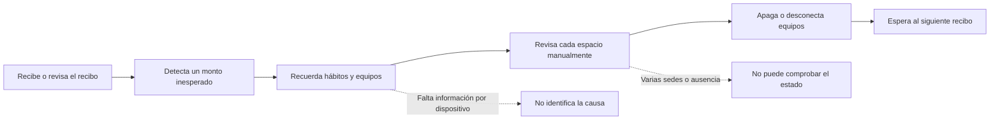
```mermaid
flowchart LR
    A[Recibe o revisa el recibo] --> B[Detecta un monto inesperado]
    B --> C[Recuerda hábitos y equipos]
    C --> D[Revisa cada espacio manualmente]
    D --> E[Apaga o desconecta equipos]
    E --> F[Espera al siguiente recibo]
    C -. Falta información por dispositivo .-> G[No identifica la causa]
    D -. Varias sedes o ausencia .-> H[No puede comprobar el estado]
```

Los principales puntos de dolor son la información tardía, la inspección manual y la ausencia de una relación directa entre consumo, espacio y acción.

## 2.4 Ubiquitous Language

| Término | Definición compartida |
|:--|:--|
| User | Persona autenticada que utiliza EnergyCore. |
| Access Profile | Conjunto de permisos asignado a un User. |
| Location | Sede física administrada por el usuario. |
| Room | Espacio perteneciente a una Location. |
| Device | Equipo energético registrable y controlable. |
| Device Assignment | Relación operativa entre un Device y un Room o Location. |
| Device Group | Conjunto de Devices operados como unidad. |
| Routine | Secuencia programada de acciones sobre un alcance. |
| Operation Mode | Configuración coordinada de rutinas, horarios, metas y alertas. |
| Energy Reading | Medición de potencia o consumo asociada a un dispositivo y momento. |
| Alert Rule | Condición que determina cuándo generar una alerta. |
| Energy Goal | Objetivo de consumo con valor y fecha límite. |
| Consumption Report | Resumen de lecturas dentro de un periodo. |
| Subscription | Relación vigente entre User y Plan. |
| Support Ticket | Solicitud de ayuda reportada por el usuario. |

# Capítulo III Requirements Specification

## 3.1 To Be Scenario Mapping

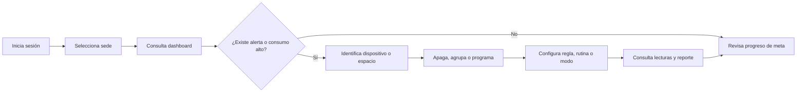
```mermaid
flowchart LR
    A[Inicia sesión] --> B[Selecciona sede]
    B --> C[Consulta dashboard]
    C --> D{¿Existe alerta o consumo alto?}
    D -- No --> E[Revisa progreso de meta]
    D -- Sí --> F[Identifica dispositivo o espacio]
    F --> G[Apaga, agrupa o programa]
    G --> H[Configura regla, rutina o modo]
    H --> I[Consulta lecturas y reporte]
    I --> E
```

El escenario futuro reduce la distancia entre observación y acción: la misma plataforma presenta la señal, el contexto y los controles disponibles.

## 3.2 User Stories

| ID | User Story | Acceptance Criteria |
|:--|:--|:--|
| US-01 | Como visitante, quiero conocer la propuesta y los planes para decidir si ingreso. | Given que visita la Landing Page, when recorre sus secciones, then visualiza propuesta, capacidades, planes y un CTA al login. |
| US-02 | Como usuario, quiero registrarme e iniciar sesión para acceder a mi cuenta. | Given datos válidos, when confirma el formulario, then el sistema crea o autentica la cuenta y establece una sesión JWT. |
| US-03 | Como usuario, quiero recuperar mi contraseña para restablecer el acceso. | Given un correo registrado, when solicita recuperación, then el sistema genera un token temporal y permite definir una nueva contraseña. |
| US-04 | Como usuario, quiero crear sedes y habitaciones para representar mis espacios. | Given una sesión autorizada, when registra los datos válidos, then la sede o habitación aparece en su contexto activo. |
| US-05 | Como usuario, quiero vincular y nombrar dispositivos para reconocerlos. | Given un identificador válido, when completa la vinculación, then el dispositivo queda disponible para asignación y control. |
| US-06 | Como usuario, quiero encender o apagar dispositivos remotamente. | Given un dispositivo disponible, when cambia su estado, then la plataforma registra y muestra el nuevo estado. |
| US-07 | Como usuario, quiero agrupar dispositivos para operarlos juntos. | Given varios dispositivos, when crea un grupo y ejecuta una acción, then la operación se aplica al alcance definido. |
| US-08 | Como usuario, quiero programar rutinas para automatizar acciones repetitivas. | Given un alcance y horario válidos, when activa la rutina, then queda programada y puede ejecutarse o desactivarse. |
| US-09 | Como usuario, quiero usar modos de operación para coordinar mi espacio. | Given rutinas y reglas compatibles, when activa un modo, then el sistema presenta el impacto previsto y aplica la configuración. |
| US-10 | Como usuario, quiero ver consumo actual e histórico para detectar variaciones. | Given lecturas registradas, when abre el dashboard o filtra fechas, then visualiza métricas y series correspondientes. |
| US-11 | Como usuario, quiero recibir alertas configurables para atender situaciones importantes. | Given una regla cumplida, when se evalúa, then se genera una alerta respetando preferencias y horario silencioso. |
| US-12 | Como usuario, quiero crear metas y reportes para seguir mi desempeño energético. | Given un objetivo o periodo válido, when confirma la operación, then el sistema almacena y presenta el progreso o reporte. |
| US-13 | Como administrador, quiero asignar perfiles para limitar acciones sensibles. | Given un usuario y perfil autorizados, when realiza la asignación, then las rutas y operaciones respetan los permisos. |
| US-14 | Como usuario, quiero seleccionar idioma y tema para adaptar la experiencia. | Given una preferencia disponible, when la selecciona, then web y móvil aplican y conservan su configuración. |
| US-15 | Como usuario, quiero registrar soporte o mantenimiento para gestionar incidencias. | Given una descripción válida, when crea el ticket, then puede consultar su estado y evolución. |
| US-16 | Como usuario, quiero comparar y contratar planes para ampliar límites. | Given un plan disponible, when completa el checkout académico, then se registra el pago y la suscripción correspondiente. |

Las historias representan el incremento implementado. La redacción y prioridad deberán revisarse después de las entrevistas.

## 3.3 Product Backlog

| Orden | ID | Título | Prioridad | Story Points | Estado AV1 |
|--:|:--|:--|:--:|--:|:--|
| 1 | US-02 | Registro, login y recuperación | Must | 8 | Implementado |
| 2 | US-04 | Sedes y habitaciones | Must | 8 | Implementado |
| 3 | US-05 | Vinculación de dispositivos | Must | 8 | Implementado |
| 4 | US-06 | Control remoto | Must | 5 | Implementado |
| 5 | US-10 | Dashboard e histórico energético | Must | 8 | Implementado |
| 6 | US-07 | Grupos de dispositivos | Should | 5 | Implementado |
| 7 | US-08 | Rutinas | Should | 8 | Implementado |
| 8 | US-11 | Alertas y preferencias | Should | 8 | Implementado |
| 9 | US-12 | Metas y reportes | Should | 8 | Implementado |
| 10 | US-09 | Modos de operación | Could | 8 | Implementado |
| 11 | US-15 | Soporte y mantenimiento | Could | 5 | Implementado |
| 12 | US-16 | Planes y suscripción | Could | 8 | Implementado como flujo académico |
| 13 | US-13 | Perfiles y permisos | Should | 5 | Implementado |
| 14 | US-14 | Tema e idiomas | Should | 5 | Implementado |
| 15 | US-01 | Landing Page y CTA | Must | 5 | Implementado |

Total referencial del incremento AV1: **102 Story Points**. Los puntos expresan complejidad relativa del equipo, no horas.

## 3.4 Impact Mapping

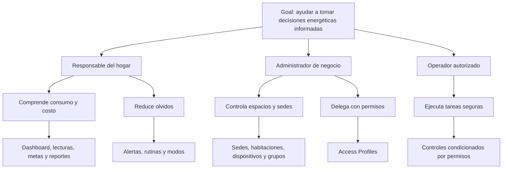
```mermaid
flowchart TB
    G[Goal: ayudar a tomar decisiones energéticas informadas]
    G --> H[Responsable del hogar]
    G --> N[Administrador de negocio]
    G --> O[Operador autorizado]
    H --> H1[Comprende consumo y costo]
    H --> H2[Reduce olvidos]
    N --> N1[Controla espacios y sedes]
    N --> N2[Delega con permisos]
    O --> O1[Ejecuta tareas seguras]
    H1 --> F1[Dashboard, lecturas, metas y reportes]
    H2 --> F2[Alertas, rutinas y modos]
    N1 --> F3[Sedes, habitaciones, dispositivos y grupos]
    N2 --> F4[Access Profiles]
    O1 --> F5[Controles condicionados por permisos]
```

# Capítulo IV Product Design

## 4.1 Style Guidelines

### 4.1.1 General Style Guidelines

EnergyCore utiliza una identidad tecnológica y calmada. El verde es el color principal para acciones, estados activos y señales de energía; los fondos se construyen con grafito y superficies neutras, y el ámbar se reserva para ahorro, recomendaciones o advertencias. La marca se representa mediante un rayo dentro de una celda redondeada y una mascota robótica propia.

| Rol | Token de referencia | Uso |
|:--|:--|:--|
| Primary | `#22C55E` | CTA, selección, foco y energía |
| Primary strong | `#15803D` / `#166534` | Estados presionados y modo claro |
| Secondary | `#F59E0B` | Ahorro y advertencias |
| Dark background | `#080D09` / `#0A0F0B` | Fondos inmersivos |
| Dark surface | `#121A14` | Tarjetas y navegación |
| Light background | `#F3F6F2` | Tema claro móvil |
| Primary text | `#F4F7F5` o `#17211A` | Contraste según tema |

Los controles táctiles mantienen al menos 44 px, el foco es visible, el contenido conserva contraste WCAG AA y las animaciones respetan `prefers-reduced-motion` cuando el canal lo permite.

### 4.1.2 Web Style Guidelines

La Landing Page usa Space Grotesk en títulos y Manrope en contenido; organiza la página sobre una grilla de hasta 1200 px, tarjetas de 20 a 24 px de radio y un hero asimétrico. La Web Application emplea componentes Angular reutilizables, navegación lateral adaptable, encabezado, tarjetas, tablas, formularios, diálogos de confirmación y Lucide Angular como biblioteca de iconos.

Los breakpoints priorizan 375 px, 768 px, 1024 px y 1440 px. En pantallas pequeñas la navegación colapsa, las columnas se apilan y no se admite desplazamiento horizontal accidental. Los estados hover no desplazan el layout y las transiciones se mantienen entre 150 y 300 ms.

### 4.1.3 Mobile Style Guidelines

#### 4.1.3.1 iOS Mobile Style Guidelines

EnergyCore utiliza una sola aplicación Flutter para Android e iOS, con jerarquía, espaciado, navegación adaptable y temas compartidos. El proyecto incluye el destino Xcode y almacenamiento de sesión mediante Keychain para iOS. Se verificó la apertura de autenticación a 393 × 852 con la plataforma iOS en una prueba de widgets; no constituye una captura ni ejecución en iPhone. La compilación y ejecución iOS requieren macOS/Xcode y permanecen no verificadas.

#### 4.1.3.2 Android Mobile Style Guidelines

La aplicación Android sigue Material Design mediante Flutter. Utiliza verde `#22C55E`, ámbar `#F59E0B`, fondos oscuros `#0A0F0B` y superficies `#121A14`, además de un tema claro. La navegación cambia entre `NavigationBar` para teléfonos y `NavigationRail` para tabletas. Los formularios presentan etiquetas, validación, retorno visible al login y mensajes persistentes con acción **Reintentar** cuando la API no está disponible.

## 4.2 Information Architecture

### 4.2.1 Organization Systems

La información se organiza principalmente por tarea y por bounded context. La Landing Page sigue una secuencia narrativa; las aplicaciones autenticadas agrupan Inicio, Energía, Espacios, Dispositivos, Automatización, Alertas, Reportes, Servicio, Facturación y Cuenta. Dentro de cada módulo se aplica una organización jerárquica de lista, detalle y operación.

### 4.2.2 Labeling Systems

Las etiquetas utilizan sustantivos concretos del Ubiquitous Language: **Sedes**, **Habitaciones**, **Dispositivos**, **Grupos**, **Rutinas**, **Modos**, **Lecturas**, **Alertas**, **Metas**, **Reportes**, **Soporte** y **Planes**. Las acciones usan verbos directos: crear, editar, vincular, mover, activar, archivar, exportar, cancelar y reintentar.

### 4.2.3 SEO Tags and Meta Tags

La Landing Page define título, descripción, viewport, color de tema, Open Graph, Twitter Card, canonical URL e icono propio. La propuesta de metadatos es:

| Etiqueta | Contenido |
|:--|:--|
| Title | EnergyCore - Smart energy management |
| Description | Monitor, understand and control energy across devices and spaces with EnergyCore. |
| Keywords | energy management, smart devices, energy monitoring, routines, alerts |
| Language | Inglés predeterminado con versión española disponible |

Antes del despliegue público se debe reemplazar el canonical temporal por el dominio definitivo y comprobar la imagen social.

### 4.2.4 Searching Systems

La Landing Page permite localizar secciones mediante navegación por anclas. En las aplicaciones, las listas aplican filtros por texto, estado, prioridad, fecha o alcance según el contexto. La búsqueda de direcciones para sedes se encapsula en infraestructura mediante OpenStreetMap/Nominatim y entrega sugerencias normalizadas a la capa de aplicación.

### 4.2.5 Navigation Systems

La Landing Page utiliza navegación global por secciones y CTA persistente hacia el login. La Web Application emplea Angular Router con guards de autenticación, suscripción y permisos. Flutter presenta un shell adaptativo con navegación inferior o lateral. En ambos clientes, cerrar sesión regresa al flujo de autenticación y las pantallas de registro y recuperación ofrecen retorno explícito al login.

## 4.3 Landing Page UI Design

### 4.3.1 Landing Page Wireframe

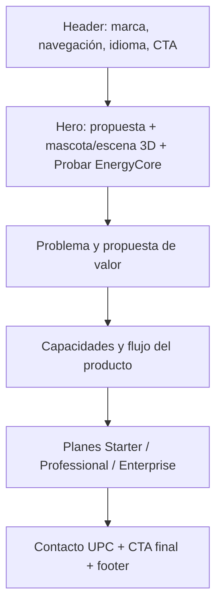
```mermaid
flowchart TB
    N[Header: marca, navegación, idioma, CTA]
    H[Hero: propuesta + mascota/escena 3D + Probar EnergyCore]
    P[Problema y propuesta de valor]
    C[Capacidades y flujo del producto]
    R[Planes Starter / Professional / Enterprise]
    F[Contacto UPC + CTA final + footer]
    N --> H --> P --> C --> R --> F
```

El wireframe privilegia un recorrido único y comprensible, con CTA al inicio de sesión en los puntos de decisión.

<p align="center">
  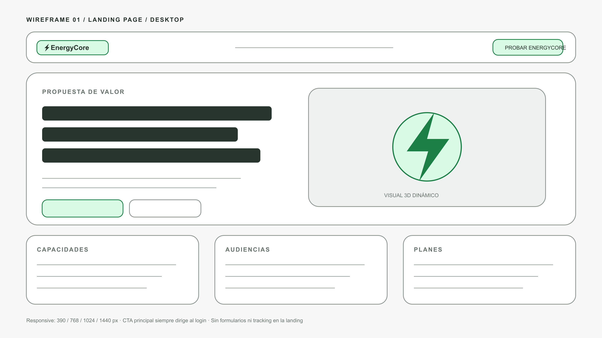
</p>

### 4.3.2 Landing Page Mockup

El mockup fue materializado directamente en `energycore-website`: tema oscuro grafito y esmeralda, hero con imagen 3D, mascota EnergyCore, iluminación dinámica, tarjetas de capacidades, planes vigentes y diseño responsivo. La evidencia ejecutable se encuentra en [energycore-website](https://github.com/teralume/energycore-website).

<p align="center">
  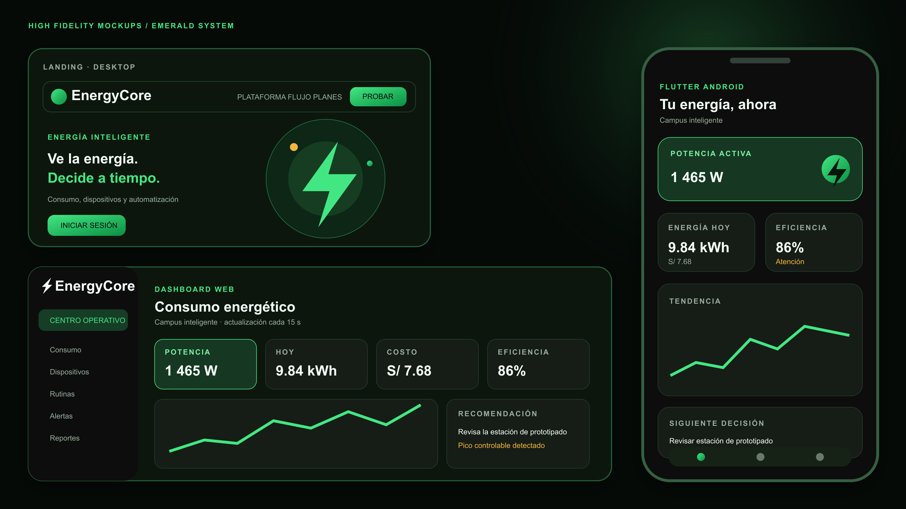
</p>

## 4.4 Mobile Applications UX UI Design

### 4.4.1 Mobile Applications Wireframes

| Pantalla | Estructura de baja fidelidad |
|:--|:--|
| Autenticación | Marca → credenciales → acción principal → recuperación/registro |
| Inicio | Saludo → consumo actual → resumen de sedes/dispositivos → alertas → accesos rápidos |
| Energía | KPIs → tendencia → filtros → lecturas → reportes/metas |
| Control | Selector de pestaña → lista de dispositivos/grupos/rutinas/modos → acción contextual |
| Espacios | Sedes → habitaciones → asignaciones |
| Cuenta | Perfil → seguridad → permisos → tema/idioma → cierre de sesión |

<p align="center">
  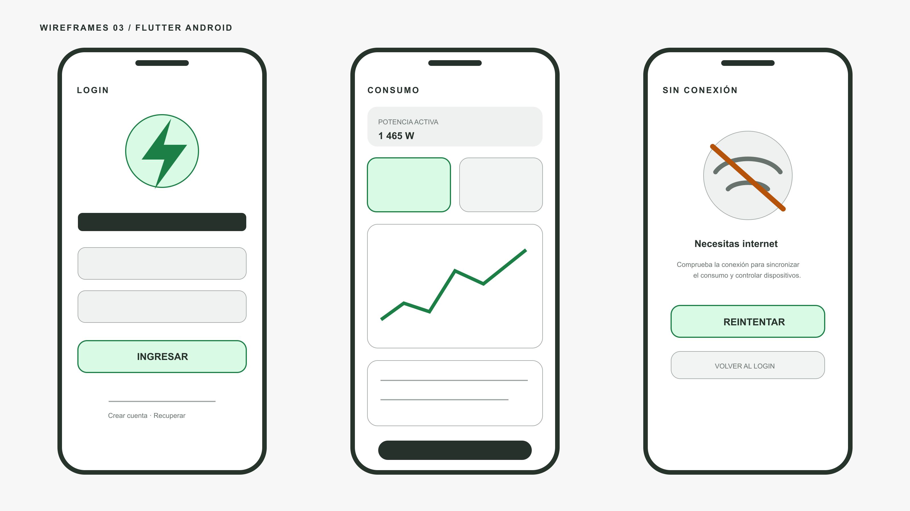
</p>

### 4.4.2 Mobile Applications Wireflow Diagrams

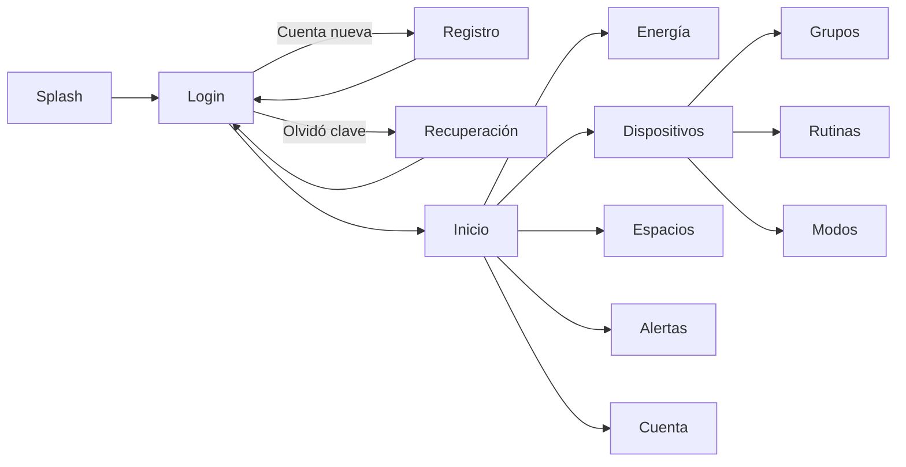
```mermaid
flowchart LR
    S[Splash] --> L[Login]
    L -->|Cuenta nueva| R[Registro]
    L -->|Olvidó clave| P[Recuperación]
    R --> L
    P --> L
    L --> H[Inicio]
    H --> E[Energía]
    H --> D[Dispositivos]
    H --> W[Espacios]
    H --> A[Alertas]
    H --> C[Cuenta]
    D --> G[Grupos]
    D --> U[Rutinas]
    D --> M[Modos]
```

<p align="center">
  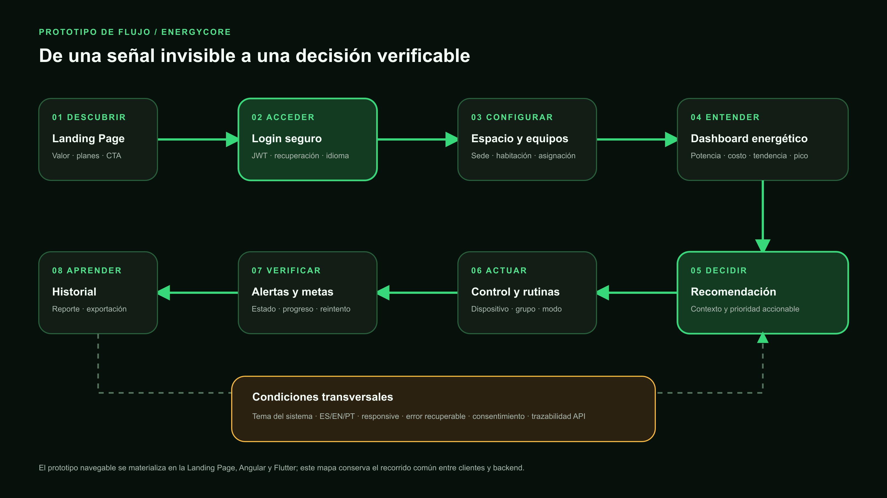
</p>

### 4.4.3 Mobile Applications Mockups

Los mockups implementados mantienen tarjetas oscuras, acento esmeralda, iconografía Material, estados vacíos, loaders, diálogos y formularios adaptativos. Incluyen autenticación, dashboard, energía, dispositivos, grupos, rutinas, modos, sedes, habitaciones, asignaciones, alertas, metas, reportes, soporte, mantenimiento, planes y cuenta. El inventario de paridad está documentado en `flutter/docs/web-parity.md` dentro del repositorio móvil.

<p align="center">
  
</p>

### 4.4.4 Mobile Applications User Flow Diagrams

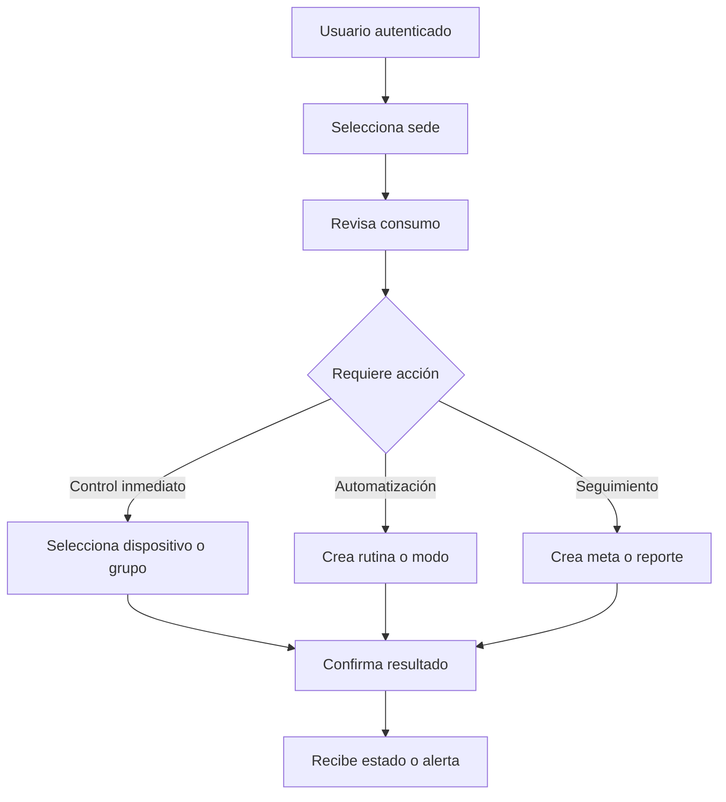
```mermaid
flowchart TD
    A[Usuario autenticado] --> B[Selecciona sede]
    B --> C[Revisa consumo]
    C --> D{Requiere acción}
    D -- Control inmediato --> E[Selecciona dispositivo o grupo]
    D -- Automatización --> F[Crea rutina o modo]
    D -- Seguimiento --> G[Crea meta o reporte]
    E --> H[Confirma resultado]
    F --> H
    G --> H
    H --> I[Recibe estado o alerta]
```

El flujo completo de autenticación, selección de sede, monitoreo, control y recuperación ante pérdida de conexión se resume en el siguiente prototipo navegacional:

<p align="center">
  
</p>

## 4.5 Mobile Applications Prototyping

### 4.5.1 Android Mobile Applications Prototyping

El prototipo funcional Android se encuentra en [energycore-mobile](https://github.com/teralume/energycore-mobile), subdirectorio `flutter`. Consume `http://10.0.2.2:8080/api/v1` desde el emulador, conserva el JWT mediante Android Keystore y AES-GCM, respeta tema de sistema y ofrece español, inglés y portugués.

Ejecución en Windows:

```powershell
subst M: "C:\JeanLoa\Universidad\Diseño de Experimentos de Ingeniería de Software\energycore-mobile\flutter"
Set-Location M:\
& "C:\JeanLoa\SDKs\flutter\bin\flutter.bat" run -d emulator-5554
```

### 4.5.2 iOS Mobile Applications Prototyping

La misma base Flutter incorpora ahora el proyecto `flutter/ios`, con nombre e iconos EnergyCore, integración de sesión JWT con iOS Keychain y la API pública HTTPS como destino predeterminado. Se reutilizan las pantallas y los bounded contexts de Android, sin desarrollar una aplicación iOS independiente. Las 11 pruebas Flutter pasan, incluida una prueba de autenticación con `TargetPlatform.iOS` y tamaño de iPhone. El documento `flutter/docs/ios-compatibility.md` del repositorio `energycore-mobile` describe la adaptación y la validación pendiente. **Estado: compatibilidad preparada en código; compilación, Keychain y ejecución real en iOS no verificadas por ausencia de macOS/Xcode.** No se presenta evidencia Android como ejecución iOS.

## 4.6 Web Applications UX UI Design

### 4.6.1 Web Applications Wireframes

| Área | Estructura de baja fidelidad |
|:--|:--|
| Shell | Sidebar → header → contexto activo → contenido |
| Dashboard | KPIs → gráfico de tendencia → alertas → resumen de dispositivos y metas |
| Gestión | Título y CTA → filtros → tabla/tarjetas → formulario modal → confirmación |
| Settings | Navegación secundaria → secciones de perfil, seguridad, accesos, facturación y apariencia |

<p align="center">
  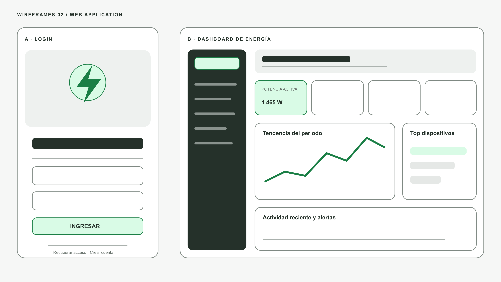
</p>

### 4.6.2 Web Applications Wireflow Diagrams

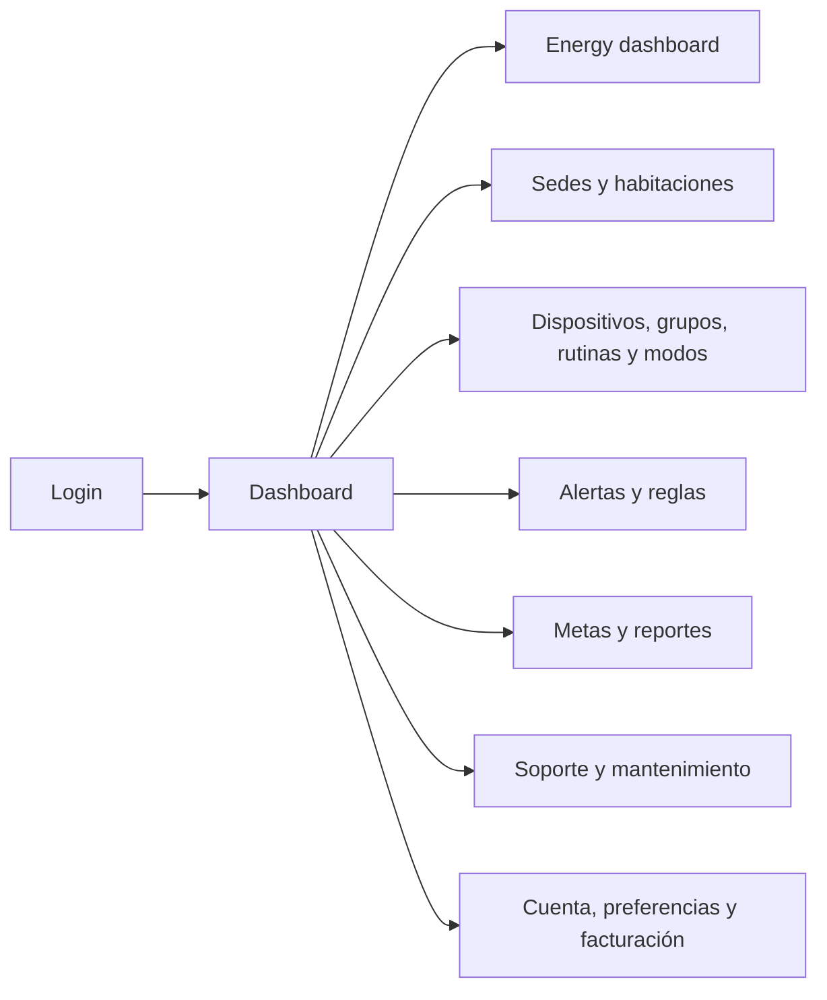
```mermaid
flowchart LR
    Login --> Dashboard
    Dashboard --> Energy[Energy dashboard]
    Dashboard --> Spaces[Sedes y habitaciones]
    Dashboard --> Control[Dispositivos, grupos, rutinas y modos]
    Dashboard --> Notifications[Alertas y reglas]
    Dashboard --> Reports[Metas y reportes]
    Dashboard --> Service[Soporte y mantenimiento]
    Dashboard --> Settings[Cuenta, preferencias y facturación]
```

### 4.6.3 Web Applications Mockups

La implementación Angular funciona como mockup de alta fidelidad y producto navegable. Usa componentes compartidos para botones, campos, selectores, fechas, tablas, tarjetas, diálogos y estados de error; Lucide Angular mantiene coherencia iconográfica. El dashboard y los contextos funcionales comparten tema, espaciado y patrones de operación.

<p align="center">
  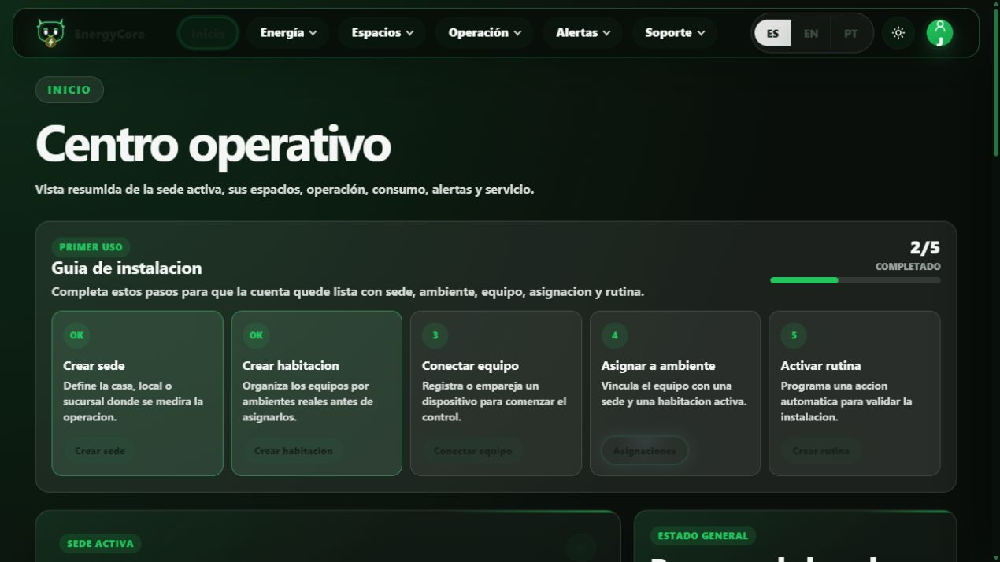
</p>

### 4.6.4 Web Applications User Flow Diagrams

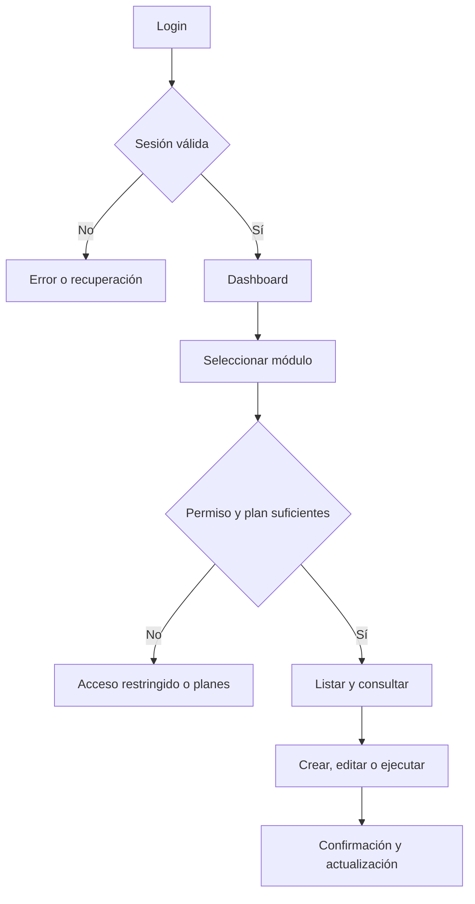
```mermaid
flowchart TD
    A[Login] --> B{Sesión válida}
    B -- No --> C[Error o recuperación]
    B -- Sí --> D[Dashboard]
    D --> E[Seleccionar módulo]
    E --> F{Permiso y plan suficientes}
    F -- No --> G[Acceso restringido o planes]
    F -- Sí --> H[Listar y consultar]
    H --> I[Crear, editar o ejecutar]
    I --> J[Confirmación y actualización]
```

## 4.7 Web Applications Prototyping

El prototipo funcional está implementado en Angular y disponible en [energycore-webapp](https://github.com/teralume/energycore-webapp). Se ejecuta con `npm install` y `npm start`, consume la API en el puerto 8080 y contiene guards para autenticación, permisos y suscripción. La compilación de producción fue ejecutada correctamente; conserva advertencias no bloqueantes sobre presupuestos de tamaño SCSS.

## 4.8 Domain Driven Software Architecture

### 4.8.1 Software Architecture Context Diagram

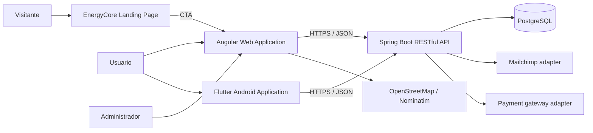
```mermaid
flowchart LR
    Visitor[Visitante] --> Landing[EnergyCore Landing Page]
    User[Usuario] --> Web[Angular Web Application]
    User --> Mobile[Flutter Android Application]
    Admin[Administrador] --> Web
    Landing -->|CTA| Web
    Web -->|HTTPS / JSON| API[Spring Boot RESTful API]
    Mobile -->|HTTPS / JSON| API
    API --> DB[(PostgreSQL)]
    API --> Mail[Mailchimp adapter]
    API --> Pay[Payment gateway adapter]
    Web --> Geo[OpenStreetMap / Nominatim]
```

### 4.8.2 Software Architecture Container Diagrams

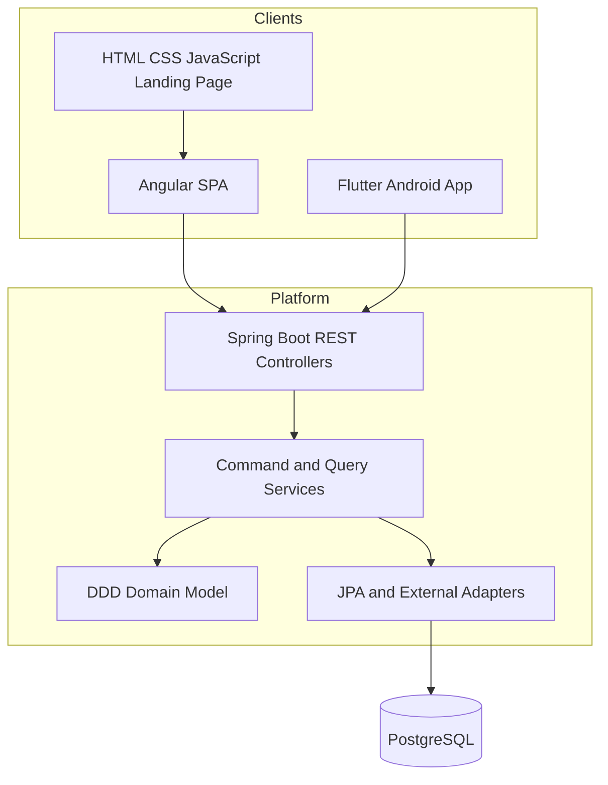
```mermaid
flowchart TB
    subgraph Clients
      LP[HTML CSS JavaScript Landing Page]
      WA[Angular SPA]
      MA[Flutter Android App]
    end
    subgraph Platform
      REST[Spring Boot REST Controllers]
      APP[Command and Query Services]
      DOM[DDD Domain Model]
      INF[JPA and External Adapters]
    end
    DB[(PostgreSQL)]
    WA --> REST
    MA --> REST
    REST --> APP --> DOM
    APP --> INF --> DB
    LP --> WA
```

Los clientes no mantienen bases de datos de producto separadas. La persistencia y las reglas compartidas permanecen en `energycore-platform`.

### 4.8.3 Software Architecture Components Diagrams

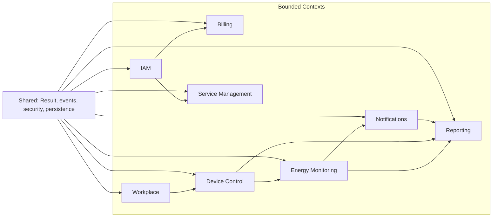
```mermaid
flowchart LR
    subgraph Bounded Contexts
      IAM[IAM]
      Billing[Billing]
      Workplace[Workplace]
      Device[Device Control]
      Energy[Energy Monitoring]
      Notifications[Notifications]
      Reporting[Reporting]
      Service[Service Management]
    end
    IAM --> Billing
    Workplace --> Device
    Device --> Energy
    Energy --> Notifications
    Energy --> Reporting
    Device --> Reporting
    Notifications --> Reporting
    IAM --> Service
    Shared[Shared: Result, events, security, persistence] --> IAM
    Shared --> Billing
    Shared --> Workplace
    Shared --> Device
    Shared --> Energy
    Shared --> Notifications
    Shared --> Reporting
    Shared --> Service
```

Cada bounded context del backend separa `domain`, `application`, `infrastructure` e `interfaces`; Angular y Flutter aplican equivalentes de `domain`, `application`, `infrastructure` y `presentation`.

## 4.9 Software Object Oriented Design

### 4.9.1 Class Diagrams

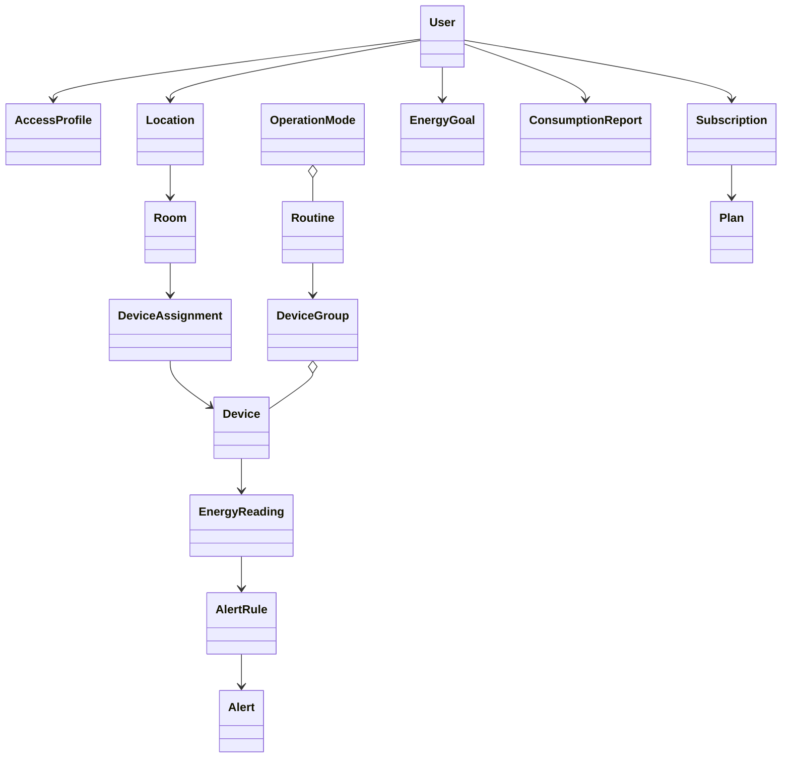
```mermaid
classDiagram
    class User
    class AccessProfile
    class Location
    class Room
    class DeviceAssignment
    class Device
    class DeviceGroup
    class Routine
    class OperationMode
    class EnergyReading
    class AlertRule
    class Alert
    class EnergyGoal
    class ConsumptionReport
    class Plan
    class Subscription
    User --> AccessProfile
    User --> Location
    Location --> Room
    Room --> DeviceAssignment
    DeviceAssignment --> Device
    DeviceGroup o-- Device
    Routine --> DeviceGroup
    OperationMode o-- Routine
    Device --> EnergyReading
    EnergyReading --> AlertRule
    AlertRule --> Alert
    User --> EnergyGoal
    User --> ConsumptionReport
    User --> Subscription
    Subscription --> Plan
```

El diagrama resume relaciones de dominio; las asociaciones físicas exactas se detallan mediante entidades JPA y repositorios de cada bounded context.

### 4.9.2 Class Dictionary

| Clase | Contexto | Responsabilidad |
|:--|:--|:--|
| User | IAM | Identidad, estado y datos de cuenta. |
| AccessProfile | IAM | Perfil y permisos de acceso. |
| Location / Room | Workplace | Jerarquía física de sedes y espacios. |
| DeviceAssignment | Workplace | Ubicación operativa de un dispositivo. |
| Device | Device Control | Estado, identidad y capacidades controlables. |
| DeviceGroup | Device Control | Operación conjunta de dispositivos. |
| Routine | Device Control | Automatización programada sobre un alcance. |
| OperationMode | Device Control | Coordinación de automatizaciones y objetivos. |
| EnergyReading | Energy Monitoring | Lectura energética fechada. |
| AlertRule / Alert | Notifications | Condición evaluable y evento notificado. |
| EnergyGoal | Reporting | Objetivo de consumo y progreso. |
| ConsumptionReport | Reporting | Resumen exportable de un periodo. |
| Plan / Subscription | Billing | Oferta y acceso contratado por el usuario. |
| SupportTicket / MaintenanceTicket | Service Management | Solicitud de soporte o mantenimiento. |

## 4.10 Database Design

### 4.10.1 Relational Non Relational Database Diagram

EnergyCore utiliza PostgreSQL. No mantiene una base NoSQL en el alcance actual.

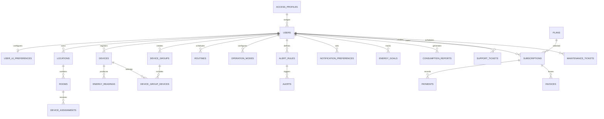
```mermaid
erDiagram
    ACCESS_PROFILES ||--o{ USERS : assigns
    USERS ||--o| USER_UI_PREFERENCES : configures
    USERS ||--o{ LOCATIONS : owns
    LOCATIONS ||--o{ ROOMS : contains
    ROOMS ||--o{ DEVICE_ASSIGNMENTS : receives
    USERS ||--o{ DEVICES : registers
    DEVICES ||--o{ ENERGY_READINGS : produces
    USERS ||--o{ DEVICE_GROUPS : creates
    DEVICE_GROUPS ||--o{ DEVICE_GROUP_DEVICES : includes
    DEVICES ||--o{ DEVICE_GROUP_DEVICES : belongs
    USERS ||--o{ ROUTINES : schedules
    USERS ||--o{ OPERATION_MODES : configures
    USERS ||--o{ ALERT_RULES : defines
    ALERT_RULES ||--o{ ALERTS : triggers
    USERS ||--o{ NOTIFICATION_PREFERENCES : sets
    USERS ||--o{ ENERGY_GOALS : tracks
    USERS ||--o{ CONSUMPTION_REPORTS : generates
    PLANS ||--o{ SUBSCRIPTIONS : selected
    USERS ||--o{ SUBSCRIPTIONS : owns
    SUBSCRIPTIONS ||--o{ PAYMENTS : records
    SUBSCRIPTIONS ||--o{ INVOICES : issues
    USERS ||--o{ SUPPORT_TICKETS : creates
    USERS ||--o{ MAINTENANCE_TICKETS : schedules
```

# Capítulo V Product Implementation

## 5.1 Software Configuration Management

### 5.1.1 Software Development Environment Configuration

| Producto | Tecnologías | Herramientas principales |
|:--|:--|:--|
| Landing Page | HTML5, CSS3, JavaScript | Navegador, VS Code/Codex, Node.js para validación sintáctica |
| Web Application | Angular 21, TypeScript 5.9, RxJS, SCSS | Node.js, npm, Angular CLI, Lucide Angular |
| Native Mobile Application | Flutter 3.44.8, Dart 3.12.2 | Android Studio, Android SDK, emulador Pixel 7 |
| RESTful API | Java, Spring Boot, Spring Security, Spring Data JPA | JDK, Maven Wrapper, Swagger UI |
| Database | PostgreSQL | Variables `DATABASE_URL`, `DATABASE_USER`, `DATABASE_PASSWORD` |
| Control de versiones | Git y GitHub | Organización pública `teralume` |

Los secretos y archivos locales no se incorporan a Git. La configuración productiva depende de variables de entorno.

### 5.1.2 Source Code Management

El producto se divide en cinco repositorios públicos independientes:

- [energycore-report](https://github.com/teralume/energycore-report)
- [energycore-platform](https://github.com/teralume/energycore-platform)
- [energycore-webapp](https://github.com/teralume/energycore-webapp)
- [energycore-mobile](https://github.com/teralume/energycore-mobile)
- [energycore-website](https://github.com/teralume/energycore-website)

Se emplean conventional commits (`feat`, `test`, `docs`, `chore`) y la rama estable `main`. Para continuar con GitFlow se crearán ramas `develop` y `feature/*` en los incrementos siguientes; el historial inicial conserva la fecha real de incorporación y no simula aportes anteriores.

### 5.1.3 Source Code Style Guide and Conventions

| Área | Convenciones |
|:--|:--|
| Java | Paquetes en minúsculas; clases PascalCase; métodos camelCase; controllers delgados; commands y queries separados. |
| Angular | Componentes y archivos kebab-case; TypeScript estricto; HTTP encapsulado en infrastructure; estado y casos de uso en application. |
| Flutter | `dart format`; archivos snake_case; widgets PascalCase; repositorios como contratos de domain; controladores en application. |
| REST | Recursos JSON; rutas plurales bajo `/api/v1`; códigos HTTP coherentes; errores centralizados. |
| Git | Conventional commits en imperativo; cambios acotados por producto. |
| Documentación | Markdown con cuatro niveles de navegación, términos técnicos correctos y evidencias verificables. |

### 5.1.4 Software Deployment Configuration

La configuración actual permite ejecución local integrada. La API usa el puerto 8080; Angular consume `/api/v1`; Flutter usa `10.0.2.2:8080` desde el emulador; y la Landing Page enlaza al login de la Web Application. El perfil `prod` del backend acepta puerto, datasource y credenciales mediante variables de entorno.

**Estado de AV1:** el despliegue local está preparado y los repositorios contienen la configuración necesaria. No se declara todavía una URL pública de producción porque no existe evidencia de despliegue remoto aprobada.

## 5.2 Product Implementation and Deployment

### 5.2.1 Sprint Backlogs

| Sprint | Objetivo | Entregables | Evidencia local |
|:--|:--|:--|:--|
| Sprint 1 | Crear la base integrada del producto | Repositorios, backend DDD, Angular y Landing Page | Commits de inicialización y producto |
| Sprint 2 | Completar la experiencia móvil y la paridad funcional | Flutter Android, autenticación, shell, contextos y conectividad | Commits `1fe1a80`, `24cf286`, `0f545f0` |
| Sprint 3 | Preparar AV1 y trazabilidad | Informe, verificación, diseño y documentación | Commits del Report y verificaciones registradas |

La asignación individual confirmada corresponde a Jean Franck Loa Rojas: organización de repositorios, rebranding, backend, Angular, Landing Page, Flutter y documentación. Los aportes de futuros integrantes se añadirán únicamente cuando existan commits verificables.

### 5.2.2 Implemented Landing Page Evidence

`energycore-website` contiene `index.html`, `styles.css`, `script.js`, mascota, marca SVG e imagen hero 3D. Implementa navegación responsiva, cambio ES/EN, animaciones con movimiento reducido, capacidades, planes Starter/Professional/Enterprise y CTA al login. `node --check script.js` fue ejecutado sin errores.

La Landing Page fue levantada localmente y recorrida en navegador sobre el artefacto actual. La captura siguiente evidencia el hero, la mascota, el recurso 3D, la navegación y el CTA dirigido al inicio de sesión. La publicación pública todavía debe verificarse después del despliegue.

<p align="center">
  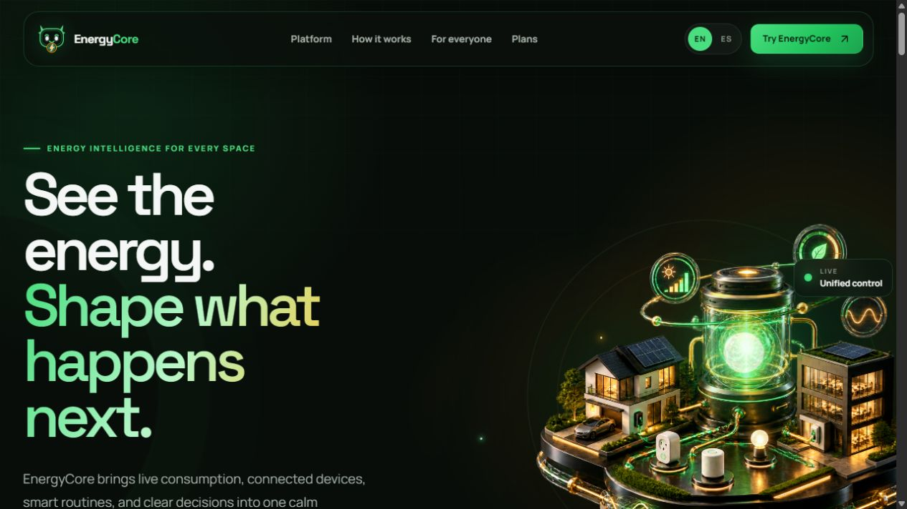
</p>

### 5.2.3 Implemented Frontend Web Application Evidence

`energycore-webapp` implementa autenticación, dashboard, energía, dispositivos, grupos, rutinas, modos, sedes, habitaciones, asignaciones, alertas, reglas, preferencias, metas, reportes, soporte, mantenimiento, planes y configuración de cuenta. Se organiza por bounded contexts con capas `domain`, `application`, `infrastructure` y `presentation`. `npm run build` concluyó correctamente, con advertencias no bloqueantes de presupuesto de estilos.

El 06/09/2026 se ejecutó el build existente de Angular contra el backend real Spring Boot y una base PostgreSQL 18.4 local aislada. Se comprobó inicio de sesión → centro operativo → consumo energético → dispositivos, con una cuenta, tres equipos y lecturas de demostración persistidas en PostgreSQL. No se interceptaron respuestas HTTP en estas nuevas capturas. Los datos no provienen de sensores físicos y esta ejecución no demuestra despliegue ni persistencia en Neon.

El rebuild de Angular en esta sesión quedó bloqueado por `spawn EPERM`; se documenta el hash del bundle usado, los commits y los límites de la prueba en la [auditoría de evidencias](presentation/evidence-audit-2026-09-06.md). El HTTP 500 de preferencias observado durante el primer acceso fue reproducido y corregido: se sincronizó la inicialización/actualización por usuario mediante un bloqueo transaccional en PostgreSQL. La [regresión de concurrencia](assets/evidence/implemented/preferences-concurrency-smoke.json) aprobó 24 GET iniciales simultáneos y 24 GET/PUT simultáneos, además de persistencia ES/EN/PT y aislamiento entre cuentas. En navegador se verificó login → inicio → cambio PT → ES con siete respuestas de preferencias HTTP 200 y ningún 500. Esta comprobación no equivale a un gate completo de todos los módulos.

<p align="center">
  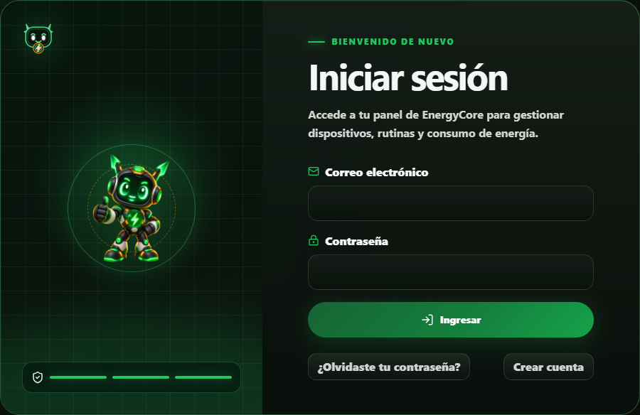
</p>

<p align="center">
  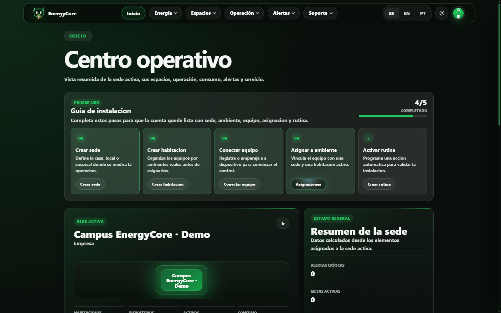
</p>

<p align="center">
  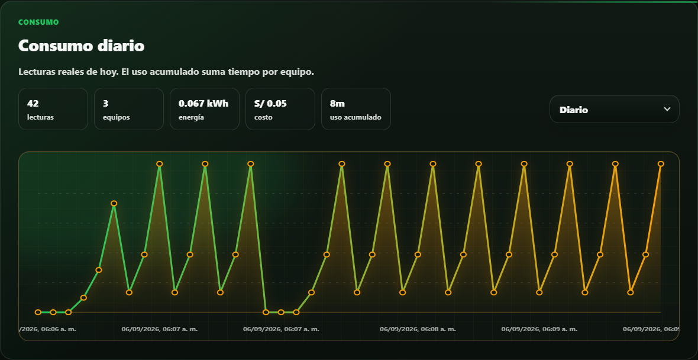
</p>

<p align="center">
  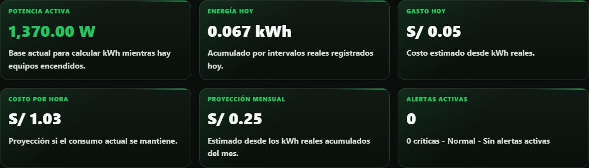
</p>

<p align="center">
  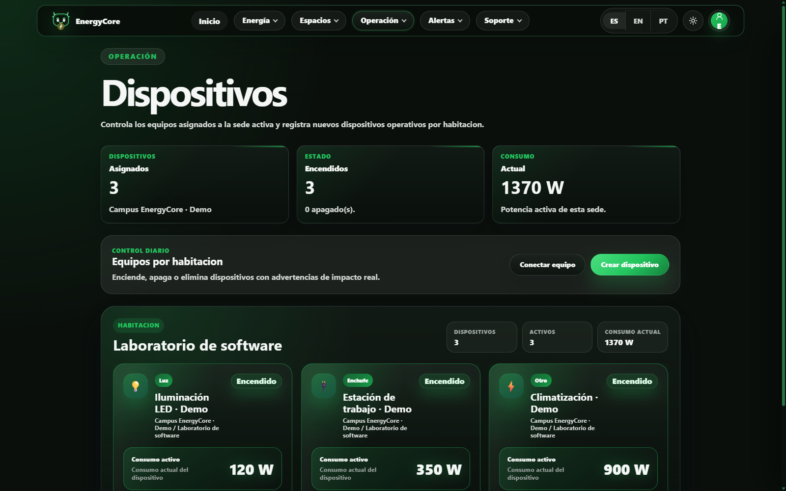
</p>

Las siguientes capturas de registro y recuperación corresponden a la revisión visual anterior con un servicio de demostración; se conservan como evidencia de interfaz, no de persistencia real.

<p align="center">
  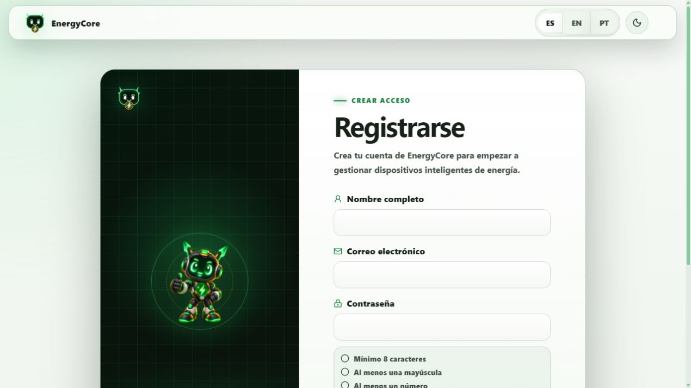
</p>

<p align="center">
  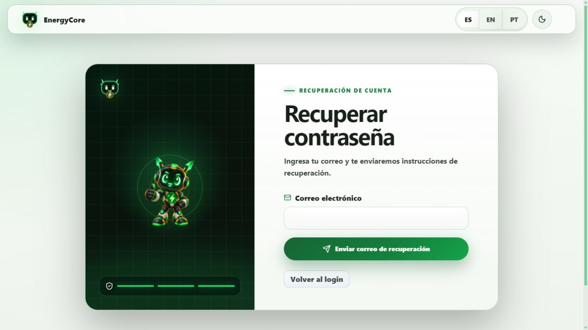
</p>

### 5.2.4 Acuerdo de Servicio SaaS

El presente acuerdo describe las condiciones objetivo del servicio académico EnergyCore. No constituye todavía un SLA comercial ni afirma un nivel de operación que no haya sido medido en producción.

| Aspecto | Compromiso de diseño |
|:--|:--|
| Alcance | Acceso a monitoreo energético, control de dispositivos, automatizaciones, alertas, metas, reportes, sedes, soporte y administración de cuenta según el plan seleccionado. |
| Disponibilidad | Objetivo mensual de 99 % una vez desplegado el servicio. El cálculo excluirá mantenimientos anunciados y dependerá de evidencia de monitoreo; mientras no exista esa evidencia, el porcentaje es una meta y no una garantía. |
| Mantenimiento | Ventana ordinaria propuesta: domingos de 02:00 a 04:00, hora de Lima, comunicada con 24 horas de anticipación. Los mantenimientos críticos de seguridad pueden ejecutarse fuera de la ventana. |
| Soporte | Registro de incidencias desde **Support Tickets**. Objetivos de primera respuesta: crítica, 4 horas; alta, 8 horas; media, 24 horas; baja, 48 horas hábiles. |
| Continuidad | Objetivos iniciales RTO de 8 horas y RPO de 24 horas. Deben validarse mediante una prueba de restauración antes de ofrecerse contractualmente. |
| Seguridad | Autenticación JWT, contraseñas con BCrypt, autorización por perfiles, secretos fuera del repositorio, HTTPS en despliegue y principio de mínimo privilegio. |
| Privacidad | Minimización de datos personales; las lecturas se asocian a la cuenta y sus espacios. No se recolectarán credenciales, JWT, direcciones completas ni datos de pago en la analítica experimental. |
| Portabilidad | Exportación de lecturas y reportes en CSV. La eliminación de cuenta debe revocar el acceso y activar el proceso de supresión aplicable. |
| Límites | La solución académica no reemplaza medidores certificados ni garantiza ahorro económico. La exactitud depende de la fuente de telemetría y de la conectividad de los dispositivos. |
| Responsabilidad del usuario | Mantener sus credenciales seguras, verificar el estado del equipo antes de operaciones sensibles y no utilizar EnergyCore como único mecanismo de protección eléctrica. |

Los planes **Starter**, **Professional** y **Enterprise** determinan límites funcionales, no niveles distintos de protección de datos. Cualquier cambio futuro en precios, límites o disponibilidad deberá publicarse antes de afectar una suscripción vigente.

### 5.2.5 Implemented Native Mobile Application Evidence

`energycore-mobile/flutter` implementa la experiencia Android con paridad respecto de los módulos web. Incluye sesión cifrada, tema claro/oscuro/sistema, español/inglés/portugués, navegación adaptable, aviso de desconexión y acción **Reintentar**. Después del ajuste de navegación de autenticación se ejecutaron en una terminal normal `dart analyze`, con resultado **No issues found**, y `flutter test`, con resultado **All tests passed**.

**Evidencia visual verificada el 06/09/2026:** Flutter ejecutándose en Pixel_7 (`emulator-5554`, Android 17/API 37). Se recorrieron login → inicio → consumo → dispositivos con la cuenta local EnergyCore Demo. Las vistas autenticadas muestran 1370 W, 1.10 kWh y tres dispositivos de demostración, consumiendo la misma API Spring Boot y PostgreSQL que la web. No son mediciones físicas ni evidencia de despliegue público.

<p align="center">
  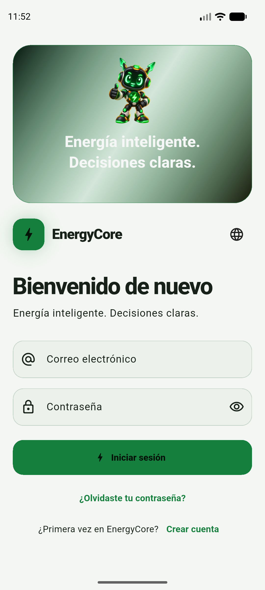
  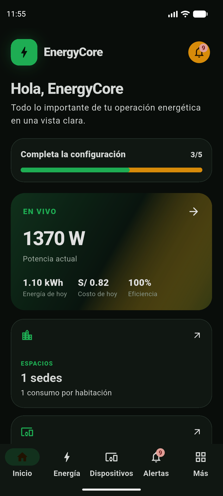
</p>
<p align="center">
  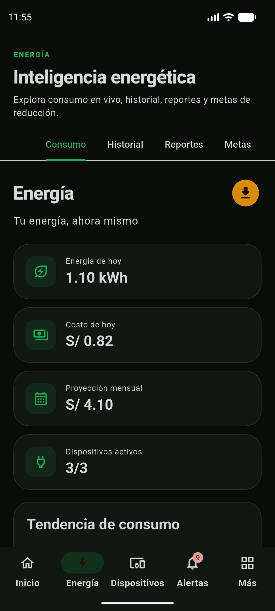
  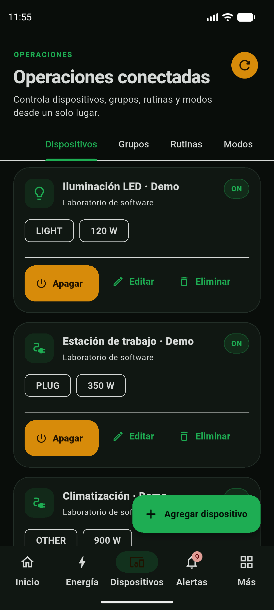
</p>

Captura adicional: [tendencia de consumo](assets/evidence/implemented/android-live-energy-20260906-065620.png). El SHA-256 del APK instalado coincide con el APK local; trazabilidad y limitaciones en la [auditoría de evidencias](presentation/evidence-audit-2026-09-06.md). Este recorrido no reemplaza las pruebas completas de todos los módulos.

**Corrección de potencia por habitación (06/09/2026):** el backend sumaba watts de muestras sucesivas. Ahora devuelve potencia actual estimada de los equipos encendidos, consistente con el total del dashboard: **120 + 350 + 900 = 1370 W**. Los kWh y costos conservan su acumulación temporal. Cinco pruebas JUnit específicas y la comprobación contra la API local aprobaron; se confirmó el resultado visible en Android después de recargar la aplicación. No fue necesario cambiar ni reinstalar Flutter.

<p align="center">
  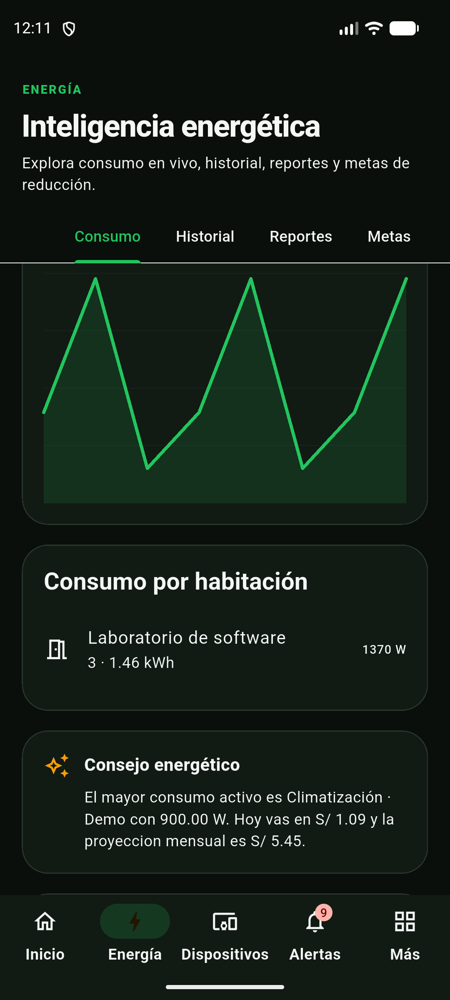
</p>

Resultado de la API: [`energy-power-smoke.json`](assets/evidence/implemented/energy-power-smoke.json). Las capturas anteriores se conservan como historial; los kWh aumentaron entre tomas por el muestreo de demostración.

### 5.2.6 Implemented RESTful API and Serverless Backend Evidence

`energycore-platform` implementa una RESTful API Spring Boot organizada en IAM, Billing, Workplace, Device Control, Energy Monitoring, Notifications, Reporting y Service Management. Emplea JWT, BCrypt, JPA/PostgreSQL, eventos de integración, servicios de dominio, command/query services, recursos y assemblers. Incluye suites unitarias, de integración y escenarios Cucumber.

**Estado de verificación:** el último reporte Surefire disponible registra 83 casos descubiertos, sin fallos ni errores: 23 pruebas JUnit ejecutadas y 60 escenarios Cucumber, de los cuales 17 se ejecutaron y 43 se omitieron por el filtro temporal del runner. El gate BDD continúa parcial hasta implementar los steps restantes y ejecutar los 60 escenarios.

### 5.2.7 RESTful API Documentation

Con la API activa, OpenAPI se publica en `http://localhost:8080/swagger-ui.html` y el documento JSON en `/v3/api-docs`.

| Contexto | Rutas principales |
|:--|:--|
| IAM | `/api/v1/auth`, `/api/v1/users`, `/api/v1/access-profiles` |
| Billing | `/api/v1/billing/plans`, `/subscriptions`, `/payments`, `/invoices` |
| Workplace | `/api/v1/workplace/locations`, `/rooms`, `/device-assignments` |
| Device Control | `/api/v1/devices`, `/device-groups`, `/routines`, `/operation-modes` |
| Energy Monitoring | `/api/v1/energy-readings`, `/dashboard-summary`, `/sampling-settings` |
| Notifications | `/api/v1/alerts`, `/alert-rules`, `/notification-preferences` |
| Reporting | `/api/v1/reports`, `/energy-goals`, `/reporting/platform/summary` |
| Service Management | `/api/v1/support-tickets`, `/maintenance-tickets` |

La tabla anterior documenta el contrato por bounded context. El 06/09/2026 se ejecutó Spring Boot contra PostgreSQL 18.4 local y se verificó `/v3/api-docs` con HTTP 200: el [documento OpenAPI exportado](assets/evidence/implemented/openapi-live.json) contiene **100 operaciones** y coincide en cantidad con el [inventario de controladores](https://github.com/teralume/energycore-platform/blob/develop/docs/api-endpoints.md). Desde Swagger se ejecutó `GET /api/v1/health`, obteniendo HTTP 200 y `status: UP`. Esto acredita ejecución local; Neon y el despliegue público siguen pendientes de evidencia.

<p align="center">
  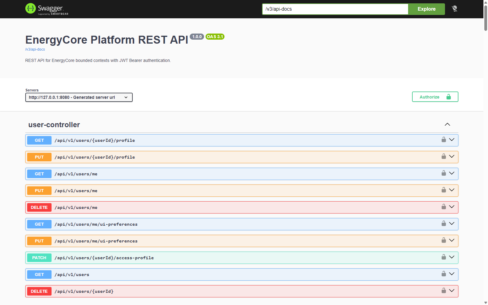
</p>

<p align="center">
  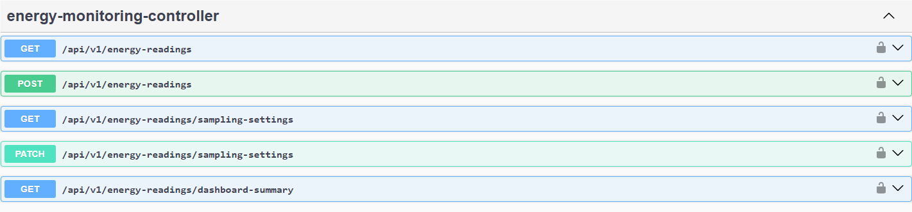
</p>

<p align="center">
  
</p>

### 5.2.8 Team Collaboration Insights

Antes de esta ampliación del informe se organizaron 13 commits locales distribuidos entre los cinco repositorios. El trabajo confirmado de Jean Franck Loa Rojas abarca configuración, migración de identidad, backend, Web Application, Landing Page, Native Mobile Application y reporte. Los árboles quedaron limpios al cerrar esa línea base; el cambio actual completa el desarrollo documental de los capítulos I al VIII, excepto las entrevistas y la evidencia externa o empírica que todavía no ha ocurrido.

Para AV1 se aplicó GitFlow sin reconstruir ni falsificar historia: cada repositorio conserva `main`, se creó `develop` y los cambios se desarrollaron en `feature/hito-1-evidence`, `feature/cloud-run-neon` y `feature/firebase-production`. Las ramas feature fueron integradas localmente a `develop` mediante merges `--no-ff` y Conventional Commits. `release/av1` se utiliza como candidato de publicación; `main` solo debe recibir el merge después de validar Cloud Run, Neon y Firebase en sus URLs públicas.

Las cinco bases de código y sus ramas `develop`/`release/av1` fueron publicadas en la organización de GitHub. La evidencia de ramas muestra los merges GitFlow y su distancia respecto de `main`. GitHub Insights calcula **Contributors** sobre la rama por defecto y excluye merges; por eso la captura todavía refleja los dos commits que ya estaban en `main`, mientras el trabajo AV1 permanece deliberadamente en `release/av1` hasta superar la verificación pública. No se atribuyen aportes a integrantes cuyos datos y commits todavía no han sido confirmados.

<p align="center">
  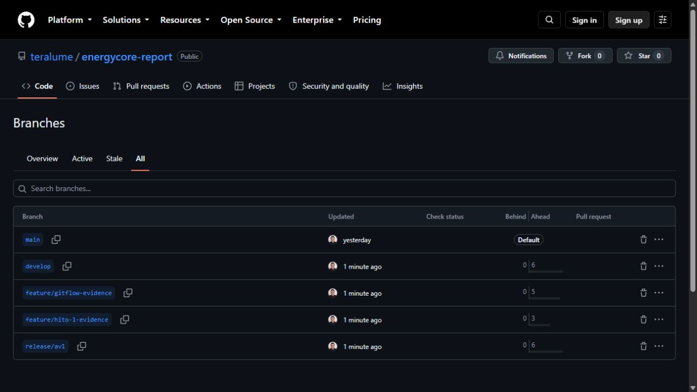
</p>

<p align="center">
  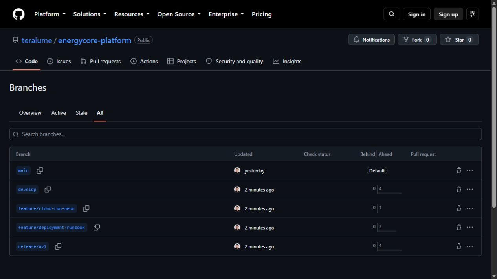
</p>

<p align="center">
  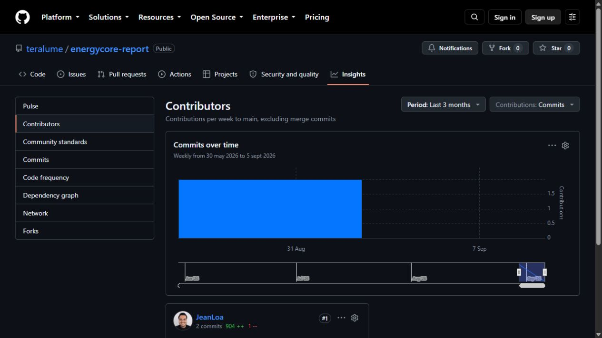
</p>

## 5.3 Video About the Product

**Bloqueo de evidencia AV1:** el enunciado exige un video de exposición y un Video About-the-Product, pero todavía no se ha proporcionado un enlace. El video debe mostrar la propuesta, el flujo Landing Page → login, la Web Application, la aplicación Android y la API, evitando afirmar despliegues o resultados de ahorro no demostrados.

Guion recomendado: problema y segmentos (45 s), propuesta de valor (45 s), demostración web (2 min), demostración móvil (2 min), arquitectura/API (1 min) y cierre con alcance y limitaciones (30 s).

# Part II Verification Validation and Pipeline

# Capítulo VI Product Verification and Validation

## 6.1 Testing Suites and Validation

La estrategia de pruebas sigue una pirámide: reglas de dominio en la base, integración HTTP y persistencia en el nivel intermedio, y recorridos de producto en la parte superior. Una prueba se considera evidencia únicamente si existe código ejecutable y un resultado registrado; los escenarios escritos sin step definitions se reportan como especificación, no como pruebas aprobadas.

### 6.1.1 Core Entities Unit Tests

El backend contiene **23 métodos JUnit** distribuidos entre servicios de dominio, servicios de aplicación, seguridad y manejadores de eventos. Las pruebas se concentran en reglas que pueden evaluarse sin interfaz de usuario.

| Área | Clases de prueba | Reglas cubiertas |
|:--|:--|:--|
| IAM | `AccessProfilePolicyServiceTest`, `AccessAuthorizationServiceTest` | Perfiles válidos, permisos y denegación de acciones no autorizadas. |
| Autenticación | `AuthApplicationServiceTest`, `PasswordHashingServiceTest` | Registro, credenciales, hashing y comportamiento ante entradas inválidas. |
| Device Control | `RoutineSchedulePolicyServiceTest`, `DevicePairingCatalogServiceTest` | Horarios, repetición, restricciones de vinculación y catálogo de dispositivos. |
| Billing | `BillingCommandServiceImplTest` | Suscripción, validación del flujo académico y cambios de estado. |
| Reporting | `MonthlyConsumptionReportSchedulerServiceTest`, `ReportingIntegrationEventHandlerTest` | Programación del reporte mensual y reacción a eventos entre contextos. |
| IAM events | `UserRegisteredEventHandlerTest` | Inicialización posterior al registro sin acoplar el controlador REST. |

En Flutter, `domain_models_test.dart` verifica progreso normalizado de metas, disponibilidad y estado de dispositivos, actualización inmutable de preferencias, permisos equivalentes a la Web Application y conservación de las opciones avanzadas de rutinas y modos. Esta combinación protege invariantes en el servidor y en el modelo de presentación móvil.

**Criterio de aprobación:** todos los tests unitarios deben finalizar sin failures ni errors. El último reporte Maven disponible registra 23 pruebas JUnit aprobadas.

### 6.1.2 Core Integration Tests

Las pruebas de integración del backend levantan el contexto Spring Boot en un puerto aleatorio mediante `@SpringBootTest(webEnvironment = RANDOM_PORT)` y activan el perfil `test`. H2 reemplaza a PostgreSQL únicamente durante la suite; Spring Security y la cadena HTTP permanecen activas.

El recorrido integrado verificable comprende:

1. registrar o autenticar un usuario;
2. obtener un JWT y enviarlo como `Bearer`;
3. consumir endpoints protegidos;
4. persistir y recuperar datos mediante repositories JPA;
5. validar códigos HTTP y recursos JSON;
6. comprobar efectos entre bounded contexts, como registro de usuario y reporting.

La Web Application añade un smoke test ejecutable, `scripts/smoke-device-group-flow.mjs`, que crea una cuenta, sede, habitación, tres dispositivos, sus asignaciones y un grupo; luego consulta `/device-groups` y falla si el grupo no fue persistido. Este test requiere la API y su base de datos activas, por lo que no se confunde con un test unitario aislado.

| Riesgo de integración | Evidencia prevista |
|:--|:--|
| Contrato cliente-servidor divergente | Respuestas reales del smoke test y OpenAPI. |
| Autorización omitida | Petición protegida sin token rechazada y petición con JWT aceptada. |
| Persistencia incompleta | Recurso creado recuperable mediante GET. |
| Relaciones inválidas | Device Assignment y Device Group creados con IDs existentes. |
| Error de CORS | Preflight desde el origen público permitido. |

**Estado:** existe la infraestructura de integración y hay escenarios ejecutados con cero fallos. El smoke test completo debe repetirse contra el entorno que se entregue y su salida debe adjuntarse como evidencia.

### 6.1.3 Core Behavior Driven Development

La especificación BDD se expresa en Gherkin y usa Given-When-Then. Existen **8 feature files** y **60 escenarios** para IAM, Billing, Workplace, Device Control, Energy Monitoring, Notifications, Reporting y Service Management.

Ejemplo representativo:

```gherkin
Scenario: Toggling a device from OFF to ON
  Given an authenticated user with a registered device
  And the device is OFF
  When the user toggles the device
  Then the API returns the device with status ON
```

Los escenarios se enlazan con historias del Product Backlog y se ejecutan con Cucumber sobre JUnit Platform. El runner actual filtra `@iam or @billing`, porque esos contextos ya poseen step definitions completas. El último reporte Surefire registra **60 escenarios descubiertos: 17 ejecutados, 43 omitidos, 0 fallos y 0 errores**. Por tanto, la suite BDD está parcialmente automatizada; los 43 escenarios omitidos son deuda verificable y no se presentan como aprobados.

Plan de cierre:

| Prioridad | Contexto | Condición para considerarlo cerrado |
|--:|:--|:--|
| 1 | Device Control y Energy Monitoring | Steps de dispositivos, rutinas, modos, dashboard y muestreo ejecutados. |
| 2 | Workplace y Notifications | Steps de sedes, habitaciones, asignaciones, reglas y alertas ejecutados. |
| 3 | Reporting y Service Management | Steps de metas, reportes, soporte y mantenimiento ejecutados. |
| 4 | Suite completa | Eliminar el filtro temporal, ejecutar los 60 escenarios y obtener cero fallos. |

### 6.1.4 Core System Tests

Las pruebas de sistema se plantean sobre recorridos completos y no sobre componentes aislados.

| ID | Recorrido | Resultado esperado | Estado de evidencia |
|:--|:--|:--|:--|
| ST-01 | Landing Page → CTA → login | El CTA abre `/iam/login`; registro y recuperación permiten regresar al login. | Implementado; captura final por incorporar. |
| ST-02 | Registro → suscripción → dashboard | La sesión se conserva y el usuario entra al shell permitido por su plan. | Flujo implementado; ejecución integrada por registrar. |
| ST-03 | Sede → habitación → dispositivo → grupo | Los recursos quedan relacionados y el grupo reaparece al consultarlo. | Smoke test disponible; requiere API activa. |
| ST-04 | Lectura alta → regla → alerta → resolución | La regla genera una alerta que puede leerse y resolverse. | Especificación BDD disponible; automatización parcial. |
| ST-05 | Rutina o modo → acción sobre dispositivos | La vista previa muestra alcance y la ejecución actualiza estados. | Implementado; evidencia audiovisual por incorporar. |
| ST-06 | Meta → dashboard → reporte CSV | El progreso usa lecturas del periodo y el reporte se puede exportar. | Implementado; evidencia integrada por registrar. |
| ST-07 | Pérdida de red en Android | Aparece aviso persistente, **Reintentar** relanza las cargas y no se pierde la sesión local. | Implementado; prueba manual en emulador por registrar. |
| ST-08 | Preferencias | Tema de sistema e idioma ES/EN/PT se mantienen entre vistas. | Pruebas Flutter aprobadas; verificación web pendiente de captura. |

El gate de sistema para una entrega exige: backend saludable, base de datos accesible, Web Application y aplicación Android apuntando a la misma API, ausencia de errores bloqueantes en consola y evidencia de al menos un flujo CRUD, uno de automatización y uno de reporte.

## 6.2 Static Testing and Verification

### 6.2.1 Static Code Analysis

#### 6.2.1.1 Coding Standard and Code Conventions

La verificación estática comprueba primero la arquitectura y luego el estilo. Las reglas aplicadas son:

- backend por bounded contexts y capas `domain`, `application`, `infrastructure`, `interfaces` y `shared`;
- controllers delgados, commands para cambios, queries para lectura, resources y assemblers en los límites REST;
- Angular dentro de `src/app/<context>/` con `domain`, `application`, `infrastructure` y `presentation`; los componentes no realizan HTTP directo;
- Flutter con archivos `snake_case`, tipos `PascalCase`, contratos en domain, controladores en application y adaptadores HTTP/almacenamiento en infrastructure;
- rutas REST plurales bajo `/api/v1`, JSON consistente y Ubiquitous Language compartido;
- HTML semántico, CSS por tokens y JavaScript sin dependencias para la Landing Page;
- commits convencionales y cambios acotados por repositorio.

Comandos de verificación reproducibles:

```powershell
# Backend
.\mvnw.cmd test

# Web Application
npm test -- --watch=false
npm run build

# Flutter
& "C:\JeanLoa\SDKs\flutter\bin\dart.bat" format --output=none --set-exit-if-changed lib test
& "C:\JeanLoa\SDKs\flutter\bin\dart.bat" analyze
& "C:\JeanLoa\SDKs\flutter\bin\flutter.bat" test

# Landing Page
node --check script.js
```

El análisis Dart más reciente terminó sin issues. La compilación Angular terminó correctamente con advertencias de presupuesto SCSS; dichas advertencias no rompen el build, pero se registran como deuda de rendimiento.

#### 6.2.1.2 Code Quality and Code Security

La revisión de calidad usa una matriz de controles preventivos y verificables.

| Control | Implementación actual | Riesgo remanente / acción |
|:--|:--|:--|
| Autenticación | JWT y contraseñas con BCrypt. | Rotar el secreto por entorno y probar expiración/revocación. |
| Autorización | Access Profiles y guards en los clientes. | Añadir casos negativos para cada operación sensible. |
| Validación | Bean Validation, value objects y validación de formularios. | Unificar todos los errores como Problem Details. |
| Secretos | Variables de entorno y Secret Manager en el diseño de despliegue. | Bloquear commits con secretos mediante secret scanning. |
| Transporte | HTTPS provisto por Cloud Run/Firebase en el destino. | No aceptar endpoints HTTP en configuración productiva. |
| CORS | Lista explícita de orígenes web y localhost. | Verificar preflight después de cada despliegue. |
| Persistencia | Repositories JPA y PostgreSQL; H2 solo para tests. | Reemplazar `ddl-auto=update` por migraciones versionadas antes de producción real. |
| Frontend | Angular AOT, budgets, rutas protegidas y sesión encapsulada. | Reducir estilos que exceden el budget y ampliar tests de componentes. |
| Mobile | Token cifrado con Android Keystore/AES-GCM y fallos tipados. | Probar borrado de token, reinstalación y dispositivo comprometido. |
| Contenedores | Runtime Java no-root y build multi-stage. | Incorporar escaneo de imagen y SBOM en CI. |

Antes de cada publicación se propone ejecutar análisis de dependencias, secret scanning, SAST y escaneo del contenedor. Un hallazgo crítico o alto sin mitigación bloquea la entrega; un hallazgo medio requiere responsable y fecha; un hallazgo bajo se incorpora al backlog técnico.

### 6.2.2 Reviews

Cada cambio debe pasar por una revisión de cuatro perspectivas:

1. **Correctitud:** criterios de aceptación, casos límite y manejo de errores.
2. **Arquitectura:** dependencia entre capas, cohesión del bounded context y ausencia de HTTP en presentation.
3. **Seguridad y privacidad:** permisos, exposición de datos, secretos, logs y validación.
4. **Experiencia:** consistencia, accesibilidad, responsive design, idioma, tema y estados vacíos/carga/error.

Checklist para Pull Request:

- [ ] La historia y sus criterios de aceptación están enlazados.
- [ ] Se añadieron o actualizaron pruebas proporcionales al riesgo.
- [ ] No se quemaron datos de negocio, credenciales ni URLs privadas.
- [ ] Los contratos públicos se conservaron o el cambio fue documentado.
- [ ] Los textos existen en ES, EN y PT cuando corresponda.
- [ ] Se revisaron 390 px, 768 px y 1440 px, teclado y contraste.
- [ ] El pipeline terminó sin fallos y las advertencias aceptadas están explicadas.
- [ ] La evidencia visual o de consola fue incorporada a la entrega.

En la línea base actual la revisión fue individual, porque solo se ha confirmado la participación de Jean Franck Loa Rojas. Para una revisión por pares real, otro integrante deberá aprobar el Pull Request y quedar visible en GitHub.

## 6.3 Validation Interviews

### 6.3.1 Diseño de Entrevistas

**Excluido de esta versión por indicación del equipo.** No se redactan respuestas, participantes ni consentimientos ficticios.

### 6.3.2 Registro de Entrevistas

**Excluido de esta versión por indicación del equipo.** Los enlaces audiovisuales y la síntesis se incorporarán únicamente después de realizar las sesiones reales.

### 6.3.3 Evaluaciones según heurísticas

Se realizó una evaluación de escritorio sobre los flujos implementados, usando las diez heurísticas de Nielsen. La escala va de 0 a 4: 0 no es un problema; 1 cosmético; 2 menor; 3 mayor; 4 crítico. Esta revisión detecta riesgos de interfaz, pero no reemplaza pruebas con usuarios.

| Heurística | Evidencia favorable | Hallazgo | Severidad | Acción |
|:--|:--|:--|:--:|:--|
| Visibilidad del estado | Loaders, toasts, estados de dispositivos y banner offline. | Falta mostrar de forma uniforme cuándo se actualizó por última vez cada métrica. | 2 | Incorporar timestamp y estado de sincronización en dashboard e histórico. |
| Correspondencia con el mundo real | Sedes, habitaciones, dispositivos, consumo, costo y metas. | Los modos de operación concentran conceptos avanzados en un solo formulario. | 2 | Añadir explicación progresiva y resumen previo a activar. |
| Control y libertad | Cancelación, confirmaciones y retorno visible al login. | Las eliminaciones confirmadas no ofrecen deshacer. | 2 | Aplicar borrado lógico o ventana de deshacer donde el dominio lo permita. |
| Consistencia | Tokens esmeralda/grafito, componentes shared y vocabulario común. | Algunos mensajes de error dependen todavía del texto técnico recibido. | 2 | Mapear errores a mensajes consistentes y traducibles. |
| Prevención de errores | Validación de formularios, permisos y límites de plan. | Las acciones masivas requieren una vista clara del alcance afectado. | 3 | Exigir resumen de dispositivos y confirmación antes de ejecutar. |
| Reconocimiento antes que recuerdo | Navegación etiquetada, tarjetas y accesos rápidos. | En móvil, una lista extensa de módulos puede ocultar tareas frecuentes. | 2 | Personalizar accesos recientes y mantener búsqueda contextual. |
| Flexibilidad y eficiencia | Responsive navigation, grupos, rutinas, modos y exportación. | No hay atajos de teclado documentados en web. | 1 | Añadir atajos solo para acciones frecuentes y visibles. |
| Diseño minimalista | Jerarquía clara y contraste alto. | Dashboard y configuración avanzada pueden resultar densos en pantallas pequeñas. | 2 | Aplicar progressive disclosure y priorizar KPI, estado y acción. |
| Recuperación ante errores | `AppFailure`, estados de error y acción **Reintentar**. | Falta correlacionar el error visible con un identificador de soporte. | 2 | Generar correlation ID sin exponer stack traces. |
| Ayuda y documentación | About, información de plataforma y tickets de soporte. | Falta ayuda contextual en vinculación, rutinas, modos y reglas. | 2 | Añadir ejemplos breves y enlaces de ayuda desde cada formulario. |

El hallazgo prioritario es la prevención de acciones masivas no deseadas. Ningún hallazgo alcanzó severidad crítica en la inspección de escritorio, pero esta conclusión solo cubre el diseño revisado y deberá contrastarse con la ejecución real.

## 6.4 Auditoría de Experiencias de Usuario

### 6.4.1 Auditoría realizada

#### 6.4.1.1 Información del grupo auditado

La auditoría se aplicará a otro grupo del mismo curso asignado por el docente. Para evitar inventar una organización, producto o contacto, estos datos se registrarán al momento del intercambio:

| Campo | Registro requerido |
|:--|:--|
| Startup y producto | Nombre oficial y enlace al reporte. |
| Grupo / NRC | Identificador confirmado por el equipo auditado. |
| Contacto | Integrante autorizado para coordinar la auditoría. |
| Artefactos | Landing Page, Web Application, Native Mobile Application y reporte. |
| Versión evaluada | Commit SHA o tag inmutable. |
| Alcance acordado | Tres flujos críticos y plataformas disponibles. |

**Estado de evidencia externa:** grupo auditado aún no asignado o confirmado.

#### 6.4.1.2 Cronograma de auditoría realizada

| Momento | Actividad | Duración | Salida |
|:--|:--|--:|:--|
| D-3 | Confirmar alcance, versión y accesos de prueba. | 20 min | Ficha de auditoría. |
| D-2 | Revisión individual por heurísticas y accesibilidad. | 60 min | Hallazgos preliminares. |
| D-1 | Consolidar duplicados y asignar severidad. | 30 min | Backlog priorizado. |
| D | Sesión de devolución con el grupo auditado. | 30 min | Acta y aceptación de hallazgos. |
| D+2 | Verificar correcciones declaradas. | 30 min | Informe de cierre. |

Las fechas reales se completarán cuando el docente confirme el intercambio. El cronograma ya define responsables, tiempo y evidencia sin simular que la auditoría ocurrió.

#### 6.4.1.3 Contenido de auditoría realizada

El paquete de auditoría está compuesto por:

- inventario de tres tareas críticas y sus criterios de éxito;
- evaluación de las diez heurísticas de Nielsen con severidad 0-4;
- revisión WCAG de contraste, foco, nombres accesibles y navegación por teclado;
- revisión responsive en 390, 768 y 1440 px;
- comprobación de estados de carga, vacío, error, offline y éxito;
- trazabilidad de cada hallazgo con captura, ruta, versión y recomendación;
- acta de devolución y verificación de correcciones.

Formato de hallazgo: `AUD-## | pantalla/ruta | heurística | pasos | resultado observado | impacto | severidad | recomendación | evidencia`. No se consignan hallazgos del otro producto hasta observarlo realmente.

### 6.4.2 Auditoría recibida

#### 6.4.2.1 Información del grupo auditor

El grupo auditor externo será el equipo designado por el docente. La ficha deberá registrar startup, producto, NRC, integrantes que participaron, enlace a su reporte y commit evaluado de EnergyCore. **No existe todavía un grupo auditor confirmado**, por lo que no se atribuyen nombres ni observaciones.

#### 6.4.2.2 Cronograma de auditoría recibida

EnergyCore propondrá el mismo esquema D-3, D-2, D-1, D y D+2 de la auditoría realizada. Antes de D-3 se congelará una versión con tag; durante D se revisará cada hallazgo; en D+2 se responderá con estado **aceptado**, **mitigado**, **rechazado con sustento** o **incorporado al backlog**.

#### 6.4.2.3 Contenido de auditoría recibida

Se entregará al grupo auditor una cuenta de prueba sin datos personales, los enlaces de los clientes, un conjunto semilla de sedes/dispositivos/lecturas, tres tareas críticas y un canal para reportar hallazgos. El contenido recibido deberá conservarse sin reescritura y cada observación tendrá una respuesta trazable del equipo EnergyCore.

**Estado de evidencia externa:** no se han recibido hallazgos de otro grupo.

#### 6.4.2.4 Resumen de modificaciones para subsanar hallazgos

La siguiente matriz queda preparada para la evidencia real:

| Hallazgo | Decisión | Cambio | Repositorio / commit | Verificación |
|:--|:--|:--|:--|:--|
| Por recibir | — | — | — | — |

No se presentan modificaciones como resultado de auditoría externa antes de recibirla. Los hallazgos de la autoevaluación heurística se mantienen separados para conservar la procedencia de la evidencia.

# Capítulo VII DevOps Practices

## 7.1 Continuous Integration

### 7.1.1 Tools and Practices

La integración continua propuesta usa GitHub, GitFlow, Conventional Commits y GitHub Actions. Cada Pull Request hacia `develop` o `main` debe ejecutar un pipeline específico por repositorio. Las ramas `feature/*` contienen cambios pequeños; `develop` integra el siguiente incremento; `release/*` estabiliza; `main` representa una versión entregable; `hotfix/*` corrige producción.

Prácticas obligatorias:

- Pull Request con historia, riesgo, evidencia y checklist;
- al menos una revisión por pares cuando haya otro integrante confirmado;
- jobs reproducibles mediante lockfiles y Maven Wrapper;
- tests sin acceso a secretos productivos;
- caché solo para dependencias, nunca para sustituir artefactos de prueba;
- protección de `main`, bloqueo ante gates fallidos y tags por entrega;
- artefactos identificados con commit SHA.

**Estado:** los repositorios contienen scripts de build y test, pero no se encontraron workflows `.github/workflows`; por tanto, CI está diseñada y puede ejecutarse localmente, pero todavía no está automatizada en GitHub.

### 7.1.2 Build and Test Suite Pipeline Components

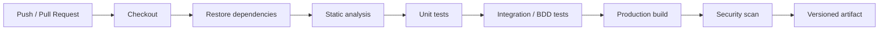
```mermaid
flowchart LR
    A[Push / Pull Request] --> B[Checkout]
    B --> C[Restore dependencies]
    C --> D[Static analysis]
    D --> E[Unit tests]
    E --> F[Integration / BDD tests]
    F --> G[Production build]
    G --> H[Security scan]
    H --> I[Versioned artifact]
```

| Repositorio | Static gate | Test gate | Build artifact |
|:--|:--|:--|:--|
| `energycore-platform` | Compilación Java y análisis SAST/dependencias | JUnit + Cucumber | JAR y Docker image |
| `energycore-webapp` | TypeScript/AOT y budgets | Vitest + smoke integrado | `dist/energycore-webapp/browser` |
| `energycore-mobile` | `dart format` + `dart analyze` | `flutter test` | APK debug/release según entrega |
| `energycore-website` | `node --check` + validación HTML | Smoke de navegación, idioma y enlaces | Directorio estático |
| `energycore-report` | Markdown links/estructura | Verificación de anclas y evidencias | README versionado y PDF de entrega |

El pipeline no debe continuar si falla una prueba. Los 43 escenarios Cucumber omitidos se muestran como deuda y no como resultado verde.

## 7.2 Continuous Delivery

### 7.2.1 Tools and Practices

Continuous Delivery significa que cada cambio aprobado produce artefactos desplegables, aunque la promoción a producción requiera una decisión humana. EnergyCore empleará Docker para la API, Firebase Hosting para los sitios web y un APK firmado para Android. Los secretos se inyectan por entorno y no forman parte de los artefactos.

La versión se asociará con un tag, release notes, checksums y una matriz de compatibilidad entre API, Web Application y Mobile. Las variables productivas se verifican antes de compilar para impedir que un cliente se publique con `localhost` o una URL obsoleta.

### 7.2.2 Stages Deployment Pipeline Components

| Etapa | Entrada | Controles | Salida |
|:--|:--|:--|:--|
| Build | Commit aprobado | Dependencias bloqueadas, build limpio | Artefactos por repositorio |
| Verify | Artefactos | Tests, SAST, secret scan, SBOM, budgets | Candidato verificable |
| Package | Candidato | SHA, versión y configuración externa | Imagen/JAR/dist/APK/report |
| Staging | Artefactos versionados | Smoke, CORS, rutas SPA, health y rollback | Release candidate |
| Approval | Evidencia de staging | Revisión humana y riesgos conocidos | Autorización de promoción |
| Release | Candidato aprobado | Despliegue inmutable | Versión publicada |
| Post-release | URL/version | Health, login sintético y logs | Acta de entrega o rollback |

Los scripts existentes preparan Cloud Run y Firebase Hosting; su presencia demuestra automatización disponible, no un despliegue exitoso. La URL pública solo se declarará después de verificar health, login, CORS y rutas SPA.

## 7.3 Continuous Deployment

### 7.3.1 Tools and Practices

Para Continuous Deployment, `main` podría promover automáticamente una versión que haya aprobado todos los gates y un smoke de staging. En el estado actual se conserva una aprobación manual antes de producción para evitar gasto, cambios de infraestructura o publicación accidental.

El backend se empaqueta con un Dockerfile multi-stage y se ejecuta como usuario no-root. El destino diseñado es Cloud Run con mínimo 0 y máximo 1 instancia para controlar costo académico. La Web Application y la Landing Page se destinan a Firebase Hosting; la aplicación móvil se distribuye como APK y no se publica automáticamente en una tienda.

### 7.3.2 Production Deployment Pipeline Components

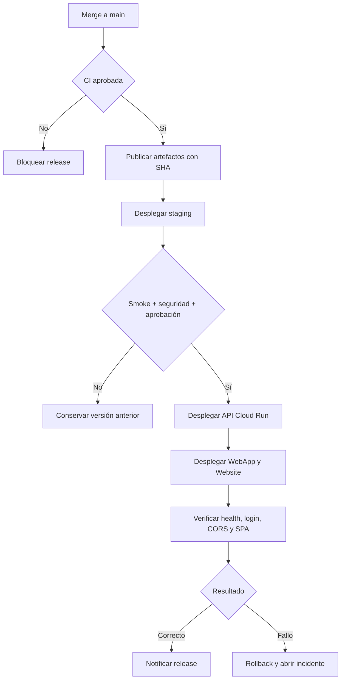
```mermaid
flowchart TD
    M[Merge a main] --> Q{CI aprobada}
    Q -- No --> X[Bloquear release]
    Q -- Sí --> P[Publicar artefactos con SHA]
    P --> S[Desplegar staging]
    S --> T{Smoke + seguridad + aprobación}
    T -- No --> R[Conservar versión anterior]
    T -- Sí --> B[Desplegar API Cloud Run]
    B --> W[Desplegar WebApp y Website]
    W --> V[Verificar health, login, CORS y SPA]
    V --> O{Resultado}
    O -- Correcto --> N[Notificar release]
    O -- Fallo --> Z[Rollback y abrir incidente]
```

El rollback de Cloud Run debe seleccionar la revisión anterior; Firebase Hosting permite volver a una release previa; Android requiere publicar un nuevo APK corregido. La base de datos necesita migraciones compatibles hacia atrás antes de automatizar el rollback de aplicación.

## 7.4 Continuous Monitoring

### 7.4.1 Tools and Practices

El monitoreo se diseña en cuatro capas: disponibilidad, rendimiento, errores y comportamiento de producto. La salud técnica no se equipara al éxito del experimento: una API disponible puede ofrecer una experiencia confusa, y una métrica de clics no demuestra ahorro energético.

Herramientas objetivo: endpoint `/api/v1/health`, logs estructurados de Spring Boot, métricas de Cloud Run, Cloud Logging/Monitoring, consola de Firebase Hosting y eventos analíticos anonimizados. El acceso a logs y tableros debe seguir mínimo privilegio.

### 7.4.2 Monitoring Pipeline Components

| Señal | Métrica | Ventana | Objetivo inicial |
|:--|:--|:--|:--|
| Disponibilidad | Respuestas correctas de `/api/v1/health` | 5 min | ≥ 99 % mensual después del lanzamiento medido |
| Latencia | p50, p95 y p99 por endpoint | 5 y 60 min | p95 < 1.5 s, excluyendo cold start identificado |
| Errores | Tasa 5xx y excepciones no controladas | 5 min | < 1 % |
| Saturación | CPU, memoria, concurrencia y conexiones DB | 5 min | Sin agotamiento sostenido |
| Cliente web | Errores JavaScript y fallos de API | sesión | < 2 % de sesiones con error bloqueante |
| Mobile | Inicio correcto y solicitudes fallidas | sesión | ≥ 99 % de sesiones sin fallo fatal |
| Producto | Decisiones energéticas completadas | semana | Línea base por establecer en piloto |

Cada despliegue añade versión, entorno y correlation ID a los registros. No se almacenan tokens, contraseñas, datos de tarjeta ni cuerpos completos con información personal.

### 7.4.3 Alerting Pipeline Components

| Alerta operativa | Condición inicial | Severidad | Respuesta |
|:--|:--|:--:|:--|
| API caída | 3 health checks consecutivos fallidos | Crítica | Verificar revisión, DB y secretos; rollback si corresponde. |
| Error 5xx alto | > 5 % durante 5 min | Alta | Revisar endpoint/versión y detener promoción. |
| Latencia p95 | > 3 s durante 10 min | Media | Separar cold start, DB y saturación. |
| Base de datos | Fallos de conexión repetidos | Crítica | Comprobar credenciales, cuota y disponibilidad. |
| Cliente incompatible | Aumento de 401/404 tras release | Alta | Validar contratos y configuración API base URL. |
| Presupuesto | Consumo cloud supera umbral acordado | Alta | Escalar a 0, detener recursos no esenciales y revisar tráfico. |

Los umbrales son iniciales y se ajustarán después de observar una línea base. Se agrupan alertas repetidas para evitar fatiga y se crea un incidente único por causa probable.

### 7.4.4 Notification Pipeline Components

El pipeline de notificación separa los avisos de producto de los avisos operativos.

- **Producto:** `BANNER`, `QUIET`, `INBOX_ONLY` o `MUTED`, respetando preferencias, severidad y horario silencioso.
- **Operaciones:** crítica y alta notifican al responsable; media se registra para horario de trabajo; baja se incorpora al informe semanal.
- **Release:** se comunica versión, commit, componentes, resultado de smoke y riesgos conocidos.
- **Incidente:** incluye correlation ID, inicio, impacto, responsable, mitigación y estado; nunca adjunta secretos.

El cierre exige registrar causa raíz, tiempo de detección, tiempo de recuperación y acción preventiva. En el alcance académico, el canal operativo puede ser GitHub Issues y correo institucional; no se afirma una guardia 24/7.

# Part III Experiment Driven Lifecycle

# Capítulo VIII Experiment Driven Development

## 8.1 Experiment Planning

### 8.1.1 As Is Summary

EnergyCore dispone de una solución funcional amplia: Landing Page, Angular, Flutter Android, API Spring Boot y PostgreSQL. El usuario puede observar consumo, organizar espacios, controlar y agrupar dispositivos, crear automatizaciones, configurar alertas y seguir metas. Sin embargo, la amplitud funcional todavía no demuestra que el usuario detecte más rápido una situación de consumo ni que ejecute la acción correcta con menor esfuerzo.

El ciclo experimental se concentra en una decisión concreta: **identificar un consumo anómalo y actuar sobre su causa**. La línea base corresponde al dashboard e histórico actuales; el tratamiento añade una recomendación accionable que explica el dispositivo o espacio implicado, el impacto estimado y una acción directa segura.

### 8.1.2 Raw Material Assumptions Knowledge Gaps Ideas Claims

| Tipo | ID | Enunciado | Evidencia actual |
|:--|:--|:--|:--|
| Assumption | A-01 | Los usuarios entienden kWh, costo y comparación temporal. | No validado con usuarios. |
| Assumption | A-02 | Una alerta con causa y acción es más útil que una cifra aislada. | Sustento de diseño; falta experimento. |
| Assumption | A-03 | Responsables del hogar y administradores de pequeños negocios comparten el flujo observar-decidir-actuar. | Proto-personas provisionales. |
| Knowledge gap | KG-01 | Tiempo actual para localizar el dispositivo responsable. | Sin línea base medida. |
| Knowledge gap | KG-02 | Diferencia de comprensión entre Web y Android. | Paridad funcional documentada; usabilidad no medida. |
| Knowledge gap | KG-03 | Confianza necesaria antes de ejecutar una acción remota. | Sin datos. |
| Idea | I-01 | Tarjeta **Consumo inusual** con explicación, impacto y CTA. | Lista para prototipar. |
| Idea | I-02 | Timestamp y estado de sincronización. | Derivada de auditoría heurística. |
| Idea | I-03 | Vista previa del alcance antes de acciones masivas. | Derivada de prevención de errores. |
| Claim | C-01 | EnergyCore ayuda a tomar decisiones energéticas informadas. | Claim de producto; aún no demostrado experimentalmente. |
| Claim | C-02 | La experiencia móvil conserva la capacidad esencial de la web. | Paridad técnica documentada; falta comparar desempeño de tareas. |

### 8.1.3 Experiment Ready Questions

Una pregunta está lista cuando identifica población, intervención, comparación, resultado y ventana de medición.

- **ERQ-01:** En responsables de hogar y administradores de pequeños negocios, ¿una recomendación con causa y CTA reduce al menos 20 % el tiempo mediano para resolver un consumo alto frente al dashboard actual durante una tarea controlada?
- **ERQ-02:** ¿La recomendación incrementa en al menos 20 puntos porcentuales la proporción de participantes que elige el dispositivo y la acción correctos sin ayuda?
- **ERQ-03:** ¿La tasa de éxito de la tarea principal en Android queda a no más de 10 puntos porcentuales de la obtenida en web con los mismos datos?
- **ERQ-04:** ¿Mostrar alcance y consecuencias antes de una acción masiva reduce errores de selección sin aumentar más de 15 % el tiempo total?
- **ERQ-05:** ¿El aviso offline con **Reintentar** permite recuperar al menos 80 % de tareas interrumpidas después de restablecer la red?

### 8.1.4 Question Backlog

La prioridad inicial usa `Score = (Impacto × Incertidumbre × Alcance) / Esfuerzo`, con factores de 1 a 5. El score ordena preguntas; no sustituye la decisión ética o técnica.

| Orden | Pregunta | Impacto | Incertidumbre | Alcance | Esfuerzo | Score |
|--:|:--|--:|--:|--:|--:|--:|
| 1 | ERQ-01: tiempo para resolver consumo alto | 5 | 5 | 5 | 3 | 41.7 |
| 2 | ERQ-02: acción correcta sin ayuda | 5 | 5 | 5 | 3 | 41.7 |
| 3 | ERQ-05: recuperación después de offline | 4 | 4 | 5 | 2 | 40.0 |
| 4 | ERQ-04: prevención en acciones masivas | 5 | 4 | 4 | 3 | 26.7 |
| 5 | ERQ-03: paridad de éxito web/Android | 4 | 4 | 4 | 3 | 21.3 |
| 6 | ¿Qué nivel de detalle genera confianza sin sobrecargar? | 4 | 5 | 4 | 4 | 20.0 |
| 7 | ¿Las metas aumentan revisiones semanales? | 3 | 5 | 3 | 4 | 11.3 |
| 8 | ¿Los planes se comprenden antes del login? | 2 | 4 | 4 | 3 | 10.7 |

### 8.1.5 Experiment Cards

**EC-01 — Recomendación accionable**

| Campo | Definición |
|:--|:--|
| Creemos que | mostrar causa probable, impacto y CTA permite responder mejor a consumo alto. |
| Para | responsables de hogar y administradores de pequeños negocios. |
| Lo sabremos si | el tiempo mediano cae ≥ 20 % y el éxito aumenta ≥ 20 pp, sin elevar errores críticos. |
| Control | dashboard actual con KPI, gráfico y ranking. |
| Tratamiento | control + tarjeta explicativa y acción directa. |
| Evidencia | eventos de tarea, tiempo, resultado, errores y encuesta breve posterior no identificable. |
| Decisión | adoptar, iterar o descartar según la matriz de 8.4.1. |

**EC-02 — Confirmación de alcance**

| Campo | Definición |
|:--|:--|
| Creemos que | una vista previa de dispositivos afectados previene acciones masivas equivocadas. |
| Prueba | comparar confirmación genérica frente a resumen con alcance y consecuencias. |
| Éxito | ≥ 30 % menos selecciones erróneas y aumento de tiempo ≤ 15 %. |
| Guardrail | ningún participante debe aplicar una acción irreversible sobre datos reales. |

**EC-03 — Recuperación offline**

| Campo | Definición |
|:--|:--|
| Creemos que | un banner persistente con **Reintentar** permite completar la tarea después de recuperar internet. |
| Prueba | interrumpir la conectividad durante una carga, restaurarla y solicitar reintento. |
| Éxito | ≥ 80 % recupera la tarea sin reiniciar sesión; cero duplicaciones de comandos. |
| Guardrail | usar ambiente de prueba y operaciones idempotentes o verificables. |

## 8.2 Experiment Design

### 8.2.1 Hypotheses

- **H1:** la mediana de `time_to_correct_action_ms` del tratamiento será al menos 20 % menor que la del control.
- **H2:** la proporción `task_success` del tratamiento será al menos 20 puntos porcentuales mayor que la del control.
- **H3:** la diferencia absoluta de éxito entre Android y web no superará 10 puntos porcentuales cuando ambos usen el tratamiento.
- **H4:** al menos 80 % de las tareas interrumpidas por una pérdida de red se completará después de seleccionar **Reintentar**.
- **H5:** la confirmación con alcance reducirá al menos 30 % los errores de dispositivo sin aumentar más de 15 % el tiempo mediano.

Las hipótesis son direccionales y fueron definidas antes de recopilar datos. Si el piloto obliga a cambiar umbrales, el cambio se versionará y no se aplicará retroactivamente.

### 8.2.2 Domain Business Metrics

| Métrica | Fórmula | Relación con el dominio |
|:--|:--|:--|
| Weekly Active Energy Decisions | usuarios con al menos una alerta resuelta, acción de dispositivo, rutina o meta por semana | Valor operativo, no solo visitas. |
| Alert Resolution Rate | alertas resueltas / alertas abiertas | Capacidad de convertir una señal en decisión. |
| Automation Adoption | usuarios que activan una rutina o modo / usuarios activos | Reducción de tareas repetitivas. |
| Goal Engagement | usuarios que revisan o actualizan una meta / usuarios con meta | Seguimiento sostenido. |
| Report Export Rate | reportes exportados / reportes generados | Utilidad de la información histórica. |
| Device Action Success | comandos confirmados / comandos solicitados | Confiabilidad percibida y técnica. |

No se usa “energía ahorrada” como KPI principal hasta disponer de telemetría calibrada y una línea base comparable; evitar esa afirmación protege la integridad del experimento.

### 8.2.3 Measures

| Variable | Tipo | Unidad / dominio | Fuente |
|:--|:--|:--|:--|
| `task_success` | Primaria binaria | 0/1 | Estado final de la tarea. |
| `time_to_correct_action_ms` | Primaria continua | milisegundos | Eventos inicio/fin. |
| `wrong_action_count` | Guardrail discreta | conteo | Comandos o selecciones incorrectas. |
| `help_request_count` | Secundaria discreta | conteo | Registro del facilitador. |
| `confidence_score` | Secundaria ordinal | 1-5 | Pregunta posterior a la tarea. |
| `offline_recovery_success` | Primaria binaria para EC-03 | 0/1 | Reintento y finalización. |
| `api_latency_ms` | Técnica continua | milisegundos | Cliente/API. |
| `api_error_class` | Técnica nominal | offline/401/validation/5xx/unknown | Manejo tipado de fallos. |

El reloj comienza cuando se presenta la tarea y termina cuando el estado correcto queda confirmado por la API. Pausas del facilitador se registran y no se eliminan sin una regla previa.

### 8.2.4 Conditions

| Factor | Control | Tratamiento |
|:--|:--|:--|
| Dashboard | KPI, gráfico, ranking y alertas actuales | Mismos elementos + recomendación explicativa y CTA. |
| Datos | Dataset semilla idéntico | Dataset semilla idéntico. |
| Tarea | Identificar causa y reducir consumo | Misma redacción. |
| Cuenta | Rol y plan equivalentes | Rol y plan equivalentes. |
| Red | Conectividad estable, salvo EC-03 | Igual condición. |
| Dispositivo | Web o Android registrado como estrato | Web o Android registrado como estrato. |

La asignación a variante será aleatoria y estratificada por segmento y plataforma. El facilitador usará un guion fijo y no explicará la interfaz durante la medición. La prueba se ejecutará con datos sintéticos para impedir acciones sobre instalaciones reales.

### 8.2.5 Scale Calculations and Decisions

Para detectar un cambio de éxito de 60 % a 85 %, con prueba bilateral, `α = 0.05` y potencia de 80 %, la aproximación para dos proporciones independientes requiere alrededor de **49 observaciones por variante**. Con 10 % de pérdida, la meta confirmatoria sería **55 por variante, 110 en total**.

Ese tamaño excede la capacidad inmediata del curso. Se adopta un diseño en dos etapas:

1. **Piloto formativo:** 24 participantes, 12 por segmento, distribuidos de forma balanceada entre variantes y plataformas. Se reportarán intervalos, tamaños de efecto y problemas de instrumentación; no se afirmará confirmación estadística.
2. **Experimento confirmatorio:** recalcular el tamaño con la tasa y varianza observadas en el piloto, congelar el protocolo y alcanzar la muestra resultante antes de aceptar o rechazar H1/H2.

La unidad de análisis es una persona por variante para la hipótesis primaria. Reintentos técnicos se registran, pero no se cuentan como participantes nuevos. No se detendrá la prueba anticipadamente al observar un resultado favorable.

### 8.2.6 Methods Selection

Se selecciona un experimento controlado entre sujetos para EC-01, evitando que el aprendizaje de una interfaz contamine la otra. EC-02 y EC-03 pueden ejecutarse como pruebas de tarea separadas después de la métrica primaria.

Métodos:

- asignación aleatoria estratificada por segmento y plataforma;
- dataset semilla y guion de tarea constantes;
- telemetría de eventos para tiempo, éxito y errores;
- observación estructurada para solicitudes de ayuda;
- pregunta Likert de confianza posterior a la tarea;
- análisis por intención de tratar y análisis de sensibilidad por protocolo;
- prueba de proporciones para éxito, comparación de tiempo según distribución y tamaños de efecto con intervalos de confianza.

Las entrevistas están fuera de esta versión. Una pregunta posterior cerrada no se presentará como entrevista cualitativa.

### 8.2.7 Data Analytics Goals KPIs and Metrics Selection

| Goal | KPI de decisión | Umbral | Guardrail |
|:--|:--|:--|:--|
| Reducir esfuerzo para actuar | Tiempo mediano a acción correcta | -20 % | Error crítico no aumenta. |
| Mejorar comprensión | Task success | +20 pp | Solicitudes de ayuda no aumentan. |
| Mantener paridad | Diferencia Android vs web | ≤ 10 pp | Latencia por plataforma registrada. |
| Recuperar fallos de red | Offline recovery success | ≥ 80 % | Cero comandos duplicados. |
| Prevenir acciones erróneas | Wrong action rate | -30 % | Tiempo +15 % como máximo. |

Los KPIs de negocio se observan después de validar la tarea. Las métricas de vanidad, como page views sin acción, no deciden la hipótesis.

### 8.2.8 Web and Mobile Tracking Plan

| Evento | Momento | Propiedades mínimas |
|:--|:--|:--|
| `landing_cta_clicked` | CTA al login | locale, viewport, source_section |
| `auth_login_started` / `auth_login_succeeded` | Inicio y fin de autenticación | platform, elapsed_ms, outcome; nunca email o token |
| `dashboard_viewed` | Dashboard listo | variant, platform, data_freshness_s |
| `energy_issue_identified` | Usuario selecciona la causa | task_id, device_category, correct |
| `device_action_started` / `completed` | Comando energético | action_type, scope_size, elapsed_ms, outcome |
| `alert_opened` / `resolved` | Gestión de alerta | severity, elapsed_ms, outcome |
| `routine_created` | Automatización confirmada | target_type, recurrence, outcome |
| `goal_created` | Meta almacenada | period_type, outcome |
| `report_exported` | Exportación terminada | format, platform, outcome |
| `offline_detected` / `offline_retry_selected` / `sync_recovered` | Recuperación de red | task_id, retry_count, elapsed_ms, outcome |

Propiedades comunes: `anonymous_participant_id`, `session_id`, `experiment_id`, `variant`, `segment`, `platform`, `app_version`, `locale`, `theme` y timestamp UTC. Se prohíbe registrar nombre, correo, JWT, contraseña, dirección, datos de tarjeta o texto libre de soporte. La retención experimental propuesta es de 90 días y el diccionario de eventos se versiona junto con el código.

## 8.3 Experimentation

### 8.3.1 To Be User Stories

| ID | To-Be User Story | Acceptance Criteria |
|:--|:--|:--|
| US-17 | Como usuario, quiero una recomendación que explique un consumo anómalo para actuar con confianza. | Given una anomalía calculada, when abro el dashboard, then veo causa probable, impacto, frescura y una acción permitida. |
| US-18 | Como usuario, quiero revisar el alcance antes de una acción masiva para evitar afectar equipos equivocados. | Given un grupo o modo, when confirmo una acción, then veo dispositivos, estado esperado y consecuencias. |
| US-19 | Como participante, quiero conocer y controlar la telemetría experimental. | Given una sesión de prueba, when inicia, then recibo aviso, finalidad, retención y opción de no participar. |
| US-20 | Como usuario móvil, quiero recuperarme de una pérdida de internet sin reiniciar mi sesión. | Given una carga fallida, when vuelve la red y pulso Reintentar, then la operación se recupera sin duplicarse. |
| US-21 | Como usuario, quiero saber cuándo se actualizó la información para no decidir con datos obsoletos. | Given una métrica, when la visualizo, then se muestra timestamp y estado de sincronización. |
| TS-01 | Como equipo, quiero asignar variantes de manera consistente para analizar el experimento. | Given un participante elegible, when inicia la prueba, then recibe una sola variante registrada. |
| TS-02 | Como analista, quiero eventos equivalentes en web y Android para comparar plataformas. | Given una acción instrumentada, when ocurre, then ambos clientes emiten el mismo nombre y esquema válido. |

### 8.3.2 To Be Product Backlog

| Orden | ID | Título | Prioridad | SP | Criterio de salida |
|--:|:--|:--|:--:|--:|:--|
| 1 | TS-01 | Asignación y configuración de variantes | Must | 5 | Variante estable y auditable por sesión. |
| 2 | TS-02 | Contrato de eventos web/mobile | Must | 8 | Esquema validado y sin PII. |
| 3 | US-21 | Frescura y sincronización | Must | 3 | Timestamp consistente en KPI y detalle. |
| 4 | US-17 | Recomendación accionable | Must | 8 | Control/tratamiento configurables. |
| 5 | US-18 | Vista previa de alcance | Must | 5 | Resumen y confirmación antes del comando. |
| 6 | US-20 | Recuperación offline idempotente | Must | 8 | Reintento sin duplicación. |
| 7 | US-19 | Aviso y control de telemetría | Must | 5 | Consentimiento/opt-out registrado. |
| 8 | TS-03 | Dataset semilla del experimento | Should | 3 | Datos idénticos y reiniciables. |
| 9 | TS-04 | Dashboard de resultados | Should | 5 | Métricas por variante, segmento y plataforma. |
| 10 | TS-05 | Exportación anonimizada | Should | 3 | Dataset reproducible sin datos personales. |

Total To-Be referencial: **53 Story Points**. La prioridad se revisará con evidencia experimental y no por cantidad de funcionalidades.

### 8.3.3 Pipeline Supported Experiment Driven To Be Software Platform Lifecycle

#### 8.3.3.1 To Be Sprint Backlogs

| Sprint | Objetivo | Historias | Evidencia de término |
|:--|:--|:--|:--|
| Sprint 4 | Preparar medición reproducible | TS-01, TS-02, TS-03, US-19 | Esquema de eventos, variantes, consentimiento y dataset versionados. |
| Sprint 5 | Implementar tratamientos seguros | US-17, US-18, US-21 | Capturas, tests, feature flag y smoke en web/Android. |
| Sprint 6 | Ejecutar piloto y aprender | US-20, TS-04, TS-05 | Dataset anonimizado, análisis, decision log y backlog reordenado. |

Cada sprint mantiene Definition of Done: criterios aprobados, tests, revisión, traducciones ES/EN/PT, responsive, seguridad, evidencia y pipeline verde.

#### 8.3.3.2 Implemented To Be Landing Page Evidence

La Landing Page ya comunica problema, propuesta de valor, capacidades, planes y CTA al login mediante HTML5, CSS3 y JavaScript. Para el ciclo To-Be se instrumentará `landing_cta_clicked` con sección de origen, idioma y viewport, sin cookies innecesarias ni datos personales.

Evidencia que debe acompañar el incremento: commit SHA, capturas 390/768/1440 px, `node --check script.js`, verificación de CTA y payload anonimizado de un evento de prueba. La imagen y la mascota son recursos visuales del producto; no se usarán como sustituto del resultado experimental.

#### 8.3.3.3 Implemented To Be Frontend Web Application Evidence

Angular contiene el dashboard, históricos, control, automatizaciones y alertas necesarios para implementar EC-01 y EC-02 sin crear módulos aislados. El tratamiento se ubicará en Energy Monitoring y delegará comandos a Device Control; los eventos se emitirán desde application mediante un puerto de analítica, no directamente desde componentes.

Evidencia de aceptación: tests del mapper de recomendación, test del componente, contrato del evento, build productivo, comparación control/tratamiento y smoke contra la API. Las advertencias de budget se conservarán visibles hasta reducirlas.

#### 8.3.3.4 Implemented To Be Native Mobile Application Evidence

Flutter ya ofrece dashboard, fallos tipados, banner offline y **Reintentar**, además de paridad funcional documentada con las 30 páginas web. El tratamiento reutilizará la misma semántica de eventos y adaptará la tarjeta a `NavigationBar`/`NavigationRail` sin copiar el layout de escritorio.

La línea base técnica incluye `dart analyze` sin issues y `flutter test` aprobado. El incremento experimental requerirá además test del estado control/tratamiento, test de reintento sin duplicación, captura en emulador y APK asociado al commit.

#### 8.3.3.5 Implemented To Be RESTful API and Serverless Backend Evidence

La API centraliza usuarios, sedes, dispositivos, lecturas, alertas y reportes; por ello será la fuente única para el dataset y el resultado de las acciones. El soporte experimental se implementará como capacidades transversales: asignación de variante, configuración versionada y recepción de eventos anonimizados, sin contaminar las entidades energéticas con detalles de interfaz.

El artefacto desplegable es una imagen Docker no-root para Cloud Run. La evidencia requerida es: tests Maven, 60 escenarios BDD sin omisiones para el cierre final, escaneo de imagen, health 200, login con JWT, CORS correcto, evento persistido y rollback probado. El despliegue público no se considera verificado mientras estas comprobaciones no produzcan una salida registrada.

#### 8.3.3.6 Team Collaboration Insights

Jean Franck Loa Rojas preparó la línea base de los cinco repositorios, la paridad web/móvil, las pruebas actuales y el diseño documental del experimento. Las tareas To-Be se asignarán mediante GitHub Issues y cada evidencia deberá enlazar issue, Pull Request, reviewer, commit y pipeline.

No se atribuyen actividades a integrantes no confirmados. Cuando el equipo se amplíe, el reporte incorporará una matriz RACI y capturas de GitHub Insights por entrega.

### 8.3.4 To Be Validation Interviews

#### 8.3.4.1 Diseño de Entrevistas

**Excluido de esta versión por indicación del equipo.**

#### 8.3.4.2 Registro de Entrevistas

**Excluido de esta versión por indicación del equipo.** No se incorporarán registros hasta contar con participantes, consentimiento y enlaces reales.

## 8.4 Experiment Aftermath and Analysis

### 8.4.1 Analysis and Interpretation of Results

Al no haberse ejecutado todavía el piloto, esta sección define el análisis y evita presentar resultados inventados.

1. Validar esquema, timestamps, variante única, duplicados y ausencia de PII.
2. Aplicar exclusiones predefinidas: caída técnica total, dataset incorrecto o retiro de consentimiento. Los errores del usuario no se excluyen.
3. Describir muestra por segmento, plataforma y variante.
4. Calcular éxito, tiempo mediano, IQR, errores, ayuda y confianza con intervalos de confianza.
5. Comparar proporciones de éxito y distribución de tiempos; reportar tamaño de efecto además de p-value.
6. Revisar guardrails, datos faltantes y sensibilidad por intención de tratar/per-protocol.
7. Separar hallazgo, inferencia y recomendación; no generalizar más allá de la muestra.

| Resultado observado | Decisión |
|:--|:--|
| Cumple tiempo y éxito; guardrails estables | Adoptar tratamiento y ampliar muestra. |
| Mejora una métrica, pero no la otra | Iterar explicación/CTA y repetir. |
| Mejora promedio, pero perjudica un segmento o plataforma | No desplegar globalmente; adaptar y revalidar. |
| Aumenta acciones equivocadas o expone riesgo | Detener, revertir y rediseñar. |
| No muestra efecto con instrumentación válida | Descartar o replantear hipótesis. |
| Datos incompletos o sesgados | Resultado inconcluso; corregir medición antes de decidir. |

**Estado:** protocolo completo; dataset y resultados aún no disponibles.

### 8.4.2 Re Scored and Re Prioritized Question Backlog

Hasta disponer de resultados se conserva un re-score **pre-experimental** basado en riesgo. Después del piloto se actualizarán impacto, incertidumbre y esfuerzo con evidencia.

| Orden provisional | Pregunta | Motivo |
|--:|:--|:--|
| 1 | ERQ-04: errores en acciones masivas | Mayor riesgo de daño y severidad heurística. |
| 2 | ERQ-01: tiempo a acción correcta | Métrica central de valor. |
| 3 | ERQ-02: decisión correcta | Evita optimizar velocidad a costa de exactitud. |
| 4 | ERQ-05: recuperación offline | Riesgo alto en el canal móvil. |
| 5 | ERQ-03: paridad web/Android | Determina si la propuesta funciona en ambos canales. |

Regla posterior: reducir incertidumbre en 1-4 puntos según fuerza de la evidencia; aumentar impacto si aparece daño o exclusión; recalcular esfuerzo con el trabajo realmente observado; registrar fecha, autor y fundamento del cambio.

## 8.5 Continuous Learning

### 8.5.1 Shareback Session Artifacts Learning Workflow

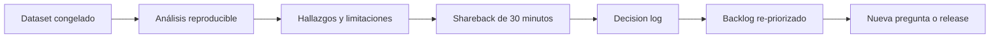
```mermaid
flowchart LR
    D[Dataset congelado] --> A[Análisis reproducible]
    A --> F[Hallazgos y limitaciones]
    F --> S[Shareback de 30 minutos]
    S --> L[Decision log]
    L --> B[Backlog re-priorizado]
    B --> N[Nueva pregunta o release]
```

Paquete de shareback:

- ficha del experimento y versión del protocolo;
- diagrama de asignación y muestra;
- resultados primarios, guardrails e intervalos;
- anomalías y datos excluidos con sustento;
- comparación por segmento y plataforma;
- decisión adopt/iterate/discard;
- backlog antes/después y responsables;
- una página de lecciones técnicas, de producto y éticas.

La sesión tendrá 5 minutos de contexto, 10 de evidencia, 10 de discusión y 5 de decisiones. El acta registrará desacuerdos y acciones; no se cambiará una conclusión solo para mostrar un resultado favorable.

## 8.6 To Be Software Platform Pre Launch

### 8.6.1 About the Product Intro Video

Guion propuesto para un video de 90 segundos:

| Tiempo | Imagen | Locución |
|:--:|:--|:--|
| 0-10 s | Recibo alto, dispositivos y espacios dispersos | “El consumo se vuelve visible demasiado tarde, cuando llega el recibo.” |
| 10-22 s | Marca, rayo y mascota EnergyCore | “EnergyCore reúne lecturas, espacios y decisiones en una sola plataforma.” |
| 22-40 s | Dashboard web y recomendación | “Identifica dónde cambia el consumo, comprende su impacto y actúa desde el mismo flujo.” |
| 40-56 s | Dispositivos, grupos, rutinas y modos | “Controla equipos y automatiza acciones repetitivas con un alcance verificable.” |
| 56-68 s | Aplicación Android, tema e idiomas | “La experiencia continúa en Android, en español, inglés o portugués, incluso cuando la red falla.” |
| 68-80 s | Alertas, metas y reportes | “Convierte señales en seguimiento mediante alertas, metas y reportes.” |
| 80-90 s | CTA al login | “Toma decisiones energéticas con contexto. Prueba EnergyCore.” |

El video debe mostrar la aplicación real, subtítulos, música con licencia y contraste suficiente. No afirmará porcentajes de ahorro ni disponibilidad hasta medirlos. **Enlace audiovisual:** se incorporará después de grabar y publicar el video real.

### 8.6.2 Resumen usando GEES Framework

El enunciado solicita GEES Framework, pero no desarrolla el significado de sus siglas. Para no atribuirle una definición no sustentada, EnergyCore lo operacionaliza en cuatro bloques de síntesis —objetivo, experimento, evidencia y decisión sistémica— que deberán ajustarse a la definición impartida en clase si difiere.

| Bloque | EnergyCore |
|:--|:--|
| Objetivo | Ayudar a responsables de hogares y pequeños negocios a identificar y resolver consumos anómalos con menor esfuerzo y riesgo. |
| Experimento | Comparar dashboard actual frente a recomendación con causa, impacto, frescura y CTA; evaluar confirmación de alcance y recuperación offline. |
| Evidencia | Éxito de tarea, tiempo a acción correcta, errores, recuperación, confianza, latencia y trazabilidad de versión. |
| Decisión sistémica | Adoptar solo si mejora valor sin perjudicar seguridad, privacidad, accesibilidad, plataforma o segmento; en caso contrario iterar o revertir. |

La síntesis conecta descubrimiento, implementación, delivery y aprendizaje. La funcionalidad no se considera validada porque exista código; necesita evidencia proporcional al claim.

### Matriz de Evaluación Ética y de Impacto

La matriz se relaciona con el Student Outcome 4: reconocer responsabilidades profesionales y formular decisiones informadas considerando impacto global, económico, ambiental y social.

| Dimensión | Riesgo | Probabilidad | Impacto | Mitigación | Riesgo residual |
|:--|:--|:--:|:--:|:--|:--:|
| Privacidad | Inferir rutinas de ocupación a partir de lecturas y horarios. | Media | Alto | Minimización, control de acceso, retención limitada, eventos sin PII. | Medio |
| Seguridad | Comando no autorizado sobre un dispositivo. | Baja/Media | Alto | JWT, perfiles, autorización backend, confirmación de alcance y logs. | Medio |
| Autonomía | Automatización ejecutada sin comprensión del usuario. | Media | Alto | Vista previa, explicación, cancelación y estado posterior. | Bajo/Medio |
| Exactitud | Recomendación basada en telemetría incompleta. | Media | Alto | Frescura visible, nivel de confianza y prohibición de afirmar medición certificada. | Medio |
| Equidad | Interfaces o planes que excluyen por idioma, dispositivo o costo. | Media | Medio | ES/EN/PT, responsive, accesibilidad, funciones esenciales en Starter. | Bajo/Medio |
| Ambiental | Efecto rebote o hardware adicional con huella propia. | Baja/Media | Medio | Priorizar software compatible, medir impacto neto y evitar claims verdes no demostrados. | Medio |
| Económico | El usuario decide sobre una estimación de costo inexacta. | Media | Medio | Mostrar fuente, moneda, periodo y carácter estimado. | Bajo/Medio |
| Transparencia | Métricas manipuladas o resultados selectivos. | Baja | Alto | Hipótesis y exclusiones previas, dataset versionado, resultados negativos reportados. | Bajo |
| Disponibilidad | Dependencia de internet impide control remoto. | Alta | Medio | Aviso offline, reintento y recomendación de controles físicos independientes. | Medio |
| Uso indebido | Supervisión de terceros sin consentimiento. | Baja/Media | Alto | Roles, auditoría de acceso y prohibición de monitoreo oculto. | Medio |

**Criterio de detención ética:** suspender el experimento si se expone información personal, se ejecuta una acción no consentida, se detecta riesgo físico o un segmento queda sistemáticamente perjudicado. La prioridad del usuario prevalece sobre la obtención de una métrica favorable.

# Conclusiones

## Conclusiones y recomendaciones

EnergyCore cuenta con una base funcional integrada para Landing Page, Web Application, Native Mobile Application y RESTful API. La separación en cinco repositorios mejora la trazabilidad del producto, mientras que la arquitectura por bounded contexts conserva una fuente central de reglas y datos para los clientes web y Android.

La verificación actual demuestra una base técnica, pero no una validación total. El backend registra 23 pruebas JUnit aprobadas y una suite Cucumber con 17 escenarios ejecutados y 43 omitidos; Flutter dispone de análisis estático sin issues y pruebas aprobadas; Angular y la Landing Page cuentan con builds y comprobaciones sintácticas. El cierre técnico exige automatizar todos los escenarios BDD, ampliar pruebas frontend, ejecutar smoke tests integrados y conservar evidencia por commit.

La hipótesis principal se ha convertido en un experimento reproducible: comparar el dashboard actual con una recomendación accionable y medir tiempo, éxito y errores. El piloto de 24 participantes servirá para depurar instrumentación y estimar parámetros; una conclusión confirmatoria requeriría recalcular y alcanzar una muestra suficiente. Hasta ejecutar el piloto, no se afirma que EnergyCore reduzca consumo ni que mejore decisiones.

El diseño ético reconoce que la telemetría energética puede revelar hábitos y que un comando remoto puede afectar dispositivos reales. Por ello se priorizan minimización de datos, perfiles, confirmación de alcance, información de frescura, resultados negativos visibles y detención ante riesgo. Esta decisión conecta el Student Outcome 4 con prácticas concretas de ingeniería.

Se recomienda implementar los workflows de CI, migraciones de base de datos, instrumentación anonimizada, observabilidad y rollback antes de automatizar producción. También deben incorporarse evidencias audiovisuales, auditoría entre grupos y resultados de experimentación cuando existan. Este texto fue redactado por Jean Franck Loa Rojas y deberá revisarse como conclusión grupal si se confirman nuevos integrantes.

# Video App Validation

El video de validación de la aplicación seguirá un recorrido reproducible de 7 minutos:

| Tiempo | Evidencia |
|:--:|:--|
| 0:00-0:30 | Mostrar tag/commit, URLs o puertos y estado health de la API. |
| 0:30-1:15 | Landing Page, idioma, responsive y CTA al login. |
| 1:15-2:00 | Registro, retorno al login, autenticación y recuperación. |
| 2:00-3:15 | Dashboard, lecturas, costo, filtros y frescura de datos. |
| 3:15-4:30 | Sede, habitación, dispositivo, asignación y grupo. |
| 4:30-5:30 | Rutina, modo, regla y alerta. |
| 5:30-6:15 | Meta, reporte, exportación y planes. |
| 6:15-6:45 | Android, cambio de idioma/tema y recuperación offline. |
| 6:45-7:00 | Consolas de pruebas, limitaciones y commit final. |

Checklist de grabación: ocultar credenciales y tokens; usar datos sintéticos; mostrar Web y Android consumiendo la misma API; no cortar errores relevantes; incluir subtítulos; colocar enlaces de repositorio y versión en la descripción.

**URL reservada para la evidencia real:** se añadirá después de grabar y publicar el video. El guion queda completo, pero no se inventa un enlace.

# Video About the Team

La versión actual solo puede atribuir un testimonio a Jean Franck Loa Rojas (U20241E406). Guion individual sugerido, 45-60 segundos:

> En EnergyCore organicé los repositorios, adapté la solución reutilizada con trazabilidad, desarrollé y verifiqué la experiencia web y Android, revisé la arquitectura DDD del backend y convertí los riesgos del producto en un plan experimental. Esta experiencia fortaleció mi responsabilidad profesional porque tuve que distinguir código implementado, evidencia verificada y resultados todavía no obtenidos. También evalué impactos de privacidad, seguridad, acceso y sostenibilidad antes de proponer una decisión de despliegue.

El video grupal debe añadir únicamente testimonios de integrantes confirmados, mostrar nombre y código, y relacionar cada intervención con 4.c.1 o 4.c.2 y una evidencia concreta. **URL reservada para la evidencia real:** se incorporará después de la grabación.

# Bibliografía

- Universidad Peruana de Ciencias Aplicadas. (2026). _Enunciado del Trabajo Final del curso Diseño de Experimentos de Ingeniería de Software, 1ASI0732_.
- Instituto Nacional de Estadística e Informática. (2018). _INEI difunde Base de Datos de los Censos Nacionales 2017 y el Perfil Sociodemográfico del Perú_. https://censo2017.inei.gob.pe/inei-difunde-base-de-datos-de-los-censos-nacionales-2017-y-el-perfil-sociodemografico-del-peru/
- Xiaomi. (s. f.). _Xiaomi Smart Plug 2 (Wi-Fi): All specs and features_. https://www.mi.com/global/product/xiaomi-smart-plug-2-wi-fi/
- SONOFF. (s. f.). _Smart Plugs_. https://sonoff.tech/collections/smart-plugs
- TP-Link. (s. f.). _KP125M Kasa Smart Wi-Fi Plug Slim, Energy Monitoring_. https://www.tp-link.com/us/home-networking/smart-plug/kp125m/
- Cohn, M. (2004). _User Stories Applied: For Agile Software Development_. Addison-Wesley.
- Gothelf, J., & Seiden, J. (2021). _Lean UX: Designing Great Products with Agile Teams_ (3rd ed.). O'Reilly Media.
- Evans, E. (2003). _Domain-Driven Design: Tackling Complexity in the Heart of Software_. Addison-Wesley.
- Nielsen Norman Group. (2024). _10 Usability Heuristics for User Interface Design_. https://www.nngroup.com/articles/ten-usability-heuristics/
- OWASP Foundation. (s. f.). _OWASP Application Security Verification Standard_. https://owasp.org/www-project-application-security-verification-standard/
- Google. (s. f.). _Site Reliability Engineering_. https://sre.google/books/
- GitHub. (s. f.). _Understanding GitHub Actions_. https://docs.github.com/actions/about-github-actions/understanding-github-actions
- World Wide Web Consortium. (2023). _Web Content Accessibility Guidelines (WCAG) 2.2_. https://www.w3.org/TR/WCAG22/

# Anexos

## Enlaces importantes

- [Project Report](https://github.com/teralume/energycore-report)
- [Landing Page](https://github.com/teralume/energycore-website)
- [Frontend Web Application](https://github.com/teralume/energycore-webapp)
- [Native Mobile Application](https://github.com/teralume/energycore-mobile)
- [RESTful API](https://github.com/teralume/energycore-platform)

## Evidencia externa o empírica no sustituible por redacción

El contenido y los protocolos del informe están desarrollados. Los siguientes artefactos solo pueden añadirse después de ejecutar la actividad correspondiente; mantenerlos explícitos evita fabricar evidencia:

- Pull Requests de liberación y actualización de Insights sobre `main` después de aprobar `release/av1`;
- verificación pública de Swagger; las capturas reales de Android y la evidencia local de Swagger ya están incorporadas y trazadas en la [auditoría del 06/09/2026](presentation/evidence-audit-2026-09-06.md);
- registro y análisis de entrevistas reales, excluidos de esta versión por indicación del equipo;
- informe de auditoría intercambiado con el grupo que asigne el docente;
- dataset anonimizado, análisis y decision log del piloto experimental;
- URLs de Video App Validation, About-the-Product y About-the-Team después de su grabación;
- URL pública y verificación post-deploy si se completa el despliegue;
- datos, testimonios y aportes de otros integrantes solo cuando sean confirmados.
