<div align="center">


**Universidad Peruana de Ciencias Aplicadas**<br>
**Carrera de Ingeniería de Software**<br>
**Ciclo académico 2026-20**

**1ASI0732**<br>
**Diseño de Experimentos de Ingeniería de Software**

**NRC 9100**

**Profesor**<br>
**Alex Humberto Sánchez Ponce**

# Informe de Trabajo Final

**Startup: Teralume**<br>
**Producto: EnergyCore**

## Integrantes

| Código | Apellidos y nombres |
|:--:|:--|
| U20241E406 | Loa Rojas, Jean Franck |

**Septiembre de 2026**

</div>

<div style="page-break-after: always;"></div>

## Registro de Versiones del Informe

| Versión | Fecha | Autor | Descripción de la modificación |
|:--:|:--:|:--|:--|
| AV1 | 05/09/2026 | Loa Rojas, Jean Franck | Creación de la estructura del informe conforme al enunciado del curso, incorporación de la carátula, los enlaces de los repositorios, el perfil individual y el sustento inicial del Student Outcome 4. |
| AV1.1 | 05/09/2026 | Loa Rojas, Jean Franck | Desarrollo de los capítulos I al V requeridos para el Primer Hito, incluyendo Lean UX, needfinding provisional, requirements specification, diseño, arquitectura, modelo de datos, backlog y evidencias técnicas. |

<div style="page-break-after: always;"></div>

## Project Report Collaboration Insights

EnergyCore se desarrolla mediante cinco repositorios independientes dentro de la organización Teralume. Esta separación permite mantener trazabilidad específica para el informe, la Landing Page, la aplicación web, la aplicación móvil y los servicios de backend.

### Repositorios del proyecto

- [Project Report](https://github.com/teralume/energycore-report)
- [Landing Page](https://github.com/teralume/energycore-website)
- [Frontend Web Application](https://github.com/teralume/energycore-webapp)
- [Native Mobile Application](https://github.com/teralume/energycore-mobile)
- [RESTful API](https://github.com/teralume/energycore-platform)

### Entrega AV1

Durante AV1 se preparó la plataforma EnergyCore a partir de un proyecto académico anterior cuya reutilización fue autorizada por el profesor. El trabajo no se limitó a cambiar el nombre del producto: se separaron los entregables en repositorios propios, se actualizó la identidad a Teralume y EnergyCore, se revisaron los contratos entre frontend y backend, se desarrolló una nueva experiencia visual y se incorporó una aplicación móvil en Flutter conectada a la misma API.

#### Participación de Loa Rojas Jean Franck

- Creó y vinculó los cinco repositorios de EnergyCore con la organización Teralume.
- Adaptó la solución previamente desarrollada a la identidad y alcance de EnergyCore.
- Implementó y corrigió la aplicación web Angular y su integración con la API REST.
- Desarrolló la Landing Page y alineó su navegación con el inicio de sesión de la aplicación.
- Implementó la aplicación móvil Flutter para Android, con autenticación, consumo energético, gestión de dispositivos y adaptación responsiva.
- Revisó la estructura DDD del backend y la conexión de los bounded contexts del producto.
- Preparó la estructura inicial del informe de acuerdo con el enunciado de Diseño de Experimentos de Ingeniería de Software.

#### Evidencias de colaboración y commits

Los siguientes commits locales organizan el trabajo existente en bloques verificables. Se generaron con la fecha real de incorporación al control de versiones y no pretenden simular una cronología anterior.

| Repositorio | Commits preparados para AV1 |
|:--|:--|
| Report | `1a0eced` - estructura y Student Outcome; `4b24a34` - línea base de commits; ampliación AV1 incluida en el cambio actual |
| Platform | `63d5a7a` - inicialización; `6f7f47e` - bounded contexts; `250517e` - pruebas |
| WebApp | `d3b1c79` - inicialización; `eb76229` - experiencia web; `85ee2eb` - referencias de diseño |
| Mobile | `1fe1a80` - inicialización Flutter; `24cf286` - experiencia móvil; `0f545f0` - pruebas y paridad web |
| Website | `b3adb4e` - Landing Page; `268de90` - sistema de diseño |

_Las capturas de commits y GitHub Insights permanecen pendientes hasta publicar las ramas en los repositorios remotos._

<div style="page-break-after: always;"></div>

## Contenido

- [Student Outcome](#student-outcome)
  - [Loa Rojas Jean Franck](#loa-rojas-jean-franck)
- [Part I As Is Software Project](#part-i-as-is-software-project)
  - [Capítulo I Introducción](#capítulo-i-introducción)
    - [1.1 Startup Profile](#11-startup-profile)
      - [1.1.1 Descripción de la Startup](#111-descripción-de-la-startup)
      - [1.1.2 Perfiles de integrantes del equipo](#112-perfiles-de-integrantes-del-equipo)
    - [1.2 Solution Profile](#12-solution-profile)
      - [1.2.1 Antecedentes y problemática](#121-antecedentes-y-problemática)
      - [1.2.2 Lean UX Process](#122-lean-ux-process)
        - [1.2.2.1 Lean UX Problem Statements](#1221-lean-ux-problem-statements)
        - [1.2.2.2 Lean UX Assumptions](#1222-lean-ux-assumptions)
      - [1.2.2.3 Lean UX Hypothesis Statements](#1223-lean-ux-hypothesis-statements)
      - [1.2.2.4 Lean UX Canvas](#1224-lean-ux-canvas)
    - [1.3 Segmentos objetivo](#13-segmentos-objetivo)
  - [Capítulo II Requirements Elicitation and Analysis](#capítulo-ii-requirements-elicitation-and-analysis)
    - [2.1 Competidores](#21-competidores)
      - [2.1.1 Análisis competitivo](#211-análisis-competitivo)
      - [2.1.2 Estrategias y tácticas frente a competidores](#212-estrategias-y-tácticas-frente-a-competidores)
    - [2.2 Entrevistas](#22-entrevistas)
      - [2.2.1 Diseño de entrevistas](#221-diseño-de-entrevistas)
      - [2.2.2 Registro de entrevistas](#222-registro-de-entrevistas)
      - [2.2.3 Análisis de entrevistas](#223-análisis-de-entrevistas)
    - [2.3 Needfinding](#23-needfinding)
      - [2.3.1 User Personas](#231-user-personas)
      - [2.3.2 User Task Matrix](#232-user-task-matrix)
      - [2.3.3 User Journey Mapping](#233-user-journey-mapping)
      - [2.3.4 Empathy Mapping](#234-empathy-mapping)
      - [2.3.5 As Is Scenario Mapping](#235-as-is-scenario-mapping)
    - [2.4 Ubiquitous Language](#24-ubiquitous-language)
  - [Capítulo III Requirements Specification](#capítulo-iii-requirements-specification)
    - [3.1 To Be Scenario Mapping](#31-to-be-scenario-mapping)
    - [3.2 User Stories](#32-user-stories)
    - [3.3 Product Backlog](#33-product-backlog)
    - [3.4 Impact Mapping](#34-impact-mapping)
  - [Capítulo IV Product Design](#capítulo-iv-product-design)
    - [4.1 Style Guidelines](#41-style-guidelines)
      - [4.1.1 General Style Guidelines](#411-general-style-guidelines)
      - [4.1.2 Web Style Guidelines](#412-web-style-guidelines)
      - [4.1.3 Mobile Style Guidelines](#413-mobile-style-guidelines)
        - [4.1.3.1 iOS Mobile Style Guidelines](#4131-ios-mobile-style-guidelines)
        - [4.1.3.2 Android Mobile Style Guidelines](#4132-android-mobile-style-guidelines)
    - [4.2 Information Architecture](#42-information-architecture)
      - [4.2.1 Organization Systems](#421-organization-systems)
      - [4.2.2 Labeling Systems](#422-labeling-systems)
      - [4.2.3 SEO Tags and Meta Tags](#423-seo-tags-and-meta-tags)
      - [4.2.4 Searching Systems](#424-searching-systems)
      - [4.2.5 Navigation Systems](#425-navigation-systems)
    - [4.3 Landing Page UI Design](#43-landing-page-ui-design)
      - [4.3.1 Landing Page Wireframe](#431-landing-page-wireframe)
      - [4.3.2 Landing Page Mockup](#432-landing-page-mockup)
    - [4.4 Mobile Applications UX UI Design](#44-mobile-applications-ux-ui-design)
      - [4.4.1 Mobile Applications Wireframes](#441-mobile-applications-wireframes)
      - [4.4.2 Mobile Applications Wireflow Diagrams](#442-mobile-applications-wireflow-diagrams)
      - [4.4.3 Mobile Applications Mockups](#443-mobile-applications-mockups)
      - [4.4.4 Mobile Applications User Flow Diagrams](#444-mobile-applications-user-flow-diagrams)
    - [4.5 Mobile Applications Prototyping](#45-mobile-applications-prototyping)
      - [4.5.1 Android Mobile Applications Prototyping](#451-android-mobile-applications-prototyping)
      - [4.5.2 iOS Mobile Applications Prototyping](#452-ios-mobile-applications-prototyping)
    - [4.6 Web Applications UX UI Design](#46-web-applications-ux-ui-design)
      - [4.6.1 Web Applications Wireframes](#461-web-applications-wireframes)
      - [4.6.2 Web Applications Wireflow Diagrams](#462-web-applications-wireflow-diagrams)
      - [4.6.3 Web Applications Mockups](#463-web-applications-mockups)
      - [4.6.4 Web Applications User Flow Diagrams](#464-web-applications-user-flow-diagrams)
    - [4.7 Web Applications Prototyping](#47-web-applications-prototyping)
    - [4.8 Domain Driven Software Architecture](#48-domain-driven-software-architecture)
      - [4.8.1 Software Architecture Context Diagram](#481-software-architecture-context-diagram)
      - [4.8.2 Software Architecture Container Diagrams](#482-software-architecture-container-diagrams)
      - [4.8.3 Software Architecture Components Diagrams](#483-software-architecture-components-diagrams)
    - [4.9 Software Object Oriented Design](#49-software-object-oriented-design)
      - [4.9.1 Class Diagrams](#491-class-diagrams)
      - [4.9.2 Class Dictionary](#492-class-dictionary)
    - [4.10 Database Design](#410-database-design)
      - [4.10.1 Relational Non Relational Database Diagram](#4101-relational-non-relational-database-diagram)
  - [Capítulo V Product Implementation](#capítulo-v-product-implementation)
    - [5.1 Software Configuration Management](#51-software-configuration-management)
      - [5.1.1 Software Development Environment Configuration](#511-software-development-environment-configuration)
      - [5.1.2 Source Code Management](#512-source-code-management)
      - [5.1.3 Source Code Style Guide and Conventions](#513-source-code-style-guide-and-conventions)
      - [5.1.4 Software Deployment Configuration](#514-software-deployment-configuration)
    - [5.2 Product Implementation and Deployment](#52-product-implementation-and-deployment)
      - [5.2.1 Sprint Backlogs](#521-sprint-backlogs)
      - [5.2.2 Implemented Landing Page Evidence](#522-implemented-landing-page-evidence)
      - [5.2.3 Implemented Frontend Web Application Evidence](#523-implemented-frontend-web-application-evidence)
      - [5.2.4 Acuerdo de Servicio SaaS](#524-acuerdo-de-servicio-saas)
      - [5.2.5 Implemented Native Mobile Application Evidence](#525-implemented-native-mobile-application-evidence)
      - [5.2.6 Implemented RESTful API and Serverless Backend Evidence](#526-implemented-restful-api-and-serverless-backend-evidence)
      - [5.2.7 RESTful API Documentation](#527-restful-api-documentation)
      - [5.2.8 Team Collaboration Insights](#528-team-collaboration-insights)
    - [5.3 Video About the Product](#53-video-about-the-product)
- [Part II Verification Validation and Pipeline](#part-ii-verification-validation-and-pipeline)
  - [Capítulo VI Product Verification and Validation](#capítulo-vi-product-verification-and-validation)
    - [6.1 Testing Suites and Validation](#61-testing-suites-and-validation)
      - [6.1.1 Core Entities Unit Tests](#611-core-entities-unit-tests)
      - [6.1.2 Core Integration Tests](#612-core-integration-tests)
      - [6.1.3 Core Behavior Driven Development](#613-core-behavior-driven-development)
      - [6.1.4 Core System Tests](#614-core-system-tests)
    - [6.2 Static Testing and Verification](#62-static-testing-and-verification)
      - [6.2.1 Static Code Analysis](#621-static-code-analysis)
        - [6.2.1.1 Coding Standard and Code Conventions](#6211-coding-standard-and-code-conventions)
        - [6.2.1.2 Code Quality and Code Security](#6212-code-quality-and-code-security)
      - [6.2.2 Reviews](#622-reviews)
    - [6.3 Validation Interviews](#63-validation-interviews)
      - [6.3.1 Diseño de Entrevistas](#631-diseño-de-entrevistas)
      - [6.3.2 Registro de Entrevistas](#632-registro-de-entrevistas)
      - [6.3.3 Evaluaciones según heurísticas](#633-evaluaciones-según-heurísticas)
    - [6.4 Auditoría de Experiencias de Usuario](#64-auditoría-de-experiencias-de-usuario)
      - [6.4.1 Auditoría realizada](#641-auditoría-realizada)
        - [6.4.1.1 Información del grupo auditado](#6411-información-del-grupo-auditado)
        - [6.4.1.2 Cronograma de auditoría realizada](#6412-cronograma-de-auditoría-realizada)
        - [6.4.1.3 Contenido de auditoría realizada](#6413-contenido-de-auditoría-realizada)
      - [6.4.2 Auditoría recibida](#642-auditoría-recibida)
        - [6.4.2.1 Información del grupo auditor](#6421-información-del-grupo-auditor)
        - [6.4.2.2 Cronograma de auditoría recibida](#6422-cronograma-de-auditoría-recibida)
        - [6.4.2.3 Contenido de auditoría recibida](#6423-contenido-de-auditoría-recibida)
        - [6.4.2.4 Resumen de modificaciones para subsanar hallazgos](#6424-resumen-de-modificaciones-para-subsanar-hallazgos)
  - [Capítulo VII DevOps Practices](#capítulo-vii-devops-practices)
    - [7.1 Continuous Integration](#71-continuous-integration)
      - [7.1.1 Tools and Practices](#711-tools-and-practices)
      - [7.1.2 Build and Test Suite Pipeline Components](#712-build-and-test-suite-pipeline-components)
    - [7.2 Continuous Delivery](#72-continuous-delivery)
      - [7.2.1 Tools and Practices](#721-tools-and-practices)
      - [7.2.2 Stages Deployment Pipeline Components](#722-stages-deployment-pipeline-components)
    - [7.3 Continuous Deployment](#73-continuous-deployment)
      - [7.3.1 Tools and Practices](#731-tools-and-practices)
      - [7.3.2 Production Deployment Pipeline Components](#732-production-deployment-pipeline-components)
    - [7.4 Continuous Monitoring](#74-continuous-monitoring)
      - [7.4.1 Tools and Practices](#741-tools-and-practices)
      - [7.4.2 Monitoring Pipeline Components](#742-monitoring-pipeline-components)
      - [7.4.3 Alerting Pipeline Components](#743-alerting-pipeline-components)
      - [7.4.4 Notification Pipeline Components](#744-notification-pipeline-components)
- [Part III Experiment Driven Lifecycle](#part-iii-experiment-driven-lifecycle)
  - [Capítulo VIII Experiment Driven Development](#capítulo-viii-experiment-driven-development)
    - [8.1 Experiment Planning](#81-experiment-planning)
      - [8.1.1 As Is Summary](#811-as-is-summary)
      - [8.1.2 Raw Material Assumptions Knowledge Gaps Ideas Claims](#812-raw-material-assumptions-knowledge-gaps-ideas-claims)
      - [8.1.3 Experiment Ready Questions](#813-experiment-ready-questions)
      - [8.1.4 Question Backlog](#814-question-backlog)
      - [8.1.5 Experiment Cards](#815-experiment-cards)
    - [8.2 Experiment Design](#82-experiment-design)
      - [8.2.1 Hypotheses](#821-hypotheses)
      - [8.2.2 Domain Business Metrics](#822-domain-business-metrics)
      - [8.2.3 Measures](#823-measures)
      - [8.2.4 Conditions](#824-conditions)
      - [8.2.5 Scale Calculations and Decisions](#825-scale-calculations-and-decisions)
      - [8.2.6 Methods Selection](#826-methods-selection)
      - [8.2.7 Data Analytics Goals KPIs and Metrics Selection](#827-data-analytics-goals-kpis-and-metrics-selection)
      - [8.2.8 Web and Mobile Tracking Plan](#828-web-and-mobile-tracking-plan)
    - [8.3 Experimentation](#83-experimentation)
      - [8.3.1 To Be User Stories](#831-to-be-user-stories)
      - [8.3.2 To Be Product Backlog](#832-to-be-product-backlog)
      - [8.3.3 Pipeline Supported Experiment Driven To Be Software Platform Lifecycle](#833-pipeline-supported-experiment-driven-to-be-software-platform-lifecycle)
        - [8.3.3.1 To Be Sprint Backlogs](#8331-to-be-sprint-backlogs)
        - [8.3.3.2 Implemented To Be Landing Page Evidence](#8332-implemented-to-be-landing-page-evidence)
        - [8.3.3.3 Implemented To Be Frontend Web Application Evidence](#8333-implemented-to-be-frontend-web-application-evidence)
        - [8.3.3.4 Implemented To Be Native Mobile Application Evidence](#8334-implemented-to-be-native-mobile-application-evidence)
        - [8.3.3.5 Implemented To Be RESTful API and Serverless Backend Evidence](#8335-implemented-to-be-restful-api-and-serverless-backend-evidence)
        - [8.3.3.6 Team Collaboration Insights](#8336-team-collaboration-insights)
      - [8.3.4 To Be Validation Interviews](#834-to-be-validation-interviews)
        - [8.3.4.1 Diseño de Entrevistas](#8341-diseño-de-entrevistas)
        - [8.3.4.2 Registro de Entrevistas](#8342-registro-de-entrevistas)
    - [8.4 Experiment Aftermath and Analysis](#84-experiment-aftermath-and-analysis)
      - [8.4.1 Analysis and Interpretation of Results](#841-analysis-and-interpretation-of-results)
      - [8.4.2 Re Scored and Re Prioritized Question Backlog](#842-re-scored-and-re-prioritized-question-backlog)
    - [8.5 Continuous Learning](#85-continuous-learning)
      - [8.5.1 Shareback Session Artifacts Learning Workflow](#851-shareback-session-artifacts-learning-workflow)
    - [8.6 To Be Software Platform Pre Launch](#86-to-be-software-platform-pre-launch)
      - [8.6.1 About the Product Intro Video](#861-about-the-product-intro-video)
      - [8.6.2 Resumen usando GEES Framework](#862-resumen-usando-gees-framework)
- [Conclusiones](#conclusiones)
- [Video App Validation](#video-app-validation)
- [Video About the Team](#video-about-the-team)
- [Bibliografía](#bibliografía)
- [Anexos](#anexos)

<div style="page-break-after: always;"></div>

## Student Outcome

Cada participante del equipo debe sustentar evidencia de cómo las actividades realizadas en el trabajo final han ayudado a desarrollar las dimensiones del student outcome. Por ello en esta sección debe haber una subsección por cada alumno donde éste describa por escrito la relación entre el outcome, sus dimensiones y el trabajo que ha realizado. Esto se complementa con lo reflejado en los testimonios expuestos que forman parte del video About The Team.

El curso contribuye al cumplimiento del Student Outcome ABET:

**ABET EAC Student Outcome 4**

**Criterio:** La capacidad de reconocer responsabilidades éticas y profesionales en situaciones de ingeniería y hacer juicios informados, que deben considerar el impacto de las soluciones de ingeniería en contextos globales, económicos, ambientales y sociales.

En el siguiente cuadro se describen las acciones realizadas y los enunciados de conclusiones que permiten sustentar el logro del ABET EAC Student Outcome 4.

### Loa Rojas Jean Franck

| Criterio específico | Acciones realizadas | Conclusiones |
|:--|:--|:--|
| **4.c.1 Reconoce responsabilidad ética y profesional en situaciones de ingeniería de software** | **AV1:** Reutilicé un proyecto académico anterior con autorización expresa del profesor y documenté su adaptación bajo una nueva identidad, evitando presentarlo como un producto creado íntegramente desde cero para este curso. Organicé EnergyCore en repositorios independientes para conservar trazabilidad y revisé que los componentes reutilizados no mantuvieran nombres, cachés o referencias funcionales de ElectroCorp. En la solución técnica consideré la autenticación con JWT, el cifrado de contraseñas con BCrypt, el almacenamiento del token móvil mediante Android Keystore y AES-GCM, la separación de responsabilidades mediante bounded contexts y la comunicación honesta de las verificaciones que todavía requieren evidencia. También incorporé una experiencia accesible mediante tema claro y oscuro, diseño responsivo, navegación de retorno en autenticación y mensajes explícitos cuando no existe conexión a Internet. | **Pendiente de consenso grupal para AV1.** |
| **4.c.2 Emite juicios informados considerando el impacto de las soluciones de ingeniería de software en contextos globales, económicos, ambientales y sociales** | **AV1:** Evalué EnergyCore como una solución multiplataforma que debe funcionar en web y Android sin mantener fuentes de datos separadas, por lo que ambas aplicaciones consumen una única API y base de datos. Consideré el impacto económico mediante el seguimiento de consumo, costos, metas y planes; el impacto ambiental mediante herramientas que permiten identificar consumos elevados, programar dispositivos y promover decisiones de ahorro energético; y el impacto social mediante una interfaz responsiva, soporte en español, inglés y portugués, y avisos de conectividad comprensibles. La adaptación de la solución busca que hogares y pequeños negocios puedan tomar decisiones informadas sin depender de una infraestructura distinta para cada cliente. | **Pendiente de consenso grupal para AV1.** |

#### Evidencias individuales

- Código de estudiante: **U20241E406**.
- Repositorios trabajados: Report, Website, WebApp, Mobile y Platform.
- Capturas de commits e Insights: **pendientes de incorporar después de la publicación de AV1**.
- Testimonio para el video About The Team: **pendiente de grabación**.

<div style="page-break-after: always;"></div>

# Part I As Is Software Project

# Capítulo I Introducción

## 1.1 Startup Profile

### 1.1.1 Descripción de la Startup

Teralume es una startup tecnológica peruana orientada a crear productos digitales que ayuden a hogares y pequeños negocios a comprender y gestionar su consumo energético. Su propuesta combina software web y móvil con un modelo de dispositivos conectados, de modo que el usuario pueda organizar sus espacios, controlar equipos, automatizar rutinas, revisar lecturas y recibir alertas desde una sola cuenta.

**Misión.** Facilitar decisiones de consumo energético informadas mediante experiencias digitales accesibles, seguras y fáciles de utilizar.

**Visión.** Ser una referencia latinoamericana en gestión energética cotidiana, conectando personas, espacios y dispositivos mediante productos de software responsables.

**Principios de trabajo.** Teralume prioriza la privacidad, la transparencia sobre las capacidades reales del producto, la accesibilidad, la interoperabilidad entre clientes y la reducción de desperdicios energéticos.

### 1.1.2 Perfiles de integrantes del equipo

| Nombre completo | Código | Carrera | Fotografía | Conocimientos y habilidades |
|:--|:--:|:--|:--:|:--|
| Loa Rojas, Jean Franck | U20241E406 | Ingeniería de Software, Universidad Peruana de Ciencias Aplicadas |  | Soy Jean Franck Loa Rojas, estudiante de séptimo ciclo de Ingeniería de Software. Aporto experiencia en desarrollo de aplicaciones web con Angular, servicios backend con Java y Spring Boot, aplicaciones móviles con Flutter, modelado de soluciones mediante Domain-Driven Design y administración de repositorios con Git. Me interesa construir productos integrados, documentar las decisiones técnicas y evaluar sus efectos sobre las personas, los costos y el uso responsable de los recursos. |

_Los perfiles de los demás integrantes se incorporarán cuando el equipo confirme sus datos._

## 1.2 Solution Profile

### 1.2.1 Antecedentes y problemática

La energía eléctrica sostiene actividades domésticas y comerciales, pero el recibo mensual muestra el resultado agregado y no explica con claridad qué equipos, espacios o hábitos generan el consumo. Las soluciones de domótica existentes suelen concentrarse en dispositivos aislados y aplicaciones propias de cada fabricante. Esto obliga al usuario a alternar herramientas y dificulta comparar lecturas, costos, rutinas y alertas dentro de un mismo contexto.

EnergyCore aborda este problema mediante una plataforma que centraliza sedes, habitaciones, dispositivos, grupos, rutinas, modos de operación, lecturas energéticas, alertas, metas, reportes y solicitudes de servicio. La Web Application y la Native Mobile Application consumen la misma RESTful API y la misma fuente de datos, lo cual evita inconsistencias entre canales.

| Elemento 5W2H | Definición para EnergyCore |
|:--|:--|
| Who | Familias urbanas y responsables de pequeños negocios que administran varios equipos eléctricos y necesitan controlar costos sin conocimientos técnicos avanzados. |
| What | Falta de visibilidad y control integrado sobre el consumo energético, los dispositivos y las automatizaciones. |
| Where | Hogares, oficinas, talleres, tiendas y otros espacios urbanos con conexión a Internet. |
| When | Al revisar consumos, salir de un espacio, programar horarios, detectar anomalías o analizar el gasto mensual. |
| Why | El consumo invisible dificulta tomar decisiones económicas y ambientales responsables. |
| How | Mediante clientes web y Android conectados a una RESTful API que organiza el dominio y presenta información accionable. |
| How much | El modelo considera planes Starter de S/29, Professional de S/79 y Enterprise de S/199 mensuales, sujetos a validación comercial antes de una operación real. |

**Objetivo general.** Diseñar e implementar una plataforma de gestión energética que permita observar, controlar y automatizar el consumo de hogares y pequeños negocios desde web y Android.

**Objetivos específicos.** Centralizar la información de sedes y dispositivos; mostrar consumo actual e histórico; permitir rutinas y modos; notificar eventos relevantes; definir metas y reportes; y conservar una experiencia coherente en español, inglés y portugués.

### 1.2.2 Lean UX Process

#### 1.2.2.1 Lean UX Problem Statements

Los responsables de hogares y pequeños negocios necesitan entender qué consume energía, dónde ocurre y qué acción pueden tomar, porque un recibo agregado y varias aplicaciones desconectadas no les permiten relacionar hábitos, dispositivos y costos. Las alternativas actuales ofrecen control remoto y medición, pero el usuario todavía debe reunir información distribuida para decidir.

EnergyCore propone una experiencia integrada y progresiva: primero organiza los espacios, luego vincula dispositivos, registra lecturas, configura automatizaciones y finalmente convierte los datos en alertas, metas y reportes. El éxito inicial se evaluará por la capacidad de los usuarios para completar esas tareas y explicar qué decisión tomarían con la información recibida.

#### 1.2.2.2 Lean UX Assumptions

| Tipo | Supuesto |
|:--|:--|
| Usuario | El usuario posee al menos un teléfono Android o acceso a un navegador moderno. |
| Problema | El usuario no identifica con facilidad qué dispositivo o espacio concentra su consumo. |
| Valor | Una vista unificada reduce el esfuerzo requerido para revisar y controlar la energía. |
| Uso | Las consultas más frecuentes serán el dashboard, el estado de dispositivos, las alertas y las rutinas. |
| Confianza | El usuario necesita confirmaciones visibles antes de operaciones sensibles y explicaciones cuando no hay conexión. |
| Negocio | Un plan escalonado puede atender desde un hogar pequeño hasta una organización con varias sedes. |
| Riesgo | La utilidad percibida disminuye si no existen lecturas recientes o si la configuración inicial resulta compleja. |
| Restricción | El alcance académico representa la integración IoT mediante registros y operaciones de software; no certifica hardware físico para uso comercial. |

#### 1.2.2.3 Lean UX Hypothesis Statements

1. Creemos que los responsables de hogares comprenderán mejor su consumo si pueden ver lecturas, alertas y metas en una misma experiencia. Sabremos que la hipótesis es válida cuando los participantes de validación identifiquen el dispositivo o espacio prioritario y propongan una acción sin asistencia.
2. Creemos que los dueños de pequeños negocios reducirán omisiones operativas si pueden agrupar dispositivos y ejecutar rutinas o modos por horario. Lo comprobaremos cuando completen la configuración y ejecución del escenario asignado dentro de la sesión de validación.
3. Creemos que una experiencia coherente entre web y Android aumentará la confianza del usuario. Lo comprobaremos cuando los participantes reconozcan las mismas entidades, estados y acciones en ambos canales.
4. Creemos que las alertas configurables evitarán fatiga de notificaciones. Lo comprobaremos cuando los participantes puedan seleccionar prioridad, canal y horario silencioso acordes con su contexto.

Estas hipótesis son de producto y todavía requieren entrevistas y pruebas con participantes; no se presentan como resultados confirmados.

#### 1.2.2.4 Lean UX Canvas

| Campo | Síntesis |
|:--|:--|
| Business problem | El usuario carece de una visión integrada para relacionar consumo, dispositivos, espacios y costo. |
| Business outcomes | Activación de cuentas, vinculación de dispositivos, uso recurrente del dashboard y adopción de planes acordes con el alcance. |
| Users | Responsables de hogares urbanos y administradores de pequeños negocios. |
| User outcomes and benefits | Comprender el consumo, detectar anomalías, automatizar acciones y decidir con mayor confianza. |
| Solutions | Dashboard energético, sedes y habitaciones, dispositivos y grupos, rutinas y modos, alertas, metas, reportes y soporte. |
| Hypotheses | La integración multiplataforma y la información accionable reducen esfuerzo y mejoran decisiones. |
| Most important thing to learn | Si los usuarios comprenden las métricas y pueden transformar una alerta o lectura en una acción concreta. |
| Least work for learning | Probar los flujos implementados con tareas moderadas y registrar éxito, tiempo, errores, comentarios y decisión final. |

## 1.3 Segmentos objetivo

**Segmento 1: responsables de hogares urbanos.** Personas adultas que administran gastos y dispositivos en departamentos o casas de zonas urbanas, usan smartphone o navegador y buscan reducir incertidumbre sobre el recibo eléctrico. El Censo Nacional 2017 registró 23 311 893 habitantes en áreas urbanas, equivalentes al 79,3 % de la población censada del Perú; esta cifra sustenta el enfoque urbano inicial, pero no representa por sí sola el mercado potencial de EnergyCore.

**Segmento 2: dueños o administradores de pequeños negocios.** Personas responsables de oficinas, tiendas, talleres o locales con varios equipos y horarios de operación. Necesitan controlar sedes, delegar acceso, automatizar tareas y analizar consumo por espacio o dispositivo.

La selección de segmentos es provisional hasta concluir las entrevistas. No se atribuyen porcentajes de ahorro ni intención de pago sin evidencia empírica.

# Capítulo II Requirements Elicitation and Analysis

## 2.1 Competidores

### 2.1.1 Análisis competitivo

Se compararon capacidades declaradas por los fabricantes, sin asumir disponibilidad, precio o soporte local en el Perú.

| Criterio | EnergyCore | Xiaomi Smart Plug 2 | SONOFF Smart Plugs | TP-Link Kasa KP125M |
|:--|:--|:--|:--|:--|
| Enfoque | Plataforma de gestión energética por sedes, espacios y dispositivos | Enchufe dentro del ecosistema Xiaomi Home | Catálogo de enchufes, interruptores y medidores | Enchufe Matter con Kasa Smart |
| Consumo energético | Dashboard, histórico, metas, alertas y reportes | Visualización de consumo | Modelos con monitoreo en tiempo real | Consumo actual e histórico |
| Automatización | Grupos, rutinas y modos con diferentes alcances | Horarios y memoria de estado | Horarios, control y protección según modelo | Horarios, temporizador, modo ausencia y grupos |
| Multiplataforma del proyecto | Angular Web Application y Flutter Android | Aplicación del fabricante | Aplicación eWeLink | Aplicación Kasa y ecosistemas Matter |
| Diferenciación prevista | Una cuenta para espacios, control, energía, alertas, metas, soporte y facturación | Integración con ecosistema Xiaomi | Amplitud de hardware y protocolos | Interoperabilidad Matter y asistentes |

Fuentes consultadas: documentación oficial de [Xiaomi Smart Plug 2](https://www.mi.com/global/product/xiaomi-smart-plug-2-wi-fi/), [SONOFF Smart Plugs](https://sonoff.tech/collections/smart-plugs) y [TP-Link Kasa KP125M](https://www.tp-link.com/us/home-networking/smart-plug/kp125m/).

### 2.1.2 Estrategias y tácticas frente a competidores

| Estrategia | Tácticas de EnergyCore |
|:--|:--|
| Enfocarse en la decisión, no solo en el dispositivo | Relacionar lecturas con espacios, alertas, metas y reportes. |
| Reducir fragmentación | Mantener Web Application y Native Mobile Application sobre la misma API y fuente de datos. |
| Facilitar incorporación gradual | Permitir comenzar con una sede y pocos dispositivos, y ampliar mediante grupos, rutinas, modos y planes. |
| Generar confianza | Mostrar estados, confirmaciones, permisos, recuperación de cuenta y mensajes claros de conectividad. |
| Localizar la experiencia | Ofrecer español, inglés y portugués; expresar precios del prototipo en soles. |
| Evitar afirmaciones engañosas | No publicar porcentajes de ahorro, clientes ni certificaciones que todavía no han sido medidos. |

## 2.2 Entrevistas

### 2.2.1 Diseño de entrevistas

Se plantea una entrevista semiestructurada de 15 a 20 minutos por participante. El equipo debe obtener consentimiento para registrar audio o video y evitar recopilar datos sensibles innecesarios.

| Segmento | Criterio de selección | Propósito |
|:--|:--|:--|
| Hogar urbano | Persona adulta que participa en el pago o control de servicios del hogar | Comprender hábitos, interpretación del recibo, dispositivos prioritarios y confianza digital. |
| Pequeño negocio | Dueño o administrador responsable de equipos y gastos del local | Comprender cierres operativos, control por áreas, delegación y costo energético. |

**Guion:**

1. Cuéntame cómo revisas actualmente el consumo o recibo eléctrico.
2. ¿Qué equipos te preocupan más y por qué?
3. Describe la última vez que olvidaste un equipo encendido o detectaste un consumo inusual.
4. ¿Cómo organizas dispositivos entre habitaciones, áreas o sedes?
5. ¿Qué automatizaciones utilizas o te gustaría utilizar?
6. ¿Qué información necesitarías para tomar una decisión de ahorro?
7. ¿Qué alertas serían útiles y cuáles resultarían molestas?
8. ¿Desde qué dispositivo preferirías administrar el sistema?
9. ¿Qué dudas de seguridad o privacidad tendrías?
10. ¿Qué tendría que demostrar una solución para que consideres adoptarla?

### 2.2.2 Registro de entrevistas

**Bloqueo de evidencia AV1:** todavía no se han proporcionado entrevistas reales ni enlaces audiovisuales autorizados. Esta sección no se completa con participantes ficticios. Para cada entrevista se incorporará fecha, segmento, duración, enlace, consentimiento y un resumen sin datos personales innecesarios.

### 2.2.3 Análisis de entrevistas

El análisis se realizará mediante codificación temática. Se agruparán observaciones en: visibilidad del consumo, control remoto, automatización, alertas, confianza, conectividad, disposición de pago y diferencias entre hogar y negocio. Luego se contrastarán los hallazgos con las assumptions e hypotheses del Capítulo I.

**Estado:** pendiente de evidencia primaria. Las proto-personas y mapas siguientes son hipótesis de diseño reutilizadas como punto de partida y no resultados de entrevistas de este ciclo.

## 2.3 Needfinding

### 2.3.1 User Personas

| Proto-persona | Contexto | Objetivos | Frustraciones | Necesidades |
|:--|:--|:--|:--|:--|
| Daniela, responsable del hogar | Administra el presupuesto familiar y usa Android a diario | Entender el consumo, evitar olvidos y controlar equipos fuera de casa | Recibo agregado, aplicaciones separadas y términos técnicos | Dashboard simple, alertas claras, rutinas y costo estimado |
| Marco, dueño de negocio | Supervisa un local y ocasionalmente varias sedes | Controlar cierre, delegar tareas y comparar áreas | Falta de trazabilidad y equipos encendidos fuera de horario | Sedes, permisos, grupos, modos, reportes y mantenimiento |

Estas proto-personas deberán validarse y corregirse con las entrevistas de AV1.

### 2.3.2 User Task Matrix

| Tarea | Daniela | Marco |
|:--|:--:|:--:|
| Revisar consumo actual | Alta | Alta |
| Encender o apagar un dispositivo | Alta | Alta |
| Crear una rutina | Media | Alta |
| Administrar varias sedes | Baja | Alta |
| Configurar alertas | Media | Alta |
| Crear una meta energética | Alta | Media |
| Exportar un reporte | Baja | Alta |
| Gestionar permisos y plan | Baja | Alta |

### 2.3.3 User Journey Mapping

| Etapa | Acción | Pensamiento | Emoción | Oportunidad |
|:--|:--|:--|:--|:--|
| Descubrimiento | Visita la Landing Page y compara planes | “¿Esto me ayudará a entender mi consumo?” | Curiosidad | Explicar resultados y alcance sin promesas falsas. |
| Acceso | Inicia sesión o recupera su contraseña | “Quiero entrar sin perder tiempo.” | Cautela | Formularios claros y retorno visible al login. |
| Configuración | Crea sede, habitación y vincula dispositivo | “Necesito que la organización coincida con mi espacio.” | Esfuerzo | Flujo guiado y etiquetas familiares. |
| Uso | Consulta dashboard, alerta o rutina | “¿Qué está ocurriendo y qué hago?” | Atención | Métricas comprensibles y acciones contextuales. |
| Seguimiento | Revisa meta o reporte | “¿Estoy mejorando?” | Control | Comparaciones temporales y progreso visible. |

### 2.3.4 Empathy Mapping

| Dimensión | Hallazgos hipotéticos por validar |
|:--|:--|
| Dice | “El recibo subió, pero no sé qué lo causó”; “quiero apagar todo al cerrar”. |
| Piensa | Que la domótica puede ser compleja o costosa y que una alerta debe explicar su causa. |
| Hace | Revisa el recibo, desconecta equipos manualmente y usa horarios informales. |
| Siente | Incertidumbre ante consumos altos y tranquilidad cuando puede confirmar el estado. |
| Dolor | Información agregada, múltiples aplicaciones, configuraciones difíciles y falta de conectividad. |
| Ganancia | Visibilidad, automatización, control desde móvil y evidencia para decidir. |

### 2.3.5 As Is Scenario Mapping

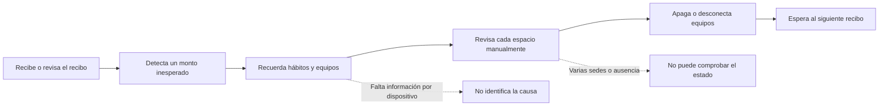

Los principales puntos de dolor son la información tardía, la inspección manual y la ausencia de una relación directa entre consumo, espacio y acción.

## 2.4 Ubiquitous Language

| Término | Definición compartida |
|:--|:--|
| User | Persona autenticada que utiliza EnergyCore. |
| Access Profile | Conjunto de permisos asignado a un User. |
| Location | Sede física administrada por el usuario. |
| Room | Espacio perteneciente a una Location. |
| Device | Equipo energético registrable y controlable. |
| Device Assignment | Relación operativa entre un Device y un Room o Location. |
| Device Group | Conjunto de Devices operados como unidad. |
| Routine | Secuencia programada de acciones sobre un alcance. |
| Operation Mode | Configuración coordinada de rutinas, horarios, metas y alertas. |
| Energy Reading | Medición de potencia o consumo asociada a un dispositivo y momento. |
| Alert Rule | Condición que determina cuándo generar una alerta. |
| Energy Goal | Objetivo de consumo con valor y fecha límite. |
| Consumption Report | Resumen de lecturas dentro de un periodo. |
| Subscription | Relación vigente entre User y Plan. |
| Support Ticket | Solicitud de ayuda reportada por el usuario. |

# Capítulo III Requirements Specification

## 3.1 To Be Scenario Mapping

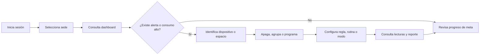

El escenario futuro reduce la distancia entre observación y acción: la misma plataforma presenta la señal, el contexto y los controles disponibles.

## 3.2 User Stories

| ID | User Story | Acceptance Criteria |
|:--|:--|:--|
| US-01 | Como visitante, quiero conocer la propuesta y los planes para decidir si ingreso. | Given que visita la Landing Page, when recorre sus secciones, then visualiza propuesta, capacidades, planes y un CTA al login. |
| US-02 | Como usuario, quiero registrarme e iniciar sesión para acceder a mi cuenta. | Given datos válidos, when confirma el formulario, then el sistema crea o autentica la cuenta y establece una sesión JWT. |
| US-03 | Como usuario, quiero recuperar mi contraseña para restablecer el acceso. | Given un correo registrado, when solicita recuperación, then el sistema genera un token temporal y permite definir una nueva contraseña. |
| US-04 | Como usuario, quiero crear sedes y habitaciones para representar mis espacios. | Given una sesión autorizada, when registra los datos válidos, then la sede o habitación aparece en su contexto activo. |
| US-05 | Como usuario, quiero vincular y nombrar dispositivos para reconocerlos. | Given un identificador válido, when completa la vinculación, then el dispositivo queda disponible para asignación y control. |
| US-06 | Como usuario, quiero encender o apagar dispositivos remotamente. | Given un dispositivo disponible, when cambia su estado, then la plataforma registra y muestra el nuevo estado. |
| US-07 | Como usuario, quiero agrupar dispositivos para operarlos juntos. | Given varios dispositivos, when crea un grupo y ejecuta una acción, then la operación se aplica al alcance definido. |
| US-08 | Como usuario, quiero programar rutinas para automatizar acciones repetitivas. | Given un alcance y horario válidos, when activa la rutina, then queda programada y puede ejecutarse o desactivarse. |
| US-09 | Como usuario, quiero usar modos de operación para coordinar mi espacio. | Given rutinas y reglas compatibles, when activa un modo, then el sistema presenta el impacto previsto y aplica la configuración. |
| US-10 | Como usuario, quiero ver consumo actual e histórico para detectar variaciones. | Given lecturas registradas, when abre el dashboard o filtra fechas, then visualiza métricas y series correspondientes. |
| US-11 | Como usuario, quiero recibir alertas configurables para atender situaciones importantes. | Given una regla cumplida, when se evalúa, then se genera una alerta respetando preferencias y horario silencioso. |
| US-12 | Como usuario, quiero crear metas y reportes para seguir mi desempeño energético. | Given un objetivo o periodo válido, when confirma la operación, then el sistema almacena y presenta el progreso o reporte. |
| US-13 | Como administrador, quiero asignar perfiles para limitar acciones sensibles. | Given un usuario y perfil autorizados, when realiza la asignación, then las rutas y operaciones respetan los permisos. |
| US-14 | Como usuario, quiero seleccionar idioma y tema para adaptar la experiencia. | Given una preferencia disponible, when la selecciona, then web y móvil aplican y conservan su configuración. |
| US-15 | Como usuario, quiero registrar soporte o mantenimiento para gestionar incidencias. | Given una descripción válida, when crea el ticket, then puede consultar su estado y evolución. |
| US-16 | Como usuario, quiero comparar y contratar planes para ampliar límites. | Given un plan disponible, when completa el checkout académico, then se registra el pago y la suscripción correspondiente. |

Las historias representan el incremento implementado. La redacción y prioridad deberán revisarse después de las entrevistas.

## 3.3 Product Backlog

| Orden | ID | Título | Prioridad | Story Points | Estado AV1 |
|--:|:--|:--|:--:|--:|:--|
| 1 | US-02 | Registro, login y recuperación | Must | 8 | Implementado |
| 2 | US-04 | Sedes y habitaciones | Must | 8 | Implementado |
| 3 | US-05 | Vinculación de dispositivos | Must | 8 | Implementado |
| 4 | US-06 | Control remoto | Must | 5 | Implementado |
| 5 | US-10 | Dashboard e histórico energético | Must | 8 | Implementado |
| 6 | US-07 | Grupos de dispositivos | Should | 5 | Implementado |
| 7 | US-08 | Rutinas | Should | 8 | Implementado |
| 8 | US-11 | Alertas y preferencias | Should | 8 | Implementado |
| 9 | US-12 | Metas y reportes | Should | 8 | Implementado |
| 10 | US-09 | Modos de operación | Could | 8 | Implementado |
| 11 | US-15 | Soporte y mantenimiento | Could | 5 | Implementado |
| 12 | US-16 | Planes y suscripción | Could | 8 | Implementado como flujo académico |
| 13 | US-13 | Perfiles y permisos | Should | 5 | Implementado |
| 14 | US-14 | Tema e idiomas | Should | 5 | Implementado |
| 15 | US-01 | Landing Page y CTA | Must | 5 | Implementado |

Total referencial del incremento AV1: **102 Story Points**. Los puntos expresan complejidad relativa del equipo, no horas.

## 3.4 Impact Mapping

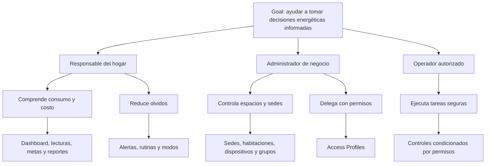

# Capítulo IV Product Design

## 4.1 Style Guidelines

### 4.1.1 General Style Guidelines

EnergyCore utiliza una identidad tecnológica y calmada. El verde es el color principal para acciones, estados activos y señales de energía; los fondos se construyen con grafito y superficies neutras, y el ámbar se reserva para ahorro, recomendaciones o advertencias. La marca se representa mediante un rayo dentro de una celda redondeada y una mascota robótica propia.

| Rol | Token de referencia | Uso |
|:--|:--|:--|
| Primary | `#22C55E` | CTA, selección, foco y energía |
| Primary strong | `#15803D` / `#166534` | Estados presionados y modo claro |
| Secondary | `#F59E0B` | Ahorro y advertencias |
| Dark background | `#080D09` / `#0A0F0B` | Fondos inmersivos |
| Dark surface | `#121A14` | Tarjetas y navegación |
| Light background | `#F3F6F2` | Tema claro móvil |
| Primary text | `#F4F7F5` o `#17211A` | Contraste según tema |

Los controles táctiles mantienen al menos 44 px, el foco es visible, el contenido conserva contraste WCAG AA y las animaciones respetan `prefers-reduced-motion` cuando el canal lo permite.

### 4.1.2 Web Style Guidelines

La Landing Page usa Space Grotesk en títulos y Manrope en contenido; organiza la página sobre una grilla de hasta 1200 px, tarjetas de 20 a 24 px de radio y un hero asimétrico. La Web Application emplea componentes Angular reutilizables, navegación lateral adaptable, encabezado, tarjetas, tablas, formularios, diálogos de confirmación y Lucide Angular como biblioteca de iconos.

Los breakpoints priorizan 375 px, 768 px, 1024 px y 1440 px. En pantallas pequeñas la navegación colapsa, las columnas se apilan y no se admite desplazamiento horizontal accidental. Los estados hover no desplazan el layout y las transiciones se mantienen entre 150 y 300 ms.

### 4.1.3 Mobile Style Guidelines

#### 4.1.3.1 iOS Mobile Style Guidelines

El diseño Flutter comparte jerarquía, espaciado, componentes adaptativos y temas con Android, por lo que constituye una base visual portable a iOS. Sin embargo, el incremento AV1 se ejecutó y verificó en Android; no se declara una compilación ni evidencia nativa iOS desde Windows. Esta limitación debe confirmarse con el docente antes de atribuir soporte iOS al entregable.

#### 4.1.3.2 Android Mobile Style Guidelines

La aplicación Android sigue Material Design mediante Flutter. Utiliza verde `#22C55E`, ámbar `#F59E0B`, fondos oscuros `#0A0F0B` y superficies `#121A14`, además de un tema claro. La navegación cambia entre `NavigationBar` para teléfonos y `NavigationRail` para tabletas. Los formularios presentan etiquetas, validación, retorno visible al login y mensajes persistentes con acción **Reintentar** cuando la API no está disponible.

## 4.2 Information Architecture

### 4.2.1 Organization Systems

La información se organiza principalmente por tarea y por bounded context. La Landing Page sigue una secuencia narrativa; las aplicaciones autenticadas agrupan Inicio, Energía, Espacios, Dispositivos, Automatización, Alertas, Reportes, Servicio, Facturación y Cuenta. Dentro de cada módulo se aplica una organización jerárquica de lista, detalle y operación.

### 4.2.2 Labeling Systems

Las etiquetas utilizan sustantivos concretos del Ubiquitous Language: **Sedes**, **Habitaciones**, **Dispositivos**, **Grupos**, **Rutinas**, **Modos**, **Lecturas**, **Alertas**, **Metas**, **Reportes**, **Soporte** y **Planes**. Las acciones usan verbos directos: crear, editar, vincular, mover, activar, archivar, exportar, cancelar y reintentar.

### 4.2.3 SEO Tags and Meta Tags

La Landing Page define título, descripción, viewport, color de tema, Open Graph, Twitter Card, canonical URL e icono propio. La propuesta de metadatos es:

| Etiqueta | Contenido |
|:--|:--|
| Title | EnergyCore - Smart energy management |
| Description | Monitor, understand and control energy across devices and spaces with EnergyCore. |
| Keywords | energy management, smart devices, energy monitoring, routines, alerts |
| Language | Inglés predeterminado con versión española disponible |

Antes del despliegue público se debe reemplazar el canonical temporal por el dominio definitivo y comprobar la imagen social.

### 4.2.4 Searching Systems

La Landing Page permite localizar secciones mediante navegación por anclas. En las aplicaciones, las listas aplican filtros por texto, estado, prioridad, fecha o alcance según el contexto. La búsqueda de direcciones para sedes se encapsula en infraestructura mediante OpenStreetMap/Nominatim y entrega sugerencias normalizadas a la capa de aplicación.

### 4.2.5 Navigation Systems

La Landing Page utiliza navegación global por secciones y CTA persistente hacia el login. La Web Application emplea Angular Router con guards de autenticación, suscripción y permisos. Flutter presenta un shell adaptativo con navegación inferior o lateral. En ambos clientes, cerrar sesión regresa al flujo de autenticación y las pantallas de registro y recuperación ofrecen retorno explícito al login.

## 4.3 Landing Page UI Design

### 4.3.1 Landing Page Wireframe

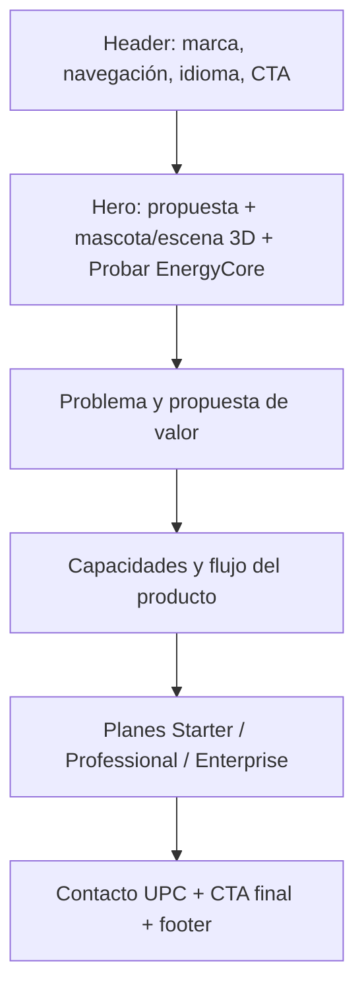

El wireframe privilegia un recorrido único y comprensible, con CTA al inicio de sesión en los puntos de decisión.

### 4.3.2 Landing Page Mockup

El mockup fue materializado directamente en `energycore-website`: tema oscuro grafito y esmeralda, hero con imagen 3D, mascota EnergyCore, iluminación dinámica, tarjetas de capacidades, planes vigentes y diseño responsivo. La evidencia ejecutable se encuentra en [energycore-website](https://github.com/teralume/energycore-website); las capturas finales se añadirán después de publicar el repositorio.

## 4.4 Mobile Applications UX UI Design

### 4.4.1 Mobile Applications Wireframes

| Pantalla | Estructura de baja fidelidad |
|:--|:--|
| Autenticación | Marca → credenciales → acción principal → recuperación/registro |
| Inicio | Saludo → consumo actual → resumen de sedes/dispositivos → alertas → accesos rápidos |
| Energía | KPIs → tendencia → filtros → lecturas → reportes/metas |
| Control | Selector de pestaña → lista de dispositivos/grupos/rutinas/modos → acción contextual |
| Espacios | Sedes → habitaciones → asignaciones |
| Cuenta | Perfil → seguridad → permisos → tema/idioma → cierre de sesión |

### 4.4.2 Mobile Applications Wireflow Diagrams

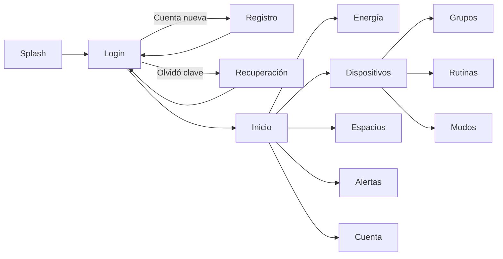

### 4.4.3 Mobile Applications Mockups

Los mockups implementados mantienen tarjetas oscuras, acento esmeralda, iconografía Material, estados vacíos, loaders, diálogos y formularios adaptativos. Incluyen autenticación, dashboard, energía, dispositivos, grupos, rutinas, modos, sedes, habitaciones, asignaciones, alertas, metas, reportes, soporte, mantenimiento, planes y cuenta. El inventario de paridad está documentado en `flutter/docs/web-parity.md` dentro del repositorio móvil.

### 4.4.4 Mobile Applications User Flow Diagrams

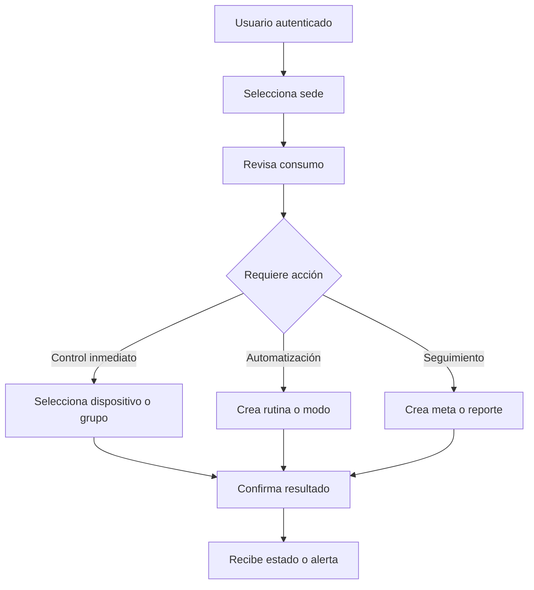

## 4.5 Mobile Applications Prototyping

### 4.5.1 Android Mobile Applications Prototyping

El prototipo funcional Android se encuentra en [energycore-mobile](https://github.com/teralume/energycore-mobile), subdirectorio `flutter`. Consume `http://10.0.2.2:8080/api/v1` desde el emulador, conserva el JWT mediante Android Keystore y AES-GCM, respeta tema de sistema y ofrece español, inglés y portugués.

Ejecución en Windows:

```powershell
subst M: "C:\JeanLoa\Universidad\Diseño de Experimentos de Ingeniería de Software\energycore-mobile\flutter"
Set-Location M:\
& "C:\JeanLoa\SDKs\flutter\bin\flutter.bat" run -d emulator-5554
```

### 4.5.2 iOS Mobile Applications Prototyping

El código de presentación Flutter se diseñó para reutilización multiplataforma, pero el proyecto fue creado con plataforma Android y no dispone de evidencia de compilación iOS. Para AV1 se declara **fuera del alcance verificado** hasta recibir confirmación del docente y disponer de un entorno macOS/Xcode.

## 4.6 Web Applications UX UI Design

### 4.6.1 Web Applications Wireframes

| Área | Estructura de baja fidelidad |
|:--|:--|
| Shell | Sidebar → header → contexto activo → contenido |
| Dashboard | KPIs → gráfico de tendencia → alertas → resumen de dispositivos y metas |
| Gestión | Título y CTA → filtros → tabla/tarjetas → formulario modal → confirmación |
| Settings | Navegación secundaria → secciones de perfil, seguridad, accesos, facturación y apariencia |

### 4.6.2 Web Applications Wireflow Diagrams

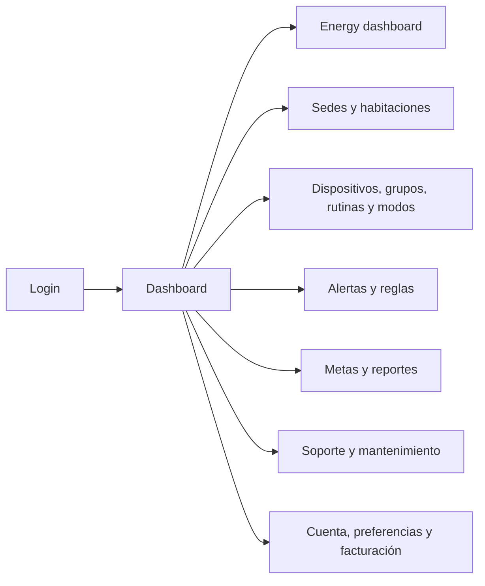

### 4.6.3 Web Applications Mockups

La implementación Angular funciona como mockup de alta fidelidad y producto navegable. Usa componentes compartidos para botones, campos, selectores, fechas, tablas, tarjetas, diálogos y estados de error; Lucide Angular mantiene coherencia iconográfica. El dashboard y los contextos funcionales comparten tema, espaciado y patrones de operación.

### 4.6.4 Web Applications User Flow Diagrams

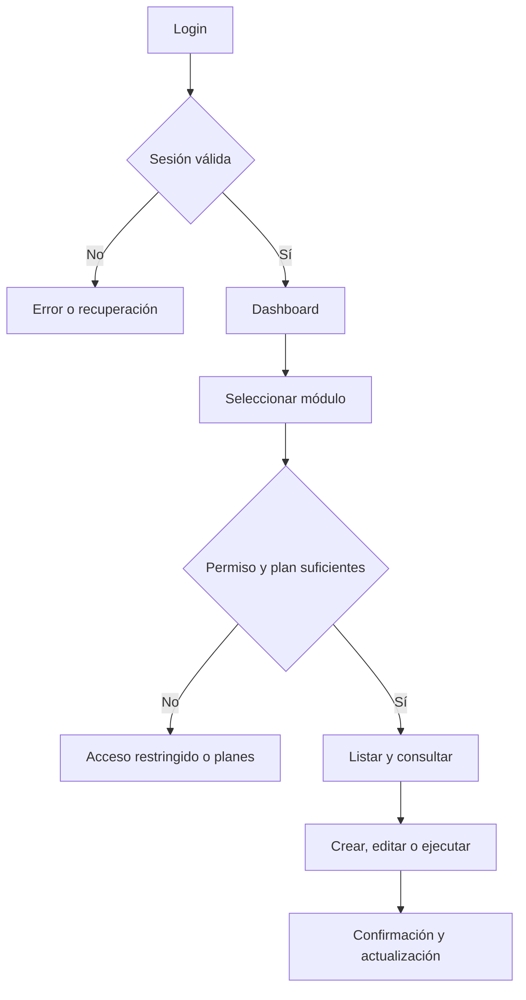

## 4.7 Web Applications Prototyping

El prototipo funcional está implementado en Angular y disponible en [energycore-webapp](https://github.com/teralume/energycore-webapp). Se ejecuta con `npm install` y `npm start`, consume la API en el puerto 8080 y contiene guards para autenticación, permisos y suscripción. La compilación de producción fue ejecutada correctamente; conserva advertencias no bloqueantes sobre presupuestos de tamaño SCSS.

## 4.8 Domain Driven Software Architecture

### 4.8.1 Software Architecture Context Diagram

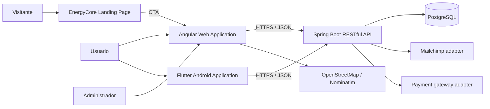

### 4.8.2 Software Architecture Container Diagrams

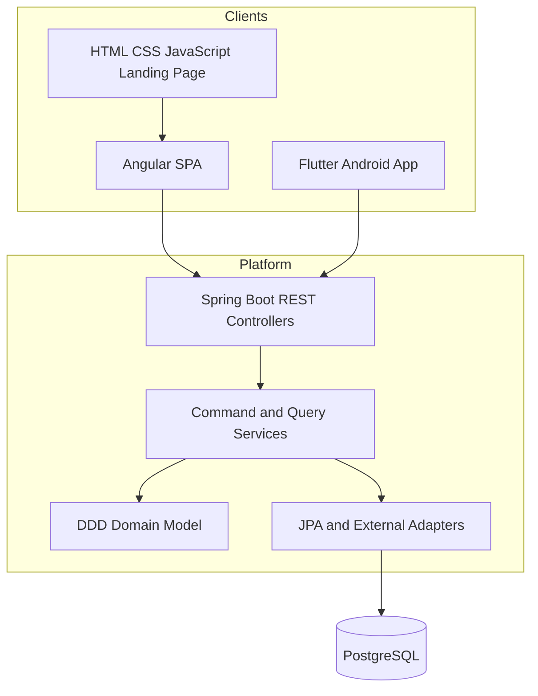

Los clientes no mantienen bases de datos de producto separadas. La persistencia y las reglas compartidas permanecen en `energycore-platform`.

### 4.8.3 Software Architecture Components Diagrams

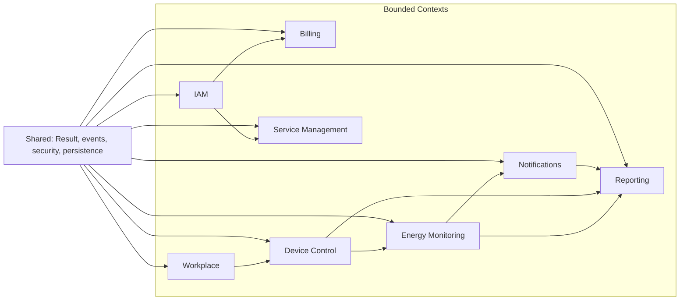

Cada bounded context del backend separa `domain`, `application`, `infrastructure` e `interfaces`; Angular y Flutter aplican equivalentes de `domain`, `application`, `infrastructure` y `presentation`.

## 4.9 Software Object Oriented Design

### 4.9.1 Class Diagrams

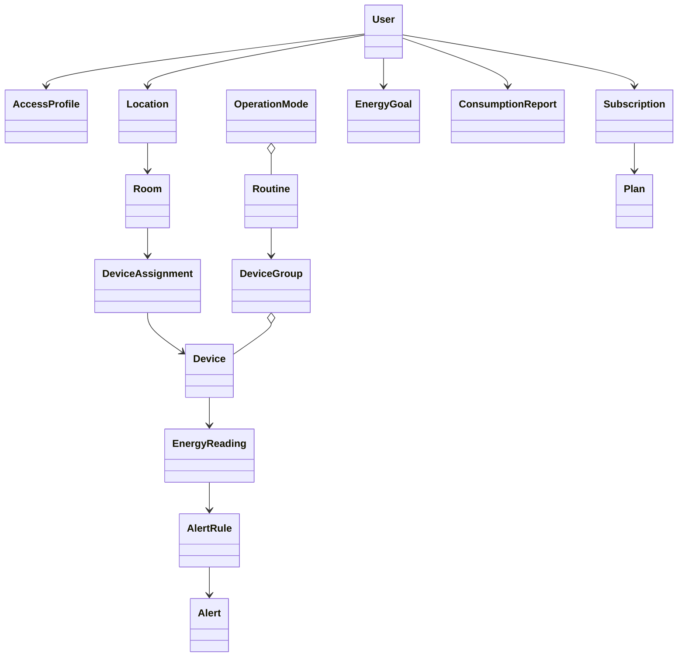

El diagrama resume relaciones de dominio; las asociaciones físicas exactas se detallan mediante entidades JPA y repositorios de cada bounded context.

### 4.9.2 Class Dictionary

| Clase | Contexto | Responsabilidad |
|:--|:--|:--|
| User | IAM | Identidad, estado y datos de cuenta. |
| AccessProfile | IAM | Perfil y permisos de acceso. |
| Location / Room | Workplace | Jerarquía física de sedes y espacios. |
| DeviceAssignment | Workplace | Ubicación operativa de un dispositivo. |
| Device | Device Control | Estado, identidad y capacidades controlables. |
| DeviceGroup | Device Control | Operación conjunta de dispositivos. |
| Routine | Device Control | Automatización programada sobre un alcance. |
| OperationMode | Device Control | Coordinación de automatizaciones y objetivos. |
| EnergyReading | Energy Monitoring | Lectura energética fechada. |
| AlertRule / Alert | Notifications | Condición evaluable y evento notificado. |
| EnergyGoal | Reporting | Objetivo de consumo y progreso. |
| ConsumptionReport | Reporting | Resumen exportable de un periodo. |
| Plan / Subscription | Billing | Oferta y acceso contratado por el usuario. |
| SupportTicket / MaintenanceTicket | Service Management | Solicitud de soporte o mantenimiento. |

## 4.10 Database Design

### 4.10.1 Relational Non Relational Database Diagram

EnergyCore utiliza PostgreSQL. No mantiene una base NoSQL en el alcance actual.

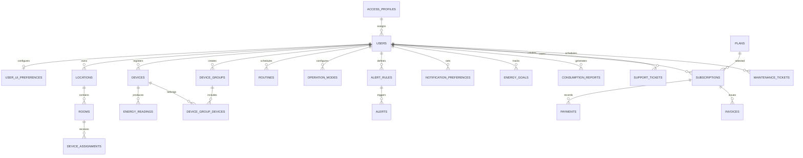

# Capítulo V Product Implementation

## 5.1 Software Configuration Management

### 5.1.1 Software Development Environment Configuration

| Producto | Tecnologías | Herramientas principales |
|:--|:--|:--|
| Landing Page | HTML5, CSS3, JavaScript | Navegador, VS Code/Codex, Node.js para validación sintáctica |
| Web Application | Angular 21, TypeScript 5.9, RxJS, SCSS | Node.js, npm, Angular CLI, Lucide Angular |
| Native Mobile Application | Flutter 3.44.8, Dart 3.12.2 | Android Studio, Android SDK, emulador Pixel 7 |
| RESTful API | Java, Spring Boot, Spring Security, Spring Data JPA | JDK, Maven Wrapper, Swagger UI |
| Database | PostgreSQL | Variables `DATABASE_URL`, `DATABASE_USER`, `DATABASE_PASSWORD` |
| Control de versiones | Git y GitHub | Organización pública `teralume` |

Los secretos y archivos locales no se incorporan a Git. La configuración productiva depende de variables de entorno.

### 5.1.2 Source Code Management

El producto se divide en cinco repositorios públicos independientes:

- [energycore-report](https://github.com/teralume/energycore-report)
- [energycore-platform](https://github.com/teralume/energycore-platform)
- [energycore-webapp](https://github.com/teralume/energycore-webapp)
- [energycore-mobile](https://github.com/teralume/energycore-mobile)
- [energycore-website](https://github.com/teralume/energycore-website)

Se emplean conventional commits (`feat`, `test`, `docs`, `chore`) y la rama estable `main`. Para continuar con GitFlow se crearán ramas `develop` y `feature/*` en los incrementos siguientes; el historial inicial conserva la fecha real de incorporación y no simula aportes anteriores.

### 5.1.3 Source Code Style Guide and Conventions

| Área | Convenciones |
|:--|:--|
| Java | Paquetes en minúsculas; clases PascalCase; métodos camelCase; controllers delgados; commands y queries separados. |
| Angular | Componentes y archivos kebab-case; TypeScript estricto; HTTP encapsulado en infrastructure; estado y casos de uso en application. |
| Flutter | `dart format`; archivos snake_case; widgets PascalCase; repositorios como contratos de domain; controladores en application. |
| REST | Recursos JSON; rutas plurales bajo `/api/v1`; códigos HTTP coherentes; errores centralizados. |
| Git | Conventional commits en imperativo; cambios acotados por producto. |
| Documentación | Markdown con cuatro niveles de navegación, términos técnicos correctos y evidencias verificables. |

### 5.1.4 Software Deployment Configuration

La configuración actual permite ejecución local integrada. La API usa el puerto 8080; Angular consume `/api/v1`; Flutter usa `10.0.2.2:8080` desde el emulador; y la Landing Page enlaza al login de la Web Application. El perfil `prod` del backend acepta puerto, datasource y credenciales mediante variables de entorno.

**Estado de AV1:** el despliegue local está preparado y los repositorios contienen la configuración necesaria. No se declara todavía una URL pública de producción porque no existe evidencia de despliegue remoto aprobada.

## 5.2 Product Implementation and Deployment

### 5.2.1 Sprint Backlogs

| Sprint | Objetivo | Entregables | Evidencia local |
|:--|:--|:--|:--|
| Sprint 1 | Crear la base integrada del producto | Repositorios, backend DDD, Angular y Landing Page | Commits de inicialización y producto |
| Sprint 2 | Completar la experiencia móvil y la paridad funcional | Flutter Android, autenticación, shell, contextos y conectividad | Commits `1fe1a80`, `24cf286`, `0f545f0` |
| Sprint 3 | Preparar AV1 y trazabilidad | Informe, verificación, diseño y documentación | Commits del Report y verificaciones registradas |

La asignación individual confirmada corresponde a Jean Franck Loa Rojas: organización de repositorios, rebranding, backend, Angular, Landing Page, Flutter y documentación. Los aportes de futuros integrantes se añadirán únicamente cuando existan commits verificables.

### 5.2.2 Implemented Landing Page Evidence

`energycore-website` contiene `index.html`, `styles.css`, `script.js`, mascota, marca SVG e imagen hero 3D. Implementa navegación responsiva, cambio ES/EN, animaciones con movimiento reducido, capacidades, planes Starter/Professional/Enterprise y CTA al login. `node --check script.js` fue ejecutado sin errores.

**Evidencia visual pendiente:** captura de escritorio y móvil después de publicar el repositorio o disponer de la URL del despliegue.

### 5.2.3 Implemented Frontend Web Application Evidence

`energycore-webapp` implementa autenticación, dashboard, energía, dispositivos, grupos, rutinas, modos, sedes, habitaciones, asignaciones, alertas, reglas, preferencias, metas, reportes, soporte, mantenimiento, planes y configuración de cuenta. Se organiza por bounded contexts con capas `domain`, `application`, `infrastructure` y `presentation`. `npm run build` concluyó correctamente, con advertencias no bloqueantes de presupuesto de estilos.

**Evidencia visual pendiente:** capturas de autenticación, dashboard y un flujo CRUD conectado al backend.

### 5.2.4 Acuerdo de Servicio SaaS

Esta sección pertenece a la estructura acumulativa general, pero no figura en la estructura específica del Primer Hito de las páginas 37 a 39 del enunciado. Se desarrollará para el Trabajo Parcial con alcance, disponibilidad, soporte, seguridad, privacidad, continuidad, límites de responsabilidad y condiciones de los planes. No se presenta un contrato ficticio como evidencia de AV1.

### 5.2.5 Implemented Native Mobile Application Evidence

`energycore-mobile/flutter` implementa la experiencia Android con paridad respecto de los módulos web. Incluye sesión cifrada, tema claro/oscuro/sistema, español/inglés/portugués, navegación adaptable, aviso de desconexión y acción **Reintentar**. `dart analyze` y `flutter test` llegaron a ejecutarse correctamente antes del último ajuste visual; la repetición dentro del entorno administrado quedó bloqueada por permisos de creación de procesos, por lo que deberá repetirse en PowerShell normal antes de la entrega.

**Evidencia visual pendiente:** capturas del emulador con login, dashboard y un flujo de energía o dispositivos.

### 5.2.6 Implemented RESTful API and Serverless Backend Evidence

`energycore-platform` implementa una RESTful API Spring Boot organizada en IAM, Billing, Workplace, Device Control, Energy Monitoring, Notifications, Reporting y Service Management. Emplea JWT, BCrypt, JPA/PostgreSQL, eventos de integración, servicios de dominio, command/query services, recursos y assemblers. Incluye suites unitarias, de integración y escenarios Cucumber.

**Estado de verificación:** el código y las pruebas están versionados. La ejecución Maven final en el entorno administrado fue bloqueada por falta de permiso de escritura en `.m2`; debe repetirse en una terminal normal antes de adjuntar la captura.

### 5.2.7 RESTful API Documentation

Con la API activa, OpenAPI se publica en `http://localhost:8080/swagger-ui.html` y el documento JSON en `/v3/api-docs`.

| Contexto | Rutas principales |
|:--|:--|
| IAM | `/api/v1/auth`, `/api/v1/users`, `/api/v1/access-profiles` |
| Billing | `/api/v1/billing/plans`, `/subscriptions`, `/payments`, `/invoices` |
| Workplace | `/api/v1/workplace/locations`, `/rooms`, `/device-assignments` |
| Device Control | `/api/v1/devices`, `/device-groups`, `/routines`, `/operation-modes` |
| Energy Monitoring | `/api/v1/energy-readings`, `/dashboard-summary`, `/sampling-settings` |
| Notifications | `/api/v1/alerts`, `/alert-rules`, `/notification-preferences` |
| Reporting | `/api/v1/reports`, `/energy-goals`, `/reporting/platform/summary` |
| Service Management | `/api/v1/support-tickets`, `/maintenance-tickets` |

La captura de Swagger UI se añadirá después de ejecutar backend y PostgreSQL en el equipo local.

### 5.2.8 Team Collaboration Insights

Antes de esta ampliación del informe se organizaron 13 commits locales distribuidos entre los cinco repositorios. El trabajo confirmado de Jean Franck Loa Rojas abarca configuración, migración de identidad, backend, Web Application, Landing Page, Native Mobile Application y reporte. Los árboles quedaron limpios al cerrar esa línea base; el cambio actual agrega el desarrollo documental de los capítulos I al V.

Las capturas de GitHub Insights deben incorporarse después de publicar las ramas. No se atribuirán aportes a integrantes cuyos datos y commits todavía no han sido confirmados.

## 5.3 Video About the Product

**Bloqueo de evidencia AV1:** el enunciado exige un video de exposición y un Video About-the-Product, pero todavía no se ha proporcionado un enlace. El video debe mostrar la propuesta, el flujo Landing Page → login, la Web Application, la aplicación Android y la API, evitando afirmar despliegues o resultados de ahorro no demostrados.

Guion recomendado: problema y segmentos (45 s), propuesta de valor (45 s), demostración web (2 min), demostración móvil (2 min), arquitectura/API (1 min) y cierre con alcance y limitaciones (30 s).

# Part II Verification Validation and Pipeline

# Capítulo VI Product Verification and Validation

## 6.1 Testing Suites and Validation

### 6.1.1 Core Entities Unit Tests

_Pendiente para la entrega correspondiente._

### 6.1.2 Core Integration Tests

_Pendiente para la entrega correspondiente._

### 6.1.3 Core Behavior Driven Development

_Pendiente para la entrega correspondiente._

### 6.1.4 Core System Tests

_Pendiente para la entrega correspondiente._

## 6.2 Static Testing and Verification

### 6.2.1 Static Code Analysis

#### 6.2.1.1 Coding Standard and Code Conventions

_Pendiente para la entrega correspondiente._

#### 6.2.1.2 Code Quality and Code Security

_Pendiente para la entrega correspondiente._

### 6.2.2 Reviews

_Pendiente para la entrega correspondiente._

## 6.3 Validation Interviews

### 6.3.1 Diseño de Entrevistas

_Pendiente para la entrega correspondiente._

### 6.3.2 Registro de Entrevistas

_Pendiente para la entrega correspondiente._

### 6.3.3 Evaluaciones según heurísticas

_Pendiente para la entrega correspondiente._

## 6.4 Auditoría de Experiencias de Usuario

### 6.4.1 Auditoría realizada

#### 6.4.1.1 Información del grupo auditado

_Pendiente para la entrega correspondiente._

#### 6.4.1.2 Cronograma de auditoría realizada

_Pendiente para la entrega correspondiente._

#### 6.4.1.3 Contenido de auditoría realizada

_Pendiente para la entrega correspondiente._

### 6.4.2 Auditoría recibida

#### 6.4.2.1 Información del grupo auditor

_Pendiente para la entrega correspondiente._

#### 6.4.2.2 Cronograma de auditoría recibida

_Pendiente para la entrega correspondiente._

#### 6.4.2.3 Contenido de auditoría recibida

_Pendiente para la entrega correspondiente._

#### 6.4.2.4 Resumen de modificaciones para subsanar hallazgos

_Pendiente para la entrega correspondiente._

# Capítulo VII DevOps Practices

## 7.1 Continuous Integration

### 7.1.1 Tools and Practices

_Pendiente para la entrega correspondiente._

### 7.1.2 Build and Test Suite Pipeline Components

_Pendiente para la entrega correspondiente._

## 7.2 Continuous Delivery

### 7.2.1 Tools and Practices

_Pendiente para la entrega correspondiente._

### 7.2.2 Stages Deployment Pipeline Components

_Pendiente para la entrega correspondiente._

## 7.3 Continuous Deployment

### 7.3.1 Tools and Practices

_Pendiente para la entrega correspondiente._

### 7.3.2 Production Deployment Pipeline Components

_Pendiente para la entrega correspondiente._

## 7.4 Continuous Monitoring

### 7.4.1 Tools and Practices

_Pendiente para la entrega correspondiente._

### 7.4.2 Monitoring Pipeline Components

_Pendiente para la entrega correspondiente._

### 7.4.3 Alerting Pipeline Components

_Pendiente para la entrega correspondiente._

### 7.4.4 Notification Pipeline Components

_Pendiente para la entrega correspondiente._

# Part III Experiment Driven Lifecycle

# Capítulo VIII Experiment Driven Development

## 8.1 Experiment Planning

### 8.1.1 As Is Summary

_Pendiente para AV2._

### 8.1.2 Raw Material Assumptions Knowledge Gaps Ideas Claims

_Pendiente para AV2._

### 8.1.3 Experiment Ready Questions

_Pendiente para AV2._

### 8.1.4 Question Backlog

_Pendiente para AV2._

### 8.1.5 Experiment Cards

_Pendiente para AV2._

## 8.2 Experiment Design

### 8.2.1 Hypotheses

_Pendiente para AV2._

### 8.2.2 Domain Business Metrics

_Pendiente para AV2._

### 8.2.3 Measures

_Pendiente para AV2._

### 8.2.4 Conditions

_Pendiente para AV2._

### 8.2.5 Scale Calculations and Decisions

_Pendiente para AV2._

### 8.2.6 Methods Selection

_Pendiente para AV2._

### 8.2.7 Data Analytics Goals KPIs and Metrics Selection

_Pendiente para AV2._

### 8.2.8 Web and Mobile Tracking Plan

_Pendiente para AV2._

## 8.3 Experimentation

### 8.3.1 To Be User Stories

_Pendiente para AV2._

### 8.3.2 To Be Product Backlog

_Pendiente para AV2._

### 8.3.3 Pipeline Supported Experiment Driven To Be Software Platform Lifecycle

#### 8.3.3.1 To Be Sprint Backlogs

_Pendiente para AV2._

#### 8.3.3.2 Implemented To Be Landing Page Evidence

_Pendiente para AV2._

#### 8.3.3.3 Implemented To Be Frontend Web Application Evidence

_Pendiente para AV2._

#### 8.3.3.4 Implemented To Be Native Mobile Application Evidence

_Pendiente para AV2._

#### 8.3.3.5 Implemented To Be RESTful API and Serverless Backend Evidence

_Pendiente para AV2._

#### 8.3.3.6 Team Collaboration Insights

_Pendiente para AV2._

### 8.3.4 To Be Validation Interviews

#### 8.3.4.1 Diseño de Entrevistas

_Pendiente para AV2._

#### 8.3.4.2 Registro de Entrevistas

_Pendiente para AV2._

## 8.4 Experiment Aftermath and Analysis

### 8.4.1 Analysis and Interpretation of Results

_Pendiente para TB2._

### 8.4.2 Re Scored and Re Prioritized Question Backlog

_Pendiente para TB2._

## 8.5 Continuous Learning

### 8.5.1 Shareback Session Artifacts Learning Workflow

_Pendiente para TB2._

## 8.6 To Be Software Platform Pre Launch

### 8.6.1 About the Product Intro Video

_Pendiente para TB2._

### 8.6.2 Resumen usando GEES Framework

_Pendiente para TB2._

### Matriz de Evaluación Ética y de Impacto

_Pendiente para TB2._

# Conclusiones

## Conclusiones y recomendaciones

Para AV1 se concluye que EnergyCore cuenta con una base funcional integrada para Landing Page, Web Application, Native Mobile Application y RESTful API. La separación en cinco repositorios mejora la trazabilidad del producto, mientras que la arquitectura por bounded contexts conserva una fuente central de reglas y datos para los clientes web y Android.

Este avance de conclusiones fue redactado por Jean Franck Loa Rojas y deberá ser revisado por los demás integrantes antes de presentarse como conclusión grupal.

La implementación técnica no valida por sí sola las hipótesis de producto. Todavía deben realizarse entrevistas con los dos segmentos, registrar evidencia audiovisual y comprobar que los participantes comprenden las métricas, alertas y automatizaciones sin asistencia. En consecuencia, las proto-personas, mapas y prioridades actuales se consideran material provisional susceptible de corrección.

También se recomienda publicar los repositorios, incorporar capturas de GitHub Insights, ejecutar nuevamente las suites Maven y Flutter fuera del entorno administrado, registrar Swagger UI con el backend activo y grabar el Video About-the-Product. Los resultados grupales del Student Outcome se completarán cuando los demás integrantes y sus aportes hayan sido confirmados.

# Video App Validation

_Pendiente de incorporar enlace._

# Video About the Team

_Pendiente de incorporar enlace y testimonio individual._

# Bibliografía

- Universidad Peruana de Ciencias Aplicadas. (2026). _Enunciado del Trabajo Final del curso Diseño de Experimentos de Ingeniería de Software, 1ASI0732_.
- Instituto Nacional de Estadística e Informática. (2018). _INEI difunde Base de Datos de los Censos Nacionales 2017 y el Perfil Sociodemográfico del Perú_. https://censo2017.inei.gob.pe/inei-difunde-base-de-datos-de-los-censos-nacionales-2017-y-el-perfil-sociodemografico-del-peru/
- Xiaomi. (s. f.). _Xiaomi Smart Plug 2 (Wi-Fi): All specs and features_. https://www.mi.com/global/product/xiaomi-smart-plug-2-wi-fi/
- SONOFF. (s. f.). _Smart Plugs_. https://sonoff.tech/collections/smart-plugs
- TP-Link. (s. f.). _KP125M Kasa Smart Wi-Fi Plug Slim, Energy Monitoring_. https://www.tp-link.com/us/home-networking/smart-plug/kp125m/
- Cohn, M. (2004). _User Stories Applied: For Agile Software Development_. Addison-Wesley.
- Gothelf, J., & Seiden, J. (2021). _Lean UX: Designing Great Products with Agile Teams_ (3rd ed.). O'Reilly Media.
- Evans, E. (2003). _Domain-Driven Design: Tackling Complexity in the Heart of Software_. Addison-Wesley.

# Anexos

## Enlaces importantes

- [Project Report](https://github.com/teralume/energycore-report)
- [Landing Page](https://github.com/teralume/energycore-website)
- [Frontend Web Application](https://github.com/teralume/energycore-webapp)
- [Native Mobile Application](https://github.com/teralume/energycore-mobile)
- [RESTful API](https://github.com/teralume/energycore-platform)

## Evidencias pendientes

- Capturas de GitHub Insights y commits de AV1.
- Capturas de ejecución de la Landing Page, Web Application, aplicación Android y Swagger UI.
- Registro y análisis de entrevistas reales con sus enlaces audiovisuales.
- Video de exposición y Video About-the-Product.
- Datos y evidencias de los demás integrantes cuando el equipo los confirme.
- URL de despliegue público, si se exige para AV1 o se incorpora antes del Trabajo Parcial.
